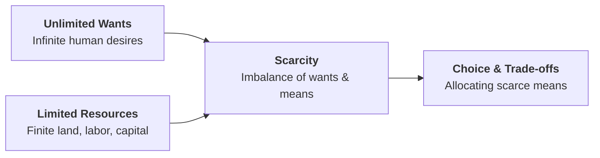
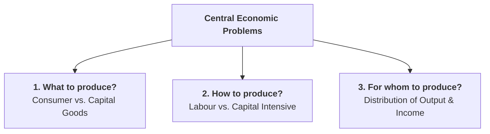

## 1. The Fundamental Economic Problem: Scarcity and Choice

Every society, whether rich or poor, capitalist or socialist, faces one fundamental reality: **Scarcity**.

* **Unlimited Human Wants:** Human desires for food, housing, education, entertainment, healthcare, and luxury goods are virtually infinite. As soon as one want is satisfied, new ones emerge.
* **Limited Productive Resources (Means):** The resources needed to produce these goods and services are strictly limited in quantity and availability.

Because resources are scarce, society cannot produce enough goods and services to satisfy everyone's desires. This forces individuals, businesses, and governments to make **choices** about how best to allocate their limited means.

---

## 2. The Four Factors of Production

To produce any economic good or service, society combines four basic categories of productive resources:

1. **Land (Natural Resources):** All gifts of nature, such as agricultural land, water, minerals, forests, and oil. The reward for land is **Rent**.
2. **Labour (Human Effort):** The physical and mental effort exerted by workers in production. The reward for labour is **Wages / Salaries**.
3. **Capital (Man-Made Resources):** Machinery, tools, factories, and technology used to produce other goods. The reward for capital is **Interest**.
4. **Entrepreneurship (Organisation &amp; Risk-Taking):** The human ability to combine land, labour, and capital, take business risks, and innovate. The reward for entrepreneurship is **Profit**.

---

## 3. The Three Central Economic Problems

Because resources are scarce and have alternative uses, every economic system must answer **three basic questions**:

### 1. What to Produce? (Selection of Goods and Quantities)
An economy must decide which goods and services to produce and in what quantities:
* Should we produce more **consumer goods** (food, clothing, consumer electronics) or more **capital goods** (machines, factories, industrial roads) that enhance future growth?
* Should society allocate resources to **civilian goods** (schools, hospitals) or **defense goods** (military equipment)?

### 2. How to Produce? (Choice of Technique)
An economy must determine the most efficient method and combination of resources to produce the chosen goods:
* **Labour-Intensive Technique:** Uses more workers and less machinery. Suitable for nations with abundant labour and scarce capital.
* **Capital-Intensive Technique:** Uses advanced machinery and automated technology with fewer workers. Suitable for capital-rich nations to achieve higher physical productivity.

### 3. For Whom to Produce? (Distribution of Output)
An economy must decide how the total national output is distributed among the members of society:
* How is national income divided among workers (wages), landowners (rent), investors (interest), and business owners (profit)?
* How does government policy (taxation and welfare subsidies) ensure fair distribution and reduce poverty?

---

## 4. The Concept of Opportunity Cost

### Definition
**Opportunity cost** is the value of the next best alternative foregone when a choice is made. 

Every economic choice involves a sacrifice. When you choose to spend resources (time, money, or raw materials) on one option, you give up the benefit of the next best alternative.

> **Example:** If a student has 3 hours of free time and chooses to study economics instead of working at a part-time job that pays Rs. 300 per hour, the **opportunity cost of studying** is Rs. 900 (the income sacrificed).

### What is NOT an Opportunity Cost? (Sunk Costs)
**Sunk costs** are expenses that have already been incurred in the past and cannot be recovered regardless of future decisions. 

* Sunk costs should **never** influence current economic decisions.
* **Example:** If you already purchased a non-refundable, non-transferable concert ticket for Rs. 1,000, that Rs. 1,000 is a sunk cost. When deciding whether to actually go to the concert tonight or stay home to rest, the Rs. 1,000 is irrelevant because the money is already gone. Only your future alternative use of time matters.

---

## 5. Review & Exam Preparation Questions

### Very Short Questions (1-2 Marks):
1. **What is the primary cause of all economic problems?**  
   *Answer:* Scarcity — the imbalance between unlimited human wants and limited productive resources.
2. **Define opportunity cost.**  
   *Answer:* The value of the next best alternative foregone when making a choice.
3. **Why are sunk costs excluded from opportunity cost?**  
   *Answer:* Because sunk costs are past, unrecoverable expenses that cannot be changed by present or future choices.
4. **Name the four factors of production and their rewards.**  
   *Answer:* Land (Rent), Labour (Wages), Capital (Interest), and Entrepreneurship (Profit).

### Short Questions (3-5 Marks):
1. Explain the three fundamental economic problems faced by any society.
2. Differentiate between Opportunity Cost and Sunk Costs with real-world examples.

### Very Short Questions (1-2 Marks):
1. **What is the primary cause of all economic problems?**  
   *Answer:* Scarcity — the imbalance between unlimited human wants and limited productive resources.
2. **Define opportunity cost.**  
   *Answer:* The value of the next best alternative foregone when making a choice.
3. **What does a point situated outside the PPC indicate?**  
   *Answer:* An unattainable production level that cannot be produced with current resources and technology.
4. **Why are sunk costs excluded from opportunity cost?**  
   *Answer:* Because sunk costs are past, unrecoverable expenses that cannot be changed by present or future choices.

### Short Questions (3-5 Marks):
1. Explain the three fundamental economic problems faced by any society.
2. What is the Production Possibility Curve? Explain why it slopes downward and is concave to the origin.
3. What factors cause the Production Possibility Curve to shift outward to the right?
