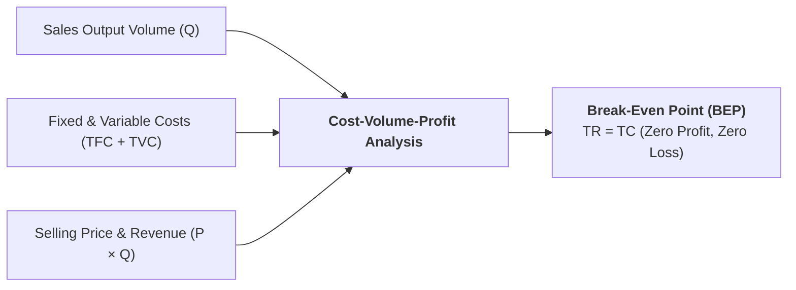

## 1. What is Break-Even Analysis?

**Break-Even Analysis (BEA)** (also called **Cost-Volume-Profit / CVP Analysis**) is a crucial managerial economics tool that examines the mathematical relationship between a firm's production volume, operational costs, sales revenue, and net profit.

> **Definition:** The **Break-Even Point (BEP)** is the operational sales volume at which **Total Revenue ($TR$) exactly equals Total Cost ($TC$)**. At this point, the firm earns **zero economic profit and incurs zero loss** (the *No-Profit, No-Loss* point).

$$\mathbf{TR = TC \implies \text{Net Profit } (\pi) = 0}$$

---

## 2. Fundamental Algebraic Formulas

1. **Contribution Margin per Unit ($CM$):**  
   The portion of selling price that contributes to covering fixed overheads and generating profit:
   $$CM = P - AVC$$
2. **Contribution Margin Ratio / P/V Ratio ($CR$):**  
   $$CR = \dfrac{P - AVC}{P} = \dfrac{CM}{P}$$
3. **Break-Even Output in Units ($BEP_{\text{units}}$):**  
   $$BEP_{\text{units}} = \dfrac{TFC}{P - AVC} = \dfrac{TFC}{CM}$$
4. **Break-Even Sales Value ($BEP_{\text{sales}}$):**  
   $$BEP_{\text{sales}} = BEP_{\text{units}} \times P = \dfrac{TFC}{CR}$$
5. **Required Sales Volume for Target Profit ($\pi^*$):**  
   $$Q_{\text{target}} = \dfrac{TFC + \pi^*}{P - AVC} = \dfrac{TFC + \pi^*}{CM}$$
6. **Margin of Safety ($MOS$):**  
   The cushion between actual sales volume and the break-even threshold:
   $$MOS_{\text{units}} = Q_{\text{actual}} - BEP_{\text{units}}$$
   $$MOS_{\%} = \left(\dfrac{Q_{\text{actual}} - BEP_{\text{units}}}{Q_{\text{actual}}}\right) \times 100\%$$

---

## 3. The Break-Even Chart

### Chart Elements:
* **Total Fixed Cost ($TFC$) Line:** A horizontal line showing fixed overheads.
* **Total Cost ($TC$) Line:** Starts from the $TFC$ intercept on the vertical axis and slopes upward.
* **Total Revenue ($TR$) Line:** Starts from the origin $(0, 0)$ and slopes upward with slope equal to price ($P$).
* **Break-Even Point ($BEP$):** The point where the $TR$ line intersects the $TC$ line.
* **Loss Zone:** The region below $BEP$ where $TC > TR$.
* **Profit Zone:** The region above $BEP$ where $TR > TC$.
* **Angle of Incidence:** The angle formed between $TR$ and $TC$ at $BEP$. A wider angle indicates a faster rate of profit generation.

---

## 4. Step-by-Step Solved Numerical Problems

### Problem 1: Hotel Banquet Event Break-Even Calculation

**Question:**  
A hotel banquet department has the following monthly operational parameters:
* Total Fixed Overhead Costs ($TFC$): **Rs. 500,000 per month**
* Variable Cost per Guest ($AVC$): **Rs. 1,200 per guest**
* Selling Price per Guest Package ($P$): **Rs. 3,200 per guest**

1. Calculate the Contribution Margin ($CM$) and Contribution Ratio ($CR$).
2. Calculate the Break-Even Point in guest packages ($BEP_{\text{units}}$) and sales revenue ($BEP_{\text{sales}}$).
3. If the hotel targets a monthly profit of **Rs. 300,000**, how many guest packages must be sold?
4. If current actual monthly sales are **350 packages**, calculate the Margin of Safety ($MOS$).

#### Solution:

**Step 1: Calculate Contribution Margin and Ratio**  
$$CM = P - AVC = \text{Rs. } 3,200 - \text{Rs. } 1,200 = \mathbf{\text{Rs. } 2,000\text{ per guest}}$$
$$CR = \dfrac{CM}{P} = \dfrac{2,000}{3,200} = \mathbf{0.625 \text{ (or } 62.5\%)}$$

**Step 2: Calculate Break-Even Point**  
$$BEP_{\text{units}} = \dfrac{TFC}{CM} = \dfrac{500,000}{2,000} = \mathbf{250\text{ guest packages}}$$
$$BEP_{\text{sales}} = BEP_{\text{units}} \times P = 250 \times 3,200 = \mathbf{\text{Rs. } 800,000}$$

**Step 3: Calculate Required Sales for Target Profit of Rs. 300,000**  
$$Q_{\text{target}} = \dfrac{TFC + \text{Target Profit}}{CM} = \dfrac{500,000 + 300,000}{2,000} = \dfrac{800,000}{2,000} = \mathbf{400\text{ packages}}$$

**Step 4: Calculate Margin of Safety at Actual Sales of 350 packages**  
$$MOS_{\text{units}} = Q_{\text{actual}} - BEP_{\text{units}} = 350 - 250 = \mathbf{100\text{ packages}}$$
$$MOS_{\%} = \left(\dfrac{100}{350}\right) \times 100\% = \mathbf{28.57\%}$$

---

### Problem 2: Profit-Maximizing Calculus Output ($MR = MC$)

**Question:**  
A manufacturing firm faces the demand function $P = 100 - 2Q$ and total cost function $TC = 15 + 0.5Q + 0.4Q^2$. Find:
1. Marginal Revenue ($MR$) and Marginal Cost ($MC$) functions.
2. The profit-maximizing output ($Q^*$).
3. Maximum total profit ($\pi^*$).

#### Solution:

**Step 1: Derive $MR$ and $MC$ Functions**  
$$TR = P \times Q = (100 - 2Q) Q = 100Q - 2Q^2$$
$$MR = \dfrac{d(TR)}{dQ} = 100 - 4Q$$
$$MC = \dfrac{d(TC)}{dQ} = 0.5 + 0.8Q$$

**Step 2: Equate $MR = MC$ to Find $Q^*$**  
$$100 - 4Q = 0.5 + 0.8Q$$
$$100 - 0.5 = 4.8Q$$
$$99.5 = 4.8Q \implies Q^* = \dfrac{99.5}{4.8} \approx \mathbf{20.73\text{ units}}$$
$$P^* = 100 - 2(20.73) = \mathbf{\text{Rs. } 58.54\text{ per unit}}$$

**Step 3: Calculate Maximum Profit ($\pi = TR - TC$)**  
$$TR = 100(20.73) - 2(20.73)^2 = 2073 - 859.43 = \text{Rs. } 1213.57$$
$$TC = 15 + 0.5(20.73) + 0.4(20.73)^2 = 15 + 10.37 + 171.88 = \text{Rs. } 197.25$$
$$\pi^* = 1213.57 - 197.25 = \mathbf{\text{Rs. } 1016.32}$$

---

## 5. Summary Reference Table: CVP Concepts

| Parameter | Formula | Managerial Interpretation |
| :--- | :--- | :--- |
| **Contribution Margin** | $CM = P - AVC$ | Extra revenue contributing to fixed overhead coverage |
| **BEP (Units)** | $\dfrac{TFC}{CM}$ | Minimum output required to avoid operational losses |
| **BEP (Revenue)** | $\dfrac{TFC}{CR}$ | Minimum gross sales revenue to break even |
| **Target Volume** | $\dfrac{TFC + \pi^*}{CM}$ | Required sales volume to achieve corporate profit goal |
| **Margin of Safety** | $Q_{\text{actual}} - BEP$ | Sales cushion protecting the company before losses occur |

---

## 6. Review & Exam Practice Questions

### Very Short Questions (1-2 Marks):
1. **Define Break-Even Point.**  
   *Answer:* The output level where Total Revenue equals Total Cost ($TR = TC$, Profit = 0).
2. **What is the Margin of Safety?**  
   *Answer:* The difference between actual/projected sales and break-even sales ($MOS = Q_{\text{actual}} - BEP$).
3. **State the formula for Contribution Margin.**  
   *Answer:* $CM = P - AVC$.

### Short Questions (3-5 Marks):
1. Explain Break-Even Analysis with a labeled chart and state four of its key assumptions.
2. Discuss the managerial uses and limitations of Cost-Volume-Profit analysis in business planning.
