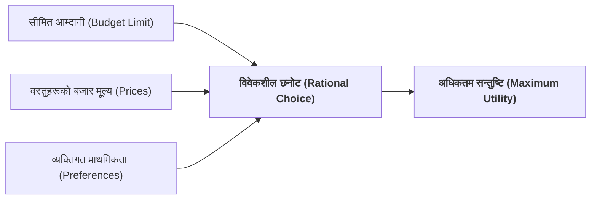

## १. उपभोक्ता र उपभोक्ताको व्यवहारको आधारभूत स्वरूप

अर्थशास्त्रको अध्ययनमा बजारको माग पक्षलाई बुझ्न **उपभोक्ता (Consumer)** र उसको **व्यवहार (Consumer Behaviour)** लाई केन्द्रविन्दुमा राखिन्छ:

| आयाम (Dimension) | मुख्य प्रश्न | सारसंक्षेप र अवधारणा |
| :--- | :---: | :--- |
| **१. अर्थ र परिभाषा** | *What?* | आवश्यकता पूरा गर्न वस्तु तथा सेवा उपभोग गर्ने अन्तिम निर्णय प्रक्रिया। |
| **२. उपभोक्ताका प्रकार** | *Who?* | व्यक्तिगत उपभोक्ता, घरायसी परिवार, र संस्थागत प्रयोगकर्ताहरू। |
| **३. अध्ययनको आवश्यकता** | *Why?* | सीमित आम्दानीबाट कुल सन्तुष्टि (Utility) अधिकतम बनाउन। |
| **४. निर्णयका चरणहरू** | *When?* | आवश्यकता महसुस, विकल्प खोजी, र खरिद निर्णयका क्रममा। |
| **५. बजार क्षेत्र** | *Where?* | परम्परागत भौतिक बजार र आधुनिक डिजिटल ई-कमर्स बजारमा। |
| **६. निर्णय विधि** | *How?* | आर्थिक विवेकशीलता (Rationality) र सीमान्त लाभ-लागत तुलनामार्फत। |

---

### क) उपभोक्ता र उपभोक्ताको व्यवहार के हो? (What is Consumer & Consumer Behaviour?)
* **उपभोक्ता (Consumer):** आफ्नो प्रत्यक्ष व्यक्तिगत वा पारिवारिक आवश्यकता पूरा गर्न बजारबाट वस्तु तथा सेवाहरू खरिद गरी उपभोग गर्ने अन्तिम आर्थिक एकाइलाई **उपभोक्ता** भनिन्छ। उपभोक्ता उत्पादनको अन्तिम बिन्दु हो।
* **उपभोक्ताको व्यवहार (Consumer Behaviour):** उपभोक्ताले आफ्नो सीमित आम्दानीलाई बजारमा उपलब्ध विभिन्न वस्तु तथा सेवाहरूमा कसरी बाँडफाँट गर्छ र खरिद निर्णय लिन्छ भन्ने समग्र **निर्णय प्रक्रिया, मनोवैज्ञानिक प्राथमिकता र आर्थिक आचरणलाई** उपभोक्ताको व्यवहार भनिन्छ।

---

### ख) उपभोक्ता को-को हुन सक्छन्? (Who are Consumers?)
अर्थशास्त्रमा उपभोक्ता भन्नाले निम्न व्यक्ति वा समूहहरूलाई जनाउँछ:
1. **व्यक्तिगत उपभोक्ता (Individual Consumer):** आफ्ना व्यक्तिगत आवश्यकताका लागि सामान किन्ने व्यक्ति (जस्तै: विद्यार्थीले किताब किन्नु, बिरामीले औषधि किन्नु)।
2. **परिवार वा घरायसी क्षेत्र (Household):** संयुक्त उपभोगका लागि निर्णय गर्ने पारिवारिक एकाइ (जस्तै: चामल, ग्यास, टेलिविजन खरिद गर्ने परिवार)।
3. **संस्थागत उपभोक्ता (Institutional Consumers):** अस्पताल, विद्यालय, अनाथालय आदि जसले आफ्ना सदस्यहरूको कल्याणका लागि अन्तिम उपभोग्य वस्तुहरू खरिद गर्छन्।

*(नोट: नाफा कमाउन वा पुनः बिक्री गर्न सामान किन्ने व्यापारीलाई उपभोक्ता मानिँदैन, ऊ मध्यस्थकर्ता वा उत्पादक हो।)*

---

### ग) उपभोक्ताको व्यवहार किन अध्ययन गरिन्छ? (Why Study Consumer Behaviour?)
* **अधिकतम सन्तुष्टि प्राप्त गर्न (Utility Maximisation):** मानव आवश्यकताहरू असीमित छन् तर ती पूरा गर्ने आम्दानी सीमित छ। उपभोक्ताले आफ्नो प्रत्येक रुपैयाँबाट अधिकतम उपयोगिता कसरी पाउन सक्छ भन्ने बुझ्न यो अध्ययन गरिन्छ।
* **बजार मागको आधार बुझ्न (Derivation of Demand):** बजारमा माग किन घट्छ वा बढ्छ भन्ने कुरा उपभोक्ताको व्यक्तिगत व्यवहारमै निर्भर हुन्छ।
* **उत्पादकलाई रणनीति बनाउन (Business Strategies):** उपभोक्ताको रुचि, प्राथमिकता र क्रय व्यवहार थाहा पाएर मात्र उत्पादकले सही वस्तु उत्पादन र मूल्य निर्धारण गर्न सक्छ।
* **सरकारी नीति निर्माण गर्न (Public Policy):** कर लगाउँदा वा अनुदान दिँदा उपभोक्ताको क्रयशक्तिमा कस्तो असर पर्छ भनी विश्लेषण गर्न।

---

### घ) उपभोक्ताको व्यवहार कहिले प्रकट हुन्छ? (When does Consumer Behaviour happen?)
उपभोक्ताको व्यवहार निम्न समय र चरणहरूमा प्रकट हुन्छ:
1. **आवश्यकता महसुस हुँदा (Problem Recognition):** जब कुनै अभाव वा चाहना उत्पन्न हुन्छ।
2. **विकल्पहरूको खोजी गर्दा (Information Search):** बजारमा उपलब्ध विभिन्न ब्रान्ड र मूल्यहरूको जानकारी संकलन गर्दा।
3. **मूल्याङ्कन र खरिद निर्णय गर्दा (Purchase Decision):** आफ्नो बजेट अनुसार सबैभन्दा उत्तम विकल्प छनोट गर्दा।
4. **उपभोगपछिको प्रतिक्रियामा (Post-purchase Evaluation):** वस्तु प्रयोग गरेपछि सन्तुष्टि वा असन्तुष्टि महसुस हुँदा।

---

### ङ) उपभोग व्यवहार कहाँ देखिन्छ? (Where does it take place?)
* **भौतिक बजारमा (Physical Markets):** पसल, डिपार्टमेन्ट स्टोर, तरकारी बजार जहाँ क्रेता र बिक्रेता प्रत्यक्ष मोलतोल गर्छन्।
* **अनलाइन / डिजिटल बजारमा (E-commerce / Digital Marketplaces):** दराज (Daraz), अमेजन जस्ता अनलाइन प्लेटफर्महरूमा मूल्य र समीक्षा हेरेर गरिने छनोटमा।
* **सार्वजनिक सेवाहरूमा (Public Utilities):** बिजुली, खानेपानी, सार्वजनिक यातायात उपभोग गर्दा।

---

### च) उपभोक्ताले निर्णय कसरी लिन्छ? (How do Consumers Decide? - Economic Rationality)
अर्थशास्त्रले उपभोक्तालाई **विवेकशील आर्थिक मानव (Rational Economic Agent)** मान्दछ। उसले निम्न तरिकाले निर्णय गर्दछ:

$$\text{उपभोक्ताको मुख्य लक्ष्य: } \max U(X, Y) \quad \text{Subject to: } P_x X + P_y Y \le M$$

1. **सीमान्त लाभ र सीमान्त लागतको तुलना गरेर:** उपभोक्ताले कुनै वस्तुको थप एकाइ खरिद गर्दा त्यसबाट प्राप्त हुने **सीमान्त सन्तुष्टि ($MU$)** र त्यसका लागि तिर्नुपर्ने **मूल्य ($P$)** बीच तुलना गर्छ।
2. **प्रतिस्थापनको नियम प्रयोग गरेर:** एउटा वस्तु महँगो भएमा सस्तो प्रतिस्थापक वस्तु छनोट गर्छ।
3. **बजेट सीमामा रहेर:** आफ्नो कुल आम्दानीभन्दा बढी खर्च नगरी सन्तुष्टिको सन्तुलन मिलाउँछ।

---

## २. उपभोक्ताको व्यवहार अध्ययनका दुई मुख्य दृष्टिकोणहरू (Two Main Approaches)

| दृष्टिकोण | मुख्य प्रतिपादक | उपयोगिता मापन विधि | मुख्य नियमहरू |
| :--- | :--- | :--- | :--- |
| **१. गणनावाचक दृष्टिकोण (Cardinal Approach)** | अल्फ्रेड मार्शल, गोसेन, जेभोन्स | उपयोगितालाई संख्या (१, २, ३ Utils) मा नाप्न सकिन्छ। | • सीमान्त उपयोगिता ह्रास नियम (DMU) • सम-सीमान्त उपयोगिता नियम |
| **२. क्रमवाचक दृष्टिकोण (Ordinal Approach)** | जे. आर. हिक्स, आर. जी. डी. एलेन | उपयोगितालाई संख्यामा होइन, प्राथमिकता वा क्रम (Rank) मा राखिन्छ। | • तटस्थता वक्ररेखा विश्लेषण (Indifference Curve Analysis) |

---

## 📌 परीक्षा उपयोगी सारांश (Key Takeaways)
* **उपभोक्ता** वस्तु तथा सेवाको अन्तिम उपभोगकर्ता हो।
* **उपभोक्ताको व्यवहार** ले सीमित साधनबाट अधिकतम सन्तुष्टि प्राप्त गर्ने निर्णय प्रक्रियालाई जनाउँछ।
* उपभोक्ता सधैं **विवेकशील (Rational)** हुन्छ र आफ्नो उपयोगिता अधिकतम बनाउन चाहन्छ।
* उपभोक्ता व्यवहारको विश्लेषण **गणनावाचक (मार्शल)** र **क्रमवाचक (हिक्स र एलेन)** दुई दृष्टिकोणबाट गरिन्छ।
