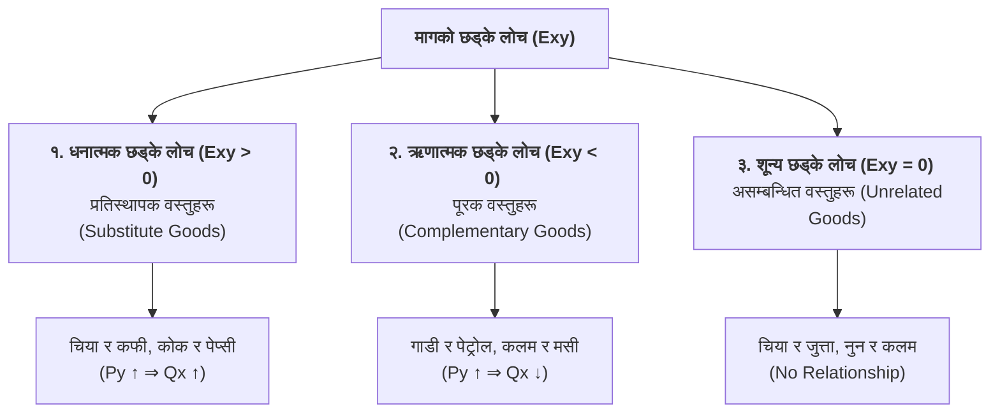

## १. मागको छड्के लोचको अर्थ र अवधारणा (Concept of Cross Elasticity - $E_{xy}$)

वास्तविक बजारमा कुनै एउटा वस्तुको माग केवल त्यसै वस्तुको मूल्यमा मात्र भर पर्दैन, बजारमा रहेका अन्य सम्बन्धित वस्तुहरूको मूल्यले पनि प्रत्यक्ष प्रभाव पार्दछ। सम्बन्धित वस्तुको मूल्य परिवर्तन हुँदा अर्को वस्तुको मागमा कति मात्रामा परिवर्तन आउँछ भनी मापन गर्न **मागको छड्के लोच** प्रयोग गरिन्छ।

> **परिभाषा:** अन्य कुराहरू स्थिर रहँदा, सम्बन्धित **वस्तु $Y$ को मूल्यमा आएको प्रतिशत परिवर्तनका कारण** **वस्तु $X$ को माग परिमाणमा आउने प्रतिशत परिवर्तनको अनुपातलाई** मागको छड्के लोच भनिन्छ।

### सूत्र (Formula):
$$E_{xy} = \frac{\text{वस्तु X को माग परिमाणमा प्रतिशत परिवर्तन}}{\text{वस्तु Y को मूल्यमा प्रतिशत परिवर्तन}} = \frac{\%\Delta Q_x}{\%\Delta P_y}$$

$$E_{xy} = \frac{\Delta Q_x}{\Delta P_y} \times \frac{P_y}{Q_x}$$

जहाँ,  
* $P_y = P_{y0}$ (वस्तु $Y$ को प्रारम्भिक मूल्य)  
* $Q_x = Q_{x0}$ (वस्तु $X$ को प्रारम्भिक माग परिमाण)  
* $\Delta P_y = P_{y1} - P_{y0}$ (वस्तु $Y$ को मूल्यमा परिवर्तन)  
* $\Delta Q_x = Q_{x1} - Q_{x0}$ (वस्तु $X$ को माग परिमाणमा परिवर्तन)  

---

## २. मागको छड्के लोचका प्रकारहरू (Types of Cross Elasticity of Demand)

वस्तुहरू बीचको आपसी सम्बन्धका आधारमा छड्के लोचलाई तीन प्रकारमा वर्गीकरण गरिन्छ:

---

### १. धनात्मक छड्के लोच (Positive Cross Elasticity: $E_{xy} > 0$)
* **सम्बन्धित वस्तुहरू:** **प्रतिस्थापक वस्तुहरू (Substitute Goods)** — अर्थात् एउटा वस्तुको सट्टामा अर्को वस्तु प्रयोग गर्न सकिने वस्तुहरू (जस्तै: चिया र कफी, कोक र पेप्सी)।
* **नियम:** जब वस्तु $Y$ (चिया) को मूल्य बढ्छ, तब चिया महँगो भएर मानिसहरू कफी पिउन थाल्छन्, जसले गर्दा वस्तु $X$ (कफी) को माग बढ्छ ($P_y \uparrow \implies Q_x \uparrow$)।
* **वक्ररेखाको प्रकृति:** प्रतिस्थापक वस्तुहरूको छड्के माग वक्ररेखा बायाँबाट दायाँ **माथितिर झुकेको (Upward Sloping)** हुन्छ।

---

### २. ऋणात्मक छड्के लोच (Negative Cross Elasticity: $E_{xy} < 0$)
* **सम्बन्धित वस्तुहरू:** **पूरक वस्तुहरू (Complementary Goods)** — अर्थात् एउटै आवश्यकता पूरा गर्न एकसाथ प्रयोग गरिने वस्तुहरू (जस्तै: गाडी र पेट्रोल, कलम र मसी, चिया र चिनी)।
* **नियम:** जब वस्तु $Y$ (पेट्रोल) को मूल्य बढ्छ, गाडी चलाउन महँगो पर्ने भएकाले वस्तु $X$ (गाडी वा मोटरसाइकल) को माग घट्छ ($P_y \uparrow \implies Q_x \downarrow$)।
* **वक्ररेखाको प्रकृति:** पूरक वस्तुहरूको छड्के माग वक्ररेखा बायाँबाट दायाँ **तलतिर झुकेको (Downward Sloping)** हुन्छ।

---

### ३. शून्य छड्के लोच (Zero Cross Elasticity: $E_{xy} = 0$)
* **सम्बन्धित वस्तुहरू:** **असम्बन्धित वस्तुहरू (Unrelated Goods)** — अर्थात् एकअर्कासँग कुनै आर्थिक सम्बन्ध नभएका वस्तुहरू (जस्तै: चिया र जुत्ता, चामल र पाठ्यपुस्तक)।
* **नियम:** एउटा वस्तुको मूल्य जतिसुकै बढे वा घटे पनि अर्को वस्तुको मागमा कुनै असर पर्दैन।

---

## ३. छड्के लोचको सारांश तालिका (Summary Table)

| छड्के लोचको मान ($E_{xy}$) | वस्तुहरू बीचको सम्बन्ध | मूल्य र मागको अन्तरसम्बन्ध | उदाहरणहरू |
| :---: | :--- | :--- | :--- |
| **$E_{xy} > 0$ (धनात्मक)** | **प्रतिस्थापक वस्तुहरू (Substitutes)** | वस्तु $Y$ को मूल्य बढ्दा वस्तु $X$ को माग बढ्ने ($P_y \uparrow \implies Q_x \uparrow$) | चिया र कफी, सेमुएल र कोकाकोला |
| **$E_{xy} < 0$ (ऋणात्मक)** | **पूरक वस्तुहरू (Complements)** | वस्तु $Y$ को मूल्य बढ्दा वस्तु $X$ को माग घट्ने ($P_y \uparrow \implies Q_x \downarrow$) | गाडी र पेट्रोल, चिया र चिनी |
| **$E_{xy} = 0$ (शून्य)** | **असम्बन्धित वस्तुहरू (Unrelated)** | कुनै सम्बन्ध नहुने | कलम र चामल |

---

## ४. उदाहरणीय संख्यात्मक समस्याहरू (Solved Numerical Examples)

### 📌 संख्यात्मक उदाहरण १: प्रतिस्थापक वस्तुहरू (Substitute Goods)
**प्रश्न:** चियाको मूल्य प्रति कप रु. २० बाट बढेर रु. ३० पुग्दा बजारमा कफीको माग १०० कपबाट बढेर १५० कप पुग्छ।  
(क) कफीको मागको छड्के लोच ($E_{xy}$) गणना गर्नुहोस्।  
(ख) प्राप्त नतिजाका आधारमा चिया र कफी बीचको सम्बन्ध स्पष्ट पार्नुहोस्।

#### 💡 समाधान:
दिइएको छ:
* वस्तु $Y$ (चिया) को प्रारम्भिक मूल्य ($P_y$) = रु. २०, \quad नयाँ मूल्य ($P_{y1}$) = रु. ३०  
  $$\Delta P_y = P_{y1} - P_y = 30 - 20 = \text{रु. } 10$$
* वस्तु $X$ (कफी) को प्रारम्भिक माग ($Q_x$) = १०० कप, \quad नयाँ माग ($Q_{x1}$) = १५० कप  
  $$\Delta Q_x = Q_{x1} - Q_x = 150 - 100 = 50 \text{ कप}$$

मागको छड्के लोचको सूत्र अनुसार:
$$E_{xy} = \frac{\Delta Q_x}{\Delta P_y} \times \frac{P_y}{Q_x}$$
$$E_{xy} = \frac{50}{10} \times \frac{20}{100} = 5 \times 0.2 = \mathbf{+1.0}$$

**सम्बन्ध व्याख्या:**
* यहाँ **$E_{xy} = +1.0$ (धनात्मक)** आएको छ।
* यसले देखाउँछ कि चियाको मूल्य बढ्दा कफीको माग बढेको छ। अतः चिया र कफी एकआपसमा **प्रतिस्थापक वस्तुहरू (Substitute Goods)** हुन्।

---

### 📌 संख्यात्मक उदाहरण २: पूरक वस्तुहरू (Complementary Goods)
**प्रश्न:** पेट्रोलको मूल्य प्रति लिटर रु. १०० बाट बढेर रु. १२० पुग्दा बजारमा मोटरसाइकलको मासिक माग ५०० वटाबाट घटेर ४०० वटामा झर्छ।  
(क) मोटरसाइकलको मागको छड्के लोच ($E_{xy}$) गणना गर्नुहोस्।  
(ख) प्राप्त नतिजाका आधारमा पेट्रोल र मोटरसाइकल बीचको सम्बन्ध स्पष्ट पार्नुहोस्।

#### 💡 समाधान:
दिइएको छ:
* वस्तु $Y$ (पेट्रोल) को प्रारम्भिक मूल्य ($P_y$) = रु. १००, \quad नयाँ मूल्य ($P_{y1}$) = रु. १२०  
  $$\Delta P_y = P_{y1} - P_y = 120 - 100 = \text{रु. } 20$$
* वस्तु $X$ (मोटरसाइकल) को प्रारम्भिक माग ($Q_x$) = ५०० वटा, \quad नयाँ माग ($Q_{x1}$) = ४०० वटा  
  $$\Delta Q_x = Q_{x1} - Q_x = 400 - 500 = -100 \text{ वटा}$$

मागको छड्के लोचको सूत्र अनुसार:
$$E_{xy} = \frac{\Delta Q_x}{\Delta P_y} \times \frac{P_y}{Q_x}$$
$$E_{xy} = \frac{-100}{20} \times \frac{100}{500} = -5 \times 0.2 = \mathbf{-1.0}$$

**सम्बन्ध व्याख्या:**
* यहाँ **$E_{xy} = -1.0$ (ऋणात्मक)** आएको छ।
* यसले पेट्रोल महँगो हुँदा मोटरसाइकलको माग घटेको देखाउँछ। अतः पेट्रोल र मोटरसाइकल एकआपसमा **पूरक वस्तुहरू (Complementary Goods)** हुन्।

---

## 📌 परीक्षा उपयोगी सारांश (Key Takeaways)
* **मागको छड्के लोच ($E_{xy}$)** ले सम्बन्धित वस्तुको मूल्य परिवर्तनप्रति मागको संवेदनशीलता नाप्छ।
* **प्रतिस्थापक वस्तुहरूका लागि $E_{xy} > 0$ (धनात्मक)** हुन्छ।
* **पूरक वस्तुहरूका लागि $E_{xy} < 0$ (ऋणात्मक)** हुन्छ।
* **असम्बन्धित वस्तुहरूका लागि $E_{xy} = 0$ (शून्य)** हुन्छ।
