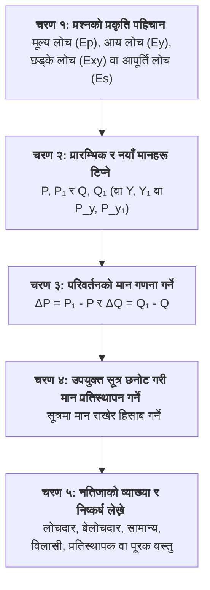
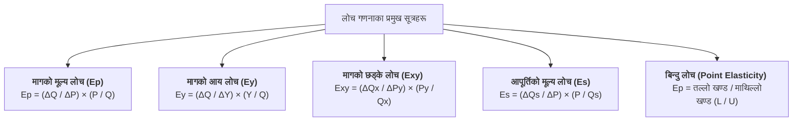

## १. लोचका गणितीय समस्या समाधान गर्ने कार्यविधि (Process of Solving Elasticity Numericals)

कक्षा ११ को परीक्षामा लोचसम्बन्धी गणितीय समस्याहरू सही तरिकाले समाधान गर्न निम्न चरणबद्ध कार्यविधि अपनाउनुहोस्:

### प्रमुख सूत्रहरू (Formula Reference Sheet):

---

## २. उदाहरणीय गणितीय समस्याहरू र समाधान (Solved Numerical Problems)

### 📌 समस्या १: प्रतिशत विधिबाट मूल्य लोच गणना (Percentage Method)
**प्रश्न:** कुनै वस्तुको प्रति एकाइ मूल्य रु. २० बाट बढेर रु. २५ पुग्दा त्यसको माग परिमाण १०० एकाइबाट घटेर ७५ एकाइ हुन्छ।  
(क) मागको मूल्य लोच ($E_p$) गणना गर्नुहोस्।  
(ख) मागको प्रकृतिको व्याख्या गर्नुहोस्।

#### 💡 समाधान:
दिइएको छ:
* प्रारम्भिक मूल्य ($P$) = रु. २०, \quad नयाँ मूल्य ($P_1$) = रु. २५  
  $$\Delta P = P_1 - P = 25 - 20 = \text{रु. } 5$$
* प्रारम्भिक माग ($Q$) = १०० एकाइ, \quad नयाँ माग ($Q_1$) = ७५ एकाइ  
  $$\Delta Q = Q_1 - Q = 75 - 100 = -25 \text{ एकाइ}$$

मागको मूल्य लोचको सूत्र अनुसार:
$$E_p = -\left(\frac{\Delta Q}{\Delta P} \times \frac{P}{Q}\right)$$
$$E_p = -\left(\frac{-25}{5} \times \frac{20}{100}\right) = -(-5 \times 0.2) = \mathbf{1}$$

**निष्कर्ष:**
* **मागको मूल्य लोच ($E_p$) = १** हुन्छ।
* यसको प्रकृति **एकाइ लोचदार माग (Unitary Elastic Demand)** हो, किनभने मूल्यमा २५% वृद्धि हुँदा माग परिमाणमा पनि ठ्याक्कै २५% ले कमी आएको छ।

---

### 📌 समस्या २: कुल खर्च विधिबाट लोच पहिचान (Total Outlay Method)
**प्रश्न:** तल दिइएको तालिकाका आधारमा कुल खर्च गणना गर्नुहोस् र वस्तुको मागको मूल्य लोचको प्रकृति (Elastic, Inelastic वा Unitary) छुट्याउनुहोस्:

| मूल्य ($P$ रु. मा) | माग परिमाण ($Q$ एकाइमा) |
| :---: | :---: |
| ५० | १० |
| ४० | १५ |
| ३० | २० |
| २० | २५ |

#### 💡 समाधान:
कुल खर्च ($TE = P \times Q$) गणना गरौं:

| मूल्य ($P$ रु.) | माग ($Q$ एकाइ) | कुल खर्च ($TE = P \times Q$) | अवस्था र परिवर्तन | लोचको मान ($E_p$) |
| :---: | :---: | :---: | :---: | :---: |
| ५० | १० | रु. ५०० | सुरुको अवस्था | - |
| ४० | १५ | रु. ६०० | मूल्य घट्दा कुल खर्च बढ्यो ↑ | **$E_p > 1$ (सापेक्षिक लोचदार)** |
| ३० | २० | रु. ६०० | मूल्य घट्दा कुल खर्च स्थिर रह्यो | **$E_p = 1$ (एकाइ लोचदार)** |
| २० | २५ | रु. ५०० | मूल्य घट्दा कुल खर्च घट्यो ↓ | **$E_p < 1$ (सापेक्षिक बेलोचदार)** |

---

### 📌 समस्या ३: रैखिक माग समीकरणबाट बिन्दु लोच गणना (Point Elasticity)
**प्रश्न:** कुनै वस्तुको बजार माग समीकरण $Q_d = 200 - 4P$ दिइएको छ।  
(क) जब मूल्य $P = \text{रु. } 10$ हुन्छ, बिन्दु मूल्य लोच पत्ता लगाउनुहोस्।  
(ख) जब मूल्य $P = \text{रु. } 25$ हुन्छ, बिन्दु मूल्य लोच पत्ता लगाउनुहोस्।

#### 💡 समाधान:
माग समीकरण $Q_d = 200 - 4P$ बाट:  
यहाँ ढाल गुणांक $\frac{\Delta Q_d}{\Delta P} = -4$ हुन्छ।

**(क) जब मूल्य $P = \text{रु. } 10$ हुन्छ:**  
* माग परिमाण ($Q$) = $200 - 4(10) = 200 - 40 = 160 \text{ एकाइ}$  
$$E_p = -\left(\frac{\Delta Q}{\Delta P} \times \frac{P}{Q}\right) = -(-4) \times \frac{10}{160} = \frac{40}{160} = \mathbf{0.25}$$  
*यहाँ $E_p = 0.25 < 1$ भएकोले यो **सापेक्षिक बेलोचदार माग** हो।*

**(ख) जब मूल्य $P = \text{रु. } 25$ हुन्छ:**  
* माग परिमाण ($Q$) = $200 - 4(25) = 200 - 100 = 100 \text{ एकाइ}$  
$$E_p = -\left(\frac{\Delta Q}{\Delta P} \times \frac{P}{Q}\right) = -(-4) \times \frac{25}{100} = \frac{100}{100} = \mathbf{1.00}$$  
*यहाँ $E_p = 1$ भएकोले यो **एकाइ लोचदार माग (मध्यबिन्दु)** हो।*

---

### 📌 समस्या ४: मागको आय लोच गणना (Income Elasticity)
**प्रश्न:** एकजना उपभोक्ताको मासिक आम्दानी रु. ३०,००० बाट बढेर रु. ४०,००० पुग्दा उसले खरिद गर्ने घिउको माग १० केजीबाट बढेर १५ केजी पुग्छ।  
(क) घिउको मागको आय लोच ($E_y$) गणना गर्नुहोस्।  
(ख) यो वस्तु सामान्य, विलासी वा निम्नस्तरको के हो, पुष्टि गर्नुहोस्।

#### 💡 समाधान:
दिइएको छ:
* $Y = 30,000, \quad Y_1 = 40,000 \implies \Delta Y = 40,000 - 30,000 = \text{रु. } 10,000$
* $Q = 10 \text{ kg}, \quad Q_1 = 15 \text{ kg} \implies \Delta Q = 15 - 10 = 5 \text{ kg}$

आय लोचको सूत्र अनुसार:
$$E_y = \frac{\Delta Q}{\Delta Y} \times \frac{Y}{Q} = \frac{5}{10,000} \times \frac{30,000}{10} = \frac{150,000}{100,000} = \mathbf{1.5}$$

**पुष्टि:**  
* यहाँ **$E_y = 1.5 > 1$ (धनात्मक र एकभन्दा बढी)** छ।  
* त्यसैले घिउ यस उपभोक्ताका लागि **विलासिताको सामान्य वस्तु (Luxury / Superior Normal Good)** हो।

---

### 📌 समस्या ५: मागको छड्के लोच गणना (Cross Elasticity)
**प्रश्न:** चियाको मूल्य प्रति कप रु. २० बाट बढेर रु. २५ पुग्दा कफीको माग ५० कपबाट बढेर ७० कप पुग्छ।  
(क) कफीको मागको छड्के लोच ($E_{xy}$) गणना गर्नुहोस्।  
(ख) चिया र कफी बीचको सम्बन्ध कस्तो छ?

#### 💡 समाधान:
दिइएको छ:
* चियाको मूल्य ($P_y$) = रु. २०, \quad $P_{y1}$ = रु. २५ $\implies \Delta P_y = 25 - 20 = \text{रु. } 5$
* कफीको माग ($Q_x$) = ५० कप, \quad $Q_{x1}$ = ७० कप $\implies \Delta Q_x = 70 - 50 = 20 \text{ कप}$

छड्के लोचको सूत्र अनुसार:
$$E_{xy} = \frac{\Delta Q_x}{\Delta P_y} \times \frac{P_y}{Q_x} = \frac{20}{5} \times \frac{20}{50} = 4 \times 0.4 = \mathbf{1.6}$$

**सम्बन्ध:**  
* यहाँ **$E_{xy} = +1.6$ (धनात्मक)** छ।  
* त्यसैले चिया र कफी एकआपसमा **प्रतिस्थापक वस्तुहरू (Substitute Goods)** हुन्।

---

### 📌 समस्या ६: आपूर्तिको मूल्य लोच गणना (Price Elasticity of Supply)
**प्रश्न:** कुनै वस्तुको बजार मूल्य रु. १० बाट बढेर रु. १५ पुग्दा उत्पादकले बजारमा गर्ने आपूर्ति परिमाण ४० एकाइबाट बढेर ८० एकाइ पुग्छ। आपूर्तिको मूल्य लोच ($E_s$) पत्ता लगाउनुहोस्।

#### 💡 समाधान:
दिइएको छ:
* $P = 10, \quad P_1 = 15 \implies \Delta P = 15 - 10 = \text{रु. } 5$
* $Q_s = 40, \quad Q_{s1} = 80 \implies \Delta Q_s = 80 - 40 = 40 \text{ एकाइ}$

आपूर्तिको लोचको सूत्र अनुसार:
$$E_s = \frac{\Delta Q_s}{\Delta P} \times \frac{P}{Q_s} = \frac{40}{5} \times \frac{10}{40} = 8 \times 0.25 = \mathbf{2}$$

**निष्कर्ष:**  
* **$E_s = 2 > 1$** भएकोले यो **सापेक्षिक लोचदार आपूर्ति (Relatively Elastic Supply)** हो।

---

## ३. स्व-मूल्याङ्कन परीक्षा अभ्यास प्रश्नहरू (Self-Practice Problems)

### ✍️ अभ्यास प्रश्न १:
जब कुनै वस्तुको मूल्य रु. ५० बाट घटेर रु. ४० हुन्छ, त्यसको माग परिमाण २०० एकाइबाट बढेर ३०० एकाइ पुग्छ। मागको मूल्य लोच ($E_p$) गणना गर्नुहोस् र यसको प्रकृतिको व्याख्या गर्नुहोस्।

### ✍️ अभ्यास प्रश्न २:
कुनै वस्तुको मूल्य रु. १०० हुँदा उपभोक्ताले ५०० एकाइ माग गर्दछ। यदि मागको मूल्य लोच $|E_p| = 1.5$ छ र मूल्य १०% ले घट्यो भने नयाँ माग परिमाण कति हुन्छ?

### ✍️ अभ्यास प्रश्न ३:
तल दिइएको तालिका पूरा गरी कुल खर्च विधिबाट मागको मूल्य लोचको प्रकृति छुट्याउनुहोस्:

| मूल्य ($P$ रु. मा) | माग परिमाण ($Q$ एकाइमा) | कुल खर्च ($TE = P \times Q$) | लोचको प्रकृति |
| :---: | :---: | :---: | :---: |
| १० | १०० | ? | ? |
| १२ | ९० | ? | ? |
| १५ | ८० | ? | ? |

### ✍️ अभ्यास प्रश्न ४:
पेट्रोलको मूल्य प्रति लिटर रु. १५० बाट बढेर रु. १८० पुग्दा मोटरसाइकलको माग महिनामा १००० वटाबाट घटेर ८०० वटामा झर्छ। मोटरसाइकलको मागको छड्के लोच ($E_{xy}$) निकाली वस्तुहरूको सम्बन्ध स्पष्ट पार्नुहोस्।

---

## 🔑 अभ्यास प्रश्नहरूको उत्तर कुञ्जिका (Answer Keys)

* **प्रश्न १:** $\Delta P = -10, \Delta Q = 100 \implies E_p = \frac{100}{10} \times \frac{50}{200} = \mathbf{2.5}$ *(सापेक्षिक लोचदार)*
* **प्रश्न २:** मागमा आउने प्रतिशत वृद्धि = $1.5 \times 10\% = 15\%$। नयाँ माग = $500 + (15\% \text{ of } 500) = 500 + 75 = \mathbf{575 \text{ एकाइ}}$।
* **प्रश्न ३:**
  * $P=10 \implies TE = \text{रु. } 1000$
  * $P=12 \implies TE = \text{रु. } 1080$ ($P \uparrow, TE \uparrow \implies \mathbf{E_p < 1}$)
  * $P=15 \implies TE = \text{रु. } 1200$ ($P \uparrow, TE \uparrow \implies \mathbf{E_p < 1}$)
* **प्रश्न ४:** $\Delta P = 30, \Delta Q = -200 \implies E_{xy} = \frac{-200}{30} \times \frac{150}{1000} = \mathbf{-1.0}$ *(ऋणात्मक, त्यसैले पेट्रोल र मोटरसाइकल **पूरक वस्तुहरू (Complements)** हुन्)*
