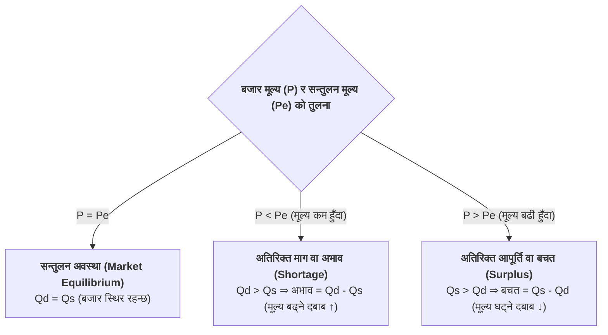

## १. बजार सन्तुलनका गणितीय समस्या समाधान गर्ने विधि (Step-by-Step Solving Guide)

कक्षा ११ को राष्ट्रिय परीक्षा बोर्ड (NEB) को अर्थशास्त्र परीक्षामा बजार सन्तुलनका गणितीय समस्याहरू (Numerical Problems) समाधान गर्न निम्न ५-चरण कार्यविधि अपनाउनुहोस्:

| चरण (Step) | मुख्य कार्य (Action) | गणितीय विधि तथा सर्त (Formula & Condition) | कार्य विवरण (Description) |
| :--- | :--- | :---: | :--- |
| **चरण १: समीकरण पहिचान** | माग र आपूर्ति समीकरण टिप्ने | $Q_D = a - bP$ र $Q_S = c + dP$ | प्रश्नमा दिइएका माग र आपूर्ति फलनहरू स्पष्ट रूपमा लेख्ने। |
| **चरण २: सन्तुलन सर्त लागू** | माग र आपूर्ति बराबर गर्ने | $Q_D = Q_S$ | बजार सन्तुलनको आधारभूत सर्त अनुसार दुवै समीकरणलाई बराबर राख्ने। |
| **चरण ३: सन्तुलन मूल्य गणना** | समीकरण हल गरी $P_e$ निकाल्ने | $a - bP = c + dP \implies P_e = \frac{a - c}{b + d}$ | समान चरहरूलाई एकातिर ल्याई मूल्य ($P_e$) को मान पत्ता लगाउने। |
| **चरण ४: सन्तुलन परिमाण गणना** | $P_e$ को मान प्रतिस्थापन गर्ने | $Q_e = a - b(P_e) \text{ वा } c + d(P_e)$ | पत्ता लागेको सन्तुलन मूल्यलाई माग वा आपूर्ति समीकरणमा राखी $Q_e$ निकाल्ने। |
| **चरण ५: बजार अवस्था विश्लेषण** | अभाव / बचत वा तालिका निर्माण | $P < P_e \implies \text{Shortage}$ $P > P_e \implies \text{Surplus}$ | यदि तालिका वा कुनै विशेष मूल्यमा बजार अवस्था सोधिएको छ भने मान राखेर तुलना गर्ने। |

---

### बजार सन्तुलनका निर्णय नियमहरू (Equilibrium Decision Rules):

---

## २. मुख्य गणितीय समस्याहरू र विस्तृत समाधान (Solved Numerical Problems)

### 📌 समस्या १ (Problem 1)
**प्रश्न:** कुनै वस्तुको बजार माग र आपूर्ति फलन निम्न अनुसार दिइएको छ:
$$Q_D = 320 - 4P \quad \text{र} \quad Q_S = -80 + 4P$$
(a) बजार सन्तुलन मूल्य (Equilibrium Price) पत्ता लगाउनुहोस्।  
(b) बजार सन्तुलन परिमाण (Equilibrium Quantity) पत्ता लगाउनुहोस्।  
(c) जब बजार मूल्य रु. ३० हुन्छ, बजारमा कुन अवस्था सिर्जना हुन्छ?  
(d) जब बजार मूल्य रु. ६० हुन्छ, बजारमा कुन अवस्था सिर्जना हुन्छ?

---

#### 💡 विस्तृत समाधान (Solution):

**(a) सन्तुलन मूल्य ($P_e$) निर्धारण:**  
हामीलाई थाहा छ, बजार सन्तुलनको सर्त अनुसार:
$$Q_D = Q_S$$
$$320 - 4P = -80 + 4P$$
$$320 + 80 = 4P + 4P$$
$$400 = 8P$$
$$P_e = \frac{400}{8} = \mathbf{\text{रु. } 50}$$

अत: **बजार सन्तुलन मूल्य ($P_e$) = रु. ५०** हुन्छ।

---

**(b) सन्तुलन परिमाण ($Q_e$) निर्धारण:**  
सन्तुलन मूल्य $P = 50$ लाई माग समीकरण ($Q_D$) मा प्रतिस्थापन गर्दा:
$$Q_e = 320 - 4(50)$$
$$Q_e = 320 - 200 = \mathbf{120 \text{ एकाइ (Units)}}$$

*(परीक्षण: $Q_S = -80 + 4(50) = -80 + 200 = 120$ एकाइ)*  
अत: **बजार सन्तुलन परिमाण ($Q_e$) = १२० एकाइ** हुन्छ।

---

**(c) जब बजार मूल्य $P = \text{रु. } 30$ हुन्छ:**  
* माग परिमाण ($Q_D$) = $320 - 4(30) = 320 - 120 = \mathbf{200 \text{ एकाइ}}$
* आपूर्ति परिमाण ($Q_S$) = $-80 + 4(30) = -80 + 120 = \mathbf{40 \text{ एकाइ}}$

यहाँ माग परिमाण आपूर्ति परिमाणभन्दा बढी छ ($Q_D > Q_S$ अर्थात $200 > 40$)।  
त्यसैले बजारमा **अतिरिक्त माग वा अभाव (Excess Demand / Shortage)** सिर्जना हुन्छ।  
$$\text{अभावको परिमाण (Shortage Amount)} = Q_D - Q_S = 200 - 40 = \mathbf{160 \text{ एकाइ}}$$

---

**(d) जब बजार मूल्य $P = \text{रु. } 60$ हुन्छ:**  
* माग परिमाण ($Q_D$) = $320 - 4(60) = 320 - 240 = \mathbf{80 \text{ एकाइ}}$
* आपूर्ति परिमाण ($Q_S$) = $-80 + 4(60) = -80 + 240 = \mathbf{160 \text{ एकाइ}}$

यहाँ आपूर्ति परिमाण माग परिमाणभन्दा बढी छ ($Q_S > Q_D$ अर्थात $160 > 80$)।  
त्यसैले बजारमा **अतिरिक्त आपूर्ति वा बचत (Excess Supply / Surplus)** सिर्जना हुन्छ।  
$$\text{बचतको परिमाण (Surplus Amount)} = Q_S - Q_D = 160 - 80 = \mathbf{80 \text{ एकाइ}}$$

---

### 📌 समस्या २ (Problem 2)
**प्रश्न:** एउटा चकलेट (Candy) को बजार माग समीकरण $Q_D = 300 - 20P$ र बजार आपूर्ति समीकरण $Q_S = 20P - 100$ दिइएको छ, जहाँ $P$ ले प्रति एकाइ चकलेटको मूल्य (रु. मा) र $Q$ ले परिमाण (एकाइमा) जनाउँछ।  
(a) विभिन्न मूल्यहरूमा माग परिमाण ($Q_D$) र आपूर्ति परिमाण ($Q_S$) गणना गरी बजार तालिका (Market Table) निर्माण गर्नुहोस्।  
(b) माथिको तालिकाको सहायताले बजार माग र आपूर्ति वक्ररेखाहरू खिच्नुहोस् तथा सन्तुलन मूल्य र परिमाण पत्ता लगाउनुहोस्।

---

#### 💡 विस्तृत समाधान (Solution):

**(a) बजार तालिकाको गणना (Computation of Table):**  
माग समीकरण: $Q_D = 300 - 20P$  
आपूर्ति समीकरण: $Q_S = 20P - 100$

विभिन्न मूल्यहरू ($P = 5, 8, 10, 12, 15$) मा मान गणना गरौं:
1. जब $P = 5$:  
   * $Q_D = 300 - 20(5) = 300 - 100 = 200$
   * $Q_S = 20(5) - 100 = 100 - 100 = 0$
2. जब $P = 8$:  
   * $Q_D = 300 - 20(8) = 300 - 160 = 140$
   * $Q_S = 20(8) - 100 = 160 - 100 = 60$
3. जब $P = 10$:  
   * $Q_D = 300 - 20(10) = 300 - 200 = 100$
   * $Q_S = 20(10) - 100 = 200 - 100 = 100$  **(सन्तुलन!)**
4. जब $P = 12$:  
   * $Q_D = 300 - 20(12) = 300 - 240 = 60$
   * $Q_S = 20(12) - 100 = 240 - 100 = 140$
5. जब $P = 15$:  
   * $Q_D = 300 - 20(15) = 300 - 300 = 0$
   * $Q_S = 20(15) - 100 = 300 - 100 = 200$

#### बजार माग र आपूर्ति तालिका:

| प्रति एकाइ मूल्य ($P$ रु. मा) | माग परिमाण ($Q_D$ एकाइ) | आपूर्ति परिमाण ($Q_S$ एकाइ) | बजारको अवस्था |
| :---: | :---: | :---: | :---: |
| ५ | २०० | ० | अतिरिक्त माग (Shortage = २००) |
| ८ | १४० | ६० | अतिरिक्त माग (Shortage = ८०) |
| **१०** | **१००** | **१००** | **सन्तुलन ($Q_D = Q_S = 100$)** |
| १२ | ६० | १४० | अतिरिक्त आपूर्ति (Surplus = ८०) |
| १५ | ० | २०० | अतिरिक्त आपूर्ति (Surplus = २००) |

---

**(b) रेखाचित्र निर्माण र सन्तुलन बिन्दु पहिचान:**  

माथिको तालिकामा रहेका माग र आपूर्तिको निर्देशांकहरूलाई रेखाचित्रमा उतार्दा:
* माग वक्ररेखा ($DD$) बायाँबाट दायाँ तलतिर झुक्छ।
* आपूर्ति वक्ररेखा ($SS$) बायाँबाट दायाँ माथितिर झुक्छ।
* दुवै वक्ररेखाहरू **बिन्दु $E$** मा एकआपसमा काटिन्छन्, जहाँ सन्तुलन मूल्य **$P_e = \text{रु. } 10$** र सन्तुलन परिमाण **$Q_e = 100 \text{ चकलेट}$** निर्धारण हुन्छ।

**निष्कर्ष तथा व्याख्या:**  
* **सन्तुलन मूल्य ($P_e$):** रु. १० प्रति चकलेट  
* **सन्तुलन परिमाण ($Q_e$):** १०० चकलेट (Candies)  
* जब मूल्य रु. १० भन्दा बढी (जस्तै: रु. १२) हुन्छ, बजारमा $140 - 60 = 80$ एकाइको **अतिरिक्त आपूर्ति (Surplus)** हुन्छ।  
* जब मूल्य रु. १० भन्दा कम (जस्तै: रु. ८) हुन्छ, बजारमा $140 - 60 = 80$ एकाइको **अतिरिक्त माग (Shortage)** हुन्छ।

---

## ३. परीक्षा लक्षित अभ्यास प्रश्नहरू (Self-Practice Questions)

### ✍️ अभ्यास प्रश्न १ (तालिका भर्ने र सन्तुलन निकाल्ने):
कुनै वस्तुको माग समीकरण $Q_d = 200 - 10P$ र आपूर्ति समीकरण $Q_s = -40 + 10P$ दिइएको छ।  
(क) मूल्य रु. ८, १०, १२, १४ र १६ हुँदा माग र आपूर्तिको तालिका तयार गर्नुहोस्।  
(ख) उक्त तालिकाबाट सन्तुलन मूल्य र सन्तुलन परिमाण पहिचान गर्नुहोस्।  
(ग) जब बजार मूल्य रु. ८ र रु. १६ हुन्छ, बजारमा कुन अवस्था (अभाव वा अतिरिक्त आपूर्ति) सिर्जना हुन्छ र कति परिमाणले?  

---

### ✍️ अभ्यास प्रश्न २ (समीकरणबाट सन्तुलन र रेखाचित्र):
मानौं स्याउको बजार माग $Q_D = 100 - 2P$ र बजार आपूर्ति $Q_S = 20 + 2P$ छ (जहाँ $P$ प्रति केजी मूल्य हो):  
(क) बजार सन्तुलन मूल्य र परिमाण गणितीय रूपमा पत्ता लगाउनुहोस्।  
(ख) $P = 10, 20, 30$ का लागि माग र आपूर्ति तालिका बनाउनुहोस्।  
(ग) माग र आपूर्ति वक्ररेखा खिची सन्तुलन बिन्दु $E$ देखाउनुहोस्।  

---

### ✍️ अभ्यास प्रश्न ३ (बजार माग र व्यक्तिगत माग):
एउटा बजारमा १० जना समान उपभोक्ताहरू छन्, जसको व्यक्तिगत माग $q_d = 15 - P$ छ, र ५ जना समान उत्पादकहरू छन्, जसको व्यक्तिगत आपूर्ति $q_s = 2P$ छ।  
(क) कुल बजार माग ($Q_D$) र कुल बजार आपूर्ति ($Q_S$) समीकरण निकाल्नुहोस्।  
(ख) बजार सन्तुलन मूल्य ($P_e$) र सन्तुलन परिमाण ($Q_e$) पत्ता लगाउनुहोस्।  

---

## 🔑 अभ्यास प्रश्नहरूको उत्तर कुञ्जिका (Answer Keys)

* **प्रश्न १ को उत्तर:**  
  (क) तालिका: $P=8 \implies Q_d=120, Q_s=40$; $P=10 \implies Q_d=100, Q_s=60$; $P=12 \implies Q_d=80, Q_s=80$; $P=14 \implies Q_d=60, Q_s=100$; $P=16 \implies Q_d=40, Q_s=120$  
  (ख) सन्तुलन मूल्य $P_e = \text{रु. } 12$, सन्तुलन परिमाण $Q_e = 80 \text{ एकाइ}$  
  (ग) $P = 8$ मा अभाव = ८० एकाइ ($120 - 40$); $P = 16$ मा अतिरिक्त आपूर्ति = ८० एकाइ ($120 - 40$)

* **प्रश्न २ को उत्तर:**  
  (क) $P_e = \text{रु. } 20$, $Q_e = 60 \text{ केजी}$  
  (ख) $P=10 \implies (80, 40)$, $P=20 \implies (60, 60)$, $P=30 \implies (40, 80)$

* **प्रश्न ३ को उत्तर:**  
  (क) $Q_D = 10(15 - P) = 150 - 10P$; $Q_S = 5(2P) = 10P$  
  (ख) $150 - 10P = 10P \implies 20P = 150 \implies P_e = \text{रु. } 7.50$, $Q_e = 75 \text{ एकाइ}$

