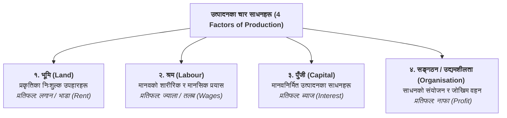

## १. उत्पादनका साधनहरूको अवधारणा (Concept of Factors of Production)

कुनै पनि वस्तु तथा सेवा उत्पादन गर्न प्रयोग गरिने भौतिक तथा अभौतिक स्रोतसाधनहरूलाई **उत्पादनका साधनहरू (Factors of Production वा Inputs)** भनिन्छ। अर्थशास्त्रमा उत्पादनका साधनहरूलाई चार प्रमुख वर्गमा विभाजन गरिन्छ:

---

## २. भूमि (Land)

### अर्थ र परिभाषा:
साधारण भाषामा भूमि भन्नाले जमिनको माथिल्लो सतहलाई मात्र बुझिन्छ। तर अर्थशास्त्रमा **भूमि भन्नाले जमिनको सतह, जमिनमुनि रहेका खनिज पदार्थ, पानी, हावा, वनजङ्गल, घामको प्रकाश लगायत प्रकृतिका सम्पूर्ण निःशुल्क उपहारहरूलाई (All Free Gifts of Nature)** जनाउँछ।

> **प्रतिफल (Reward):** भूमिको प्रयोग गरेबापत यसका मालिकलाई **लगान वा भाडा (Rent)** प्राप्त हुन्छ।

### भूमिको मुख्य विशेषताहरू (Salient Features of Land):
1. **प्रकृतिको निःशुल्क उपहार (Free Gift of Nature):** भूमिलाई मानिसले बनाएको होइन; यो प्रकृतिले विनाकुनै उत्पादन लागत उपहार दिएको हो।
2. **सीमित र बेलोचदार आपूर्ति (Fixed Supply):** मानव प्रयासले पृथ्वीको कुल क्षेत्रफल बढाउन सकिँदैन। भूमिको आपूर्ति पूर्ण बेलोचदार ($E_s = 0$) हुन्छ।
3. **अचल वा स्थान परिवर्तन गर्न नसकिने (Immobile):** भूमिलाई भौगोलिक रूपमा एक ठाउँबाट अर्को ठाउँमा ओसार्न सकिँदैन।
4. **अविनाशी शक्ति (Indestructible Powers):** रिकार्डोका अनुसार भूमिको मौलिक र अविनाशी उर्वरशक्ति नष्ट हुँदैन।
5. **उर्वरतामा विविधता (Difference in Fertility):** सबै ठाउँको जमिनको उत्पादन क्षमता र उर्वरता समान हुँदैन।
6. **उत्पादनको निष्क्रिय साधन (Passive Factor):** श्रम र पुँजी नलगाएसम्म भूमि आफैंले उत्पादन गर्न सक्दैन।

---

## ३. श्रम (Labour)

### अर्थ र परिभाषा:
कुनै वस्तु तथा सेवा उत्पादन गर्ने क्रममा मानिसले गर्ने सम्पूर्ण **शारीरिक तथा मानसिक प्रयास (Physical and Mental Human Effort)**, जसको उद्देश्य आर्थिक प्रतिफल प्राप्त गर्नु हुन्छ, त्यसलाई **श्रम** भनिन्छ।

> **प्रतिफल (Reward):** श्रमको प्रयोग गरेबापत कामदारलाई **ज्याला वा तलब (Wages / Salary)** प्राप्त हुन्छ।

*(नोट: आमाले सन्तानलाई गर्ने माया वा साथीलाई निःशुल्क गरेको सहयोग अर्थशास्त्रमा श्रम मानिँदैन किनभने त्यहाँ आर्थिक प्रतिफल हुँदैन।)*

### श्रमका मुख्य विशेषताहरू (Salient Features of Labour):
1. **श्रम नाशवान हुन्छ (Labour is Perishable):** आजको श्रम आज प्रयोग गरिएन भने त्यो सधैंका लागि खेर जान्छ; यसलाई भविष्यका लागि भण्डारण गर्न सकिँदैन।
2. **श्रमिकबाट श्रम अलग गर्न सकिँदैन (Inseparable from Labourer):** श्रम बेच्न श्रमिक आफैं कार्यस्थलमा उपस्थित हुनुपर्छ।
3. **उत्पादनको सक्रिय साधन (Active Factor):** अन्य निष्क्रिय साधनहरू (भूमि र पुँजी) लाई गतिशील बनाउने काम श्रमले गर्दछ।
4. **कमजोर मोलतोल क्षमता (Weak Bargaining Power):** गरिबी र नाशवान प्रकृतिका कारण श्रमिकको मोलतोल गर्ने क्षमता कमजोर हुन्छ।
5. **श्रमको कम गतिशीलता (Less Mobility):** भाषा, संस्कृति, परिवार र भौगोलिक कारणले गर्दा श्रमिक सजिलै एक ठाउँबाट अर्को ठाउँमा जान मान्दैन।

---

## ४. पुँजी (Capital)

### अर्थ र परिभाषा:
उत्पादन प्रक्रियालाई सहज र प्रभावकारी बनाउन मानिसद्वारा सिर्जना गरिएका सम्पूर्ण **मानवनिर्मित साधनहरू (Man-Made Instruments of Production)** लाई **पुँजी** भनिन्छ। पुँजी उत्पादनको त्यो अंश हो, जुन तत्काल उपभोग नगरी भविष्यमा थप उत्पादन गर्न प्रयोग गरिन्छ।

> **प्रतिफल (Reward):** पुँजीको प्रयोग गरेबापत पुँजीपतिलाई **ब्याज (Interest)** प्राप्त हुन्छ।

### पुँजीका मुख्य प्रकारहरू (Types of Capital):
* **स्थिर पुँजी (Fixed Capital):** लामो समयसम्म प्रयोग हुने साधनहरू (मेसिन, कारखाना भवन, औजार)।
* **चालू पुँजी (Working / Circulating Capital):** एकपटक मात्र प्रयोग हुने साधनहरू (कच्चा पदार्थ, इन्धन)।
* **मानव पुँजी (Human Capital):** शिक्षा, तालिम र स्वास्थ्यमार्फत नागरिकमा विकास गरिएको ज्ञान र सीप।

### पुँजीका मुख्य विशेषताहरू:
1. **मानवनिर्मित साधन (Man-made Factor):** यो मानिसको विगतको श्रम र बचतबाट सिर्जना हुन्छ।
2. **अत्यधिक गतिशील (Highly Mobile):** पुँजीलाई सजिलै एक ठाउँबाट अर्को ठाउँ वा एक उद्योगबाट अर्को उद्योगमा सार्न सकिन्छ।
3. **उत्पादन क्षमता वृद्धि गर्ने (Increases Productivity):** पुँजीले कामदारको कार्यक्षमता र उत्पादनको गति तीव्र बनाउँछ।
4. **ह्रासकट्टी हुने (Subject to Depreciation):** निरन्तर प्रयोग गर्दा पुँजीगत मेसिनहरूको मूल्य र क्षमता घट्दै जान्छ।

---

## ५. सङ्गठन वा उद्यमशीलता (Organisation / Entrepreneurship)

### अर्थ र परिभाषा:
उत्पादनका अन्य तीन साधनहरू (भूमि, श्रम र पुँजी) लाई सही अनुपातमा संकलन र संयोजन गरी **उत्पादनको जोखिम वहन गर्ने व्यक्ति वा संस्थालाई उद्यमी वा सङ्गठन** भनिन्छ। उद्यमी उत्पादन प्रक्रियाको मुख्य चालक हो।

> **प्रतिफल (Reward):** जोखिम उठाएबापत र नयाँ प्रविधि/विचार प्रयोग गरेबापत उद्यमीलाई **नाफा (Profit)** प्राप्त हुन्छ। (नाफा धनात्मक, शून्य वा नोक्सानी पनि हुन सक्छ)।

### उद्यमीका मुख्य कार्यहरू (Functions of an Entrepreneur):
1. **साधनहरूको संयोजन (Coordination of Factors):** भूमि, श्रम र पुँजीलाई उचित अनुपातमा जुटाउने।
2. **व्यावसायिक निर्णय लिने (Decision Making):** के, कसरी र कति उत्पादन गर्ने भन्ने निर्णय गर्नु।
3. **जोखिम र अनिश्चितता वहन (Risk and Uncertainty Bearing):** बजारमा भविष्यमा हुने नाफा-घाटाको जोखिम उठाउनु।
4. **नवप्रवर्तन (Innovation - Schumpeter):** नयाँ प्रविधि, नयाँ वस्तु वा नयाँ बजारको खोजी गर्नु।

---

## ६. उत्पादन फलनको परिचय (Introduction to Production Function)

उत्पादन गर्न प्रयोग गरिने **साधनका परिमाणहरू (Inputs)** र त्यसबाट निस्कने **उत्पादनको भौतिक परिमाण (Output)** बीचको प्राविधिक वा इन्जिनियरिङ सम्बन्धलाई **उत्पादन फलन** भनिन्छ।

$$Q = f(L, K, T, E)$$

जहाँ,  
* $Q$ = कुल उत्पादन (Output)  
* $L$ = श्रम (Labour)  
* $K$ = पुँजी (Capital)  
* $T$ = प्रविधि/भूमि (Technology/Land)  
* $f$ = फलनात्मक सम्बन्ध  

### उत्पादन फलनका दुई रूपहरू:
1. **अल्पकालीन उत्पादन फलन (Short-run Production Function):**  
   केही साधन स्थिर ($\bar{K}$) र केही परिवर्तनशील ($L$) हुने अवस्था ($Q = f(L, \bar{K})$)। यसमा **परिवर्तनशील अनुपातको नियम** लागू हुन्छ।
2. **दीर्घकालीन उत्पादन फलन (Long-run Production Function):**  
   सबै साधनहरू परिवर्तनशील हुने अवस्था ($Q = f(L, K)$)। यसमा **पैमानाको प्रतिफलको नियम** लागू हुन्छ।

---

## ७. उत्पादनका साधनहरूको तुलनात्मक सारांश (Summary Table)

| साधन (Factor) | प्रकृति र स्रोत | मुख्य विशेषता | प्रतिफल (Reward) |
| :--- | :--- | :--- | :--- |
| **१. भूमि (Land)** | प्रकृतिको उपहार (प्राकृतिक) | स्थिर आपूर्ति ($E_s = 0$), अचल, निष्क्रिय | **लगान / भाडा (Rent)** |
| **२. श्रम (Labour)** | मानवीय (शारीरिक/मानसिक) | नाशवान, श्रमिकबाट अलग गर्न नसकिने, सक्रिय | **ज्याला / तलब (Wages)** |
| **३. पुँजी (Capital)** | मानवनिर्मित (कृत्रिम) | अत्यधिक गतिशील, ह्रासकट्टी हुने, क्षमता बढाउने | **ब्याज (Interest)** |
| **४. सङ्गठन (Organisation)** | मानवीय (व्यवस्थापकीय/साहसी) | साधनको संयोजन, जोखिम वहन, नवप्रवर्तन | **नाफा (Profit)** |

---

## 📌 परीक्षा उपयोगी सारांश (Key Takeaways)
* उत्पादनका ४ आधारभूत साधनहरू: **भूमि, श्रम, पुँजी, र सङ्गठन** हुन्।
* भूमिको प्रतिफल **लगान**, श्रमको प्रतिफल **ज्याला**, पुँजीको प्रतिफल **ब्याज**, र सङ्गठनको प्रतिफल **नाफा** हो।
* **उत्पादन फलन ($Q = f(L, K)$)** ले आगत (Inputs) र निर्गत (Output) बीचको भौतिक सम्बन्धलाई देखाउँछ।
* भूमि र पुँजी निष्क्रिय साधन हुन् भने श्रम र सङ्गठन सक्रिय साधन हुन्।
