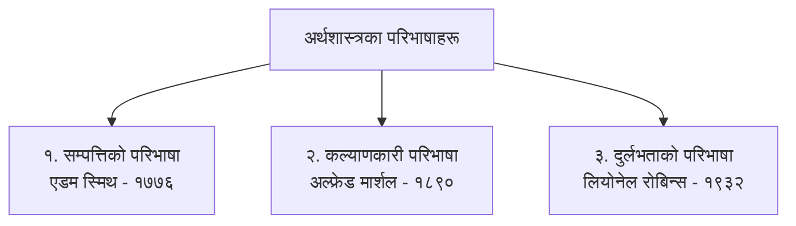

## १. 'Economics' शब्दको शाब्दिक उत्पत्ति (Origin of the Word 'Economics')

अंग्रेजी शब्द **'Economics'** ग्रीक भाषाका दुई शब्दहरूबाट बनेको हो:
* **'Oikos' (ओइकोस):** जसको अर्थ **घर वा परिवार (Household)** हुन्छ।
* **'Nemein' (नेमिन):** जसको अर्थ **व्यवस्थापन गर्नु (To Manage)** हुन्छ।

यी दुई शब्द मिलेर **'Oikonomia' (ओइकोनोमिया)** बनेको हो, जसको शाब्दिक अर्थ **'घरपरिवारको व्यवस्थापन गर्नु' (Household Management)** हुन्छ। प्राचीन समयमा सीमित पारिवारिक स्रोतसाधनबाट परिवारका आवश्यकताहरू पूरा गर्ने कार्यलाई अर्थशास्त्र भनिन्थ्यो। तर आधुनिक युगमा अर्थशास्त्र केवल पारिवारिक व्यवस्थापनमा सीमित नरही सम्पूर्ण राष्ट्र तथा विश्वकै स्रोतसाधनको व्यवस्थापन र बाँडफाँट गर्ने एक महत्त्वपूर्ण **सामाजिक विज्ञान (Social Science)** का रूपमा विकसित भएको छ।

---

## २. अर्थशास्त्र अध्ययनको आवश्यकता र महत्त्व (Why Study Economics?)

अर्थशास्त्रले सीमित स्रोतसाधनको प्रयोग गरी मानवका असङ्ख्य आवश्यकताहरू कसरी पूरा गर्न सकिन्छ भन्ने कुराको वैज्ञानिक अध्ययन गर्दछ। यसको अध्ययन निम्न कारणले आवश्यक छ:

1. **दुर्लभता र छनोटको समस्या समाधान गर्न (Addressing Scarcity and Choice):** हाम्रा चाहनाहरू असीमित छन् तर ती पूरा गर्ने स्रोतसाधन सीमित छन्। अर्थशास्त्रले सीमित साधनको अधिकतम सदुपयोग गर्ने उपाय सिकाउँछ।
2. **आधारभूत आर्थिक प्रश्नहरूको उत्तर पाउन (Answering Central Economic Questions):** के उत्पादन गर्ने (*What to produce*), कसरी उत्पादन गर्ने (*How to produce*), र कसका लागि उत्पादन गर्ने (*For whom to produce*) जस्ता प्रश्नहरूको निर्णय गर्न मद्दत गर्दछ।
3. **व्यक्तिगत तथा व्यावसायिक निर्णय लिन (Rational Decision Making):** उपभोक्तालाई अधिकतम सन्तुष्टि र उत्पादकलाई अधिकतम नाफा आर्जन गर्न मार्गदर्शन गर्दछ।
4. **सार्वजनिक नीति निर्माण गर्न (Guiding Public Policy):** सरकारलाई बजेट निर्माण, कर प्रणाली, गरिबी निवारण, र आर्थिक वृद्धिका योजना तर्जुमा गर्न मद्दत गर्दछ।

---

## ३. अर्थशास्त्रका प्रमुख परिभाषाहरूको विकासक्रम (Evolution of Definitions)

अर्थशास्त्रको परिभाषा समयसँगै विकसित हुँदै आएको छ। आर्थिक विचारको विकासक्रमलाई मुख्यतया तीन चरणमा विभाजन गरी अध्ययन गरिन्छ:



---

### क) एडम स्मिथको सम्पत्तिको परिभाषा (Adam Smith's Wealth Definition - Classical View)

क्लासिकल अर्थशास्त्री **एडम स्मिथ (Adam Smith, 1723–1790)** लाई **'अर्थशास्त्रका पिता' (Father of Economics)** मानिन्छ। उनले सन् १७७६ मा प्रकाशित आफ्नो प्रसिद्ध पुस्तक *"An Inquiry into the Nature and Causes of the Wealth of Nations"* मा अर्थशास्त्रलाई **'सम्पत्तिको विज्ञान' (Science of Wealth)** को रूपमा परिभाषित गरेका छन्।

> *"Economics is an inquiry into the nature and causes of the wealth of nations."*  
> *(अर्थशास्त्र राष्ट्रहरूको सम्पत्तिको प्रकृति र कारणहरूको खोजी गर्ने विज्ञान हो।)*

#### मुख्य विशेषताहरू (Main Features):
1. **सम्पत्तिमाथि बढी जोड (Emphasis on Wealth):** यस परिभाषा अनुसार अर्थशास्त्रको मुख्य विषयवस्तु सम्पत्तिको उत्पादन, उपभोग, विनिमय र वितरण हो।
2. **आर्थिक मानवको परिकल्पना (Concept of Economic Man):** मानिस केवल व्यक्तिगत स्वार्थ र धन कमाउने उद्देश्यबाट मात्र प्रेरित हुन्छ भन्ने मान्यता राखिएको छ।
3. **अदृश्य हात (The Invisible Hand):** व्यक्तिगत स्वार्थले बजारको अदृश्य शक्तिमार्फत स्वतः सामाजिक हित प्रवर्द्धन गर्दछ।
4. **सम्पत्तिका कारणहरूको अध्ययन (Investigation of Causes of Wealth):** राष्ट्रको सम्पत्ति कसरी वृद्धि गर्न सकिन्छ भन्ने कुराको खोजी यसले गर्दछ।

#### आलोचनाहरू (Criticisms):
* **अत्यधिक भौतिकवादी दृष्टिकोण (Dismal Science):** कार्लाइल (Carlyle) र रस्किन (Ruskin) जस्ता विद्वानहरूले यसलाई 'दुःखलाग्दो विज्ञान' (*Dismal Science*) र 'लोभी शास्त्र' (*Science of Mammonism*) भनी आलोचना गरे।
* **मानव कल्याणको उपेक्षा (Neglect of Human Welfare):** सम्पत्ति मानव कल्याणको साधन मात्र हो, तर स्मिथले सम्पत्तिलाई नै अन्तिम साध्य माने।
* **अभौतिक सेवाहरूको उपेक्षा (Ignored Services):** शिक्षक, डाक्टर, वकिल जस्ता सेवा प्रदायकहरूको योगदानलाई यस परिभाषाले समेट्न सकेन।
* **दुर्लभता र छनोटको उपेक्षा (Ignored Scarcity and Choice):** अर्थतन्त्रको मूल समस्या साधनको दुर्लभता हो, जसलाई स्मिथले ध्यान दिएनन्।

---

### ख) अल्फ्रेड मार्शलको भौतिक कल्याणको परिभाषा (Alfred Marshall's Welfare Definition - Neo-Classical View)

नव-क्लासिकल अर्थशास्त्री **अल्फ्रेड मार्शल (Alfred Marshall, 1842–1924)** ले सन् १८९० मा प्रकाशित पुस्तक *"Principles of Economics"* मा अर्थशास्त्रलाई मानव कल्याणसँग जोडेर नयाँ दिशा दिए।

> *"Economics is a study of mankind in the ordinary business of life; it examines that part of individual and social action which is most closely connected with the attainment and with the use of the material requisites of well-being."*  
> *(अर्थशास्त्र मानव जातिको दैनिक जीवनको सामान्य व्यवसायको अध्ययन हो; यसले व्यक्तिगत तथा सामाजिक कार्यको त्यस भागको अध्ययन गर्दछ जुन भौतिक सुख-कल्याणका साधनहरूको प्राप्ति र उपभोगसँग घनिष्ट रूपमा सम्बन्धित छ।)*

#### मुख्य विशेषताहरू (Main Features):
1. **मानव कल्याण प्राथमिक (Primary Focus on Human Welfare):** सम्पत्तिलाई साधन र मानव कल्याणलाई साध्य मानिएको छ।
2. **साधारण मानिसको अध्ययन (Study of Ordinary Man):** समाजमा बस्ने सामान्य मानिसको आर्थिक क्रियाकलापको अध्ययन गरिन्छ (जोगी, सन्यासी वा असामाजिक व्यक्तिको होइन)।
3. **सामाजिक विज्ञान (Social Science):** अर्थशास्त्रलाई समाजमा बस्ने मानिसहरूको व्यवहार अध्ययन गर्ने सामाजिक विज्ञान मानिएको छ।
4. **आदर्शवादी विज्ञान (Normative Science):** यसले के हुनुपर्छ (*What ought to be*) भन्ने कुराको पनि अध्ययन गर्दछ।

#### आलोचनाहरू (Lionel Robbins' Criticisms):
* **कल्याण अमूर्त र मापन गर्न नसकिने (Welfare is Subjective and Non-measurable):** कल्याण एक मानसिक अनुभूति हो, जसलाई संख्या वा मुद्रामा यथार्थ मापन गर्न सकिँदैन।
* **हानिकारक वस्तुहरूको उपेक्षा (Excludes Harmful Goods):** मदिरा, चुरोट वा हतियारको उत्पादनले कल्याण नगरे पनि ती सीमित स्रोत प्रयोग हुने आर्थिक क्रियाकलाप हुन्।
* **अभौतिक सेवाको उपेक्षा (Ignored Immaterial Services):** डाक्टर, गायक, वा शिक्षकको सेवाले पनि कल्याण बढाउँछ, तर मार्शलले भौतिक वस्तुलाई मात्र जोड दिए।
* **मानव विज्ञान (Economics is a Human Science):** रोबिन्सका अनुसार समाज बाहिर बस्ने व्यक्ति (जस्तै: रोबिन्सन क्रुसो) लाई पनि साधनको दुर्लभता र छनोटको समस्या पर्दछ।

---

### ग) लियोनेल रोबिन्सको दुर्लभता र छनोटको परिभाषा (Lionel Robbins' Scarcity Definition - Modern View)

लन्डन स्कुल अफ इकोनोमिक्सका प्राध्यापक **लियोनेल रोबिन्स (Lionel Robbins, 1898–1984)** ले सन् १९३२ मा प्रकाशित पुस्तक *"An Essay on the Nature and Significance of Economic Science"* मा आधुनिक वैज्ञानिक परिभाषा प्रस्तुत गरे।

> *"Economics is the science which studies human behaviour as a relationship between ends and scarce means which have alternative uses."*  
> *(अर्थशास्त्र त्यो विज्ञान हो जसले असीमित आवश्यकताहरू र वैकल्पिक प्रयोग हुन सक्ने दुर्लभ साधनहरू बीचको सम्बन्धको रूपमा मानव व्यवहारको अध्ययन गर्दछ।)*

#### मुख्य स्तम्भहरू / विशेषताहरू (Main Pillars):
1. **असीमित आवश्यकताहरू (Unlimited Wants / Ends):** मानिसका चाहना र आवश्यकताहरू अनगिन्ती हुन्छन्, एउटा पूरा हुनासाथ अर्को जन्मिन्छ।
2. **सीमित वा दुर्लभ साधनहरू (Scarce Means):** आवश्यकताको तुलनामा ती पूरा गर्ने साधनहरू (समय, पैसा, स्रोत) सीमित हुन्छन्।
3. **साधनहरूको वैकल्पिक प्रयोग (Alternative Uses of Resources):** सीमित स्रोतलाई विभिन्न काममा लगाउन सकिन्छ (जस्तै: रु. १०० ले खाजा खान वा कापी किन्न सकिन्छ)।
4. **तीव्रतामा भिन्नता र छनोट (Wants Differ in Urgency & Choice):** सबै आवश्यकता उत्तिकै जरुरी हुँदैनन्। बढी जरुरी आवश्यकता पहिले पूरा गरिन्छ, जसले गर्दा छनोट (*Choice*) गर्नुपर्ने हुन्छ।

#### रोबिन्सको परिभाषाको श्रेष्ठता (Superiority of Robbins' Definition):
* यो परिभाषा **विश्वव्यापी (Universal)** छ—चाहे पुँजीवादी, समाजवादी वा जुनसुकै अर्थतन्त्र होस्, दुर्लभताको समस्या सबैमा लागू हुन्छ।
* यसले अर्थशास्त्रलाई कल्याणको साँघुरो दायराबाट मुक्त गरी **वास्तविक विज्ञान (Positive Science)** बनाएको छ।

---

## ४. मार्शल र रोबिन्सको परिभाषा बीच तुलना (Comparison)

```learn-table
{
  "title": "मार्शल र रोबिन्सको परिभाषा बीच मुख्य भिन्नता (Marshall vs. Robbins)",
  "columns": [
    "तुलनाको आधार (Basis)",
    "मार्शलको परिभाषा (Marshall - 1890)",
    "रोबिन्सको परिभाषा (Robbins - 1932)"
  ],
  "rows": [
    [
      "मुख्य विषयवस्तु (Core Focus)",
      "मानव कल्याण र भौतिक सुख-सुविधा",
      "दुर्लभता, असीमित आवश्यकता र छनोट"
    ],
    [
      "विज्ञानको प्रकृति (Nature of Science)",
      "आदर्शवादी विज्ञान (Normative Science)",
      "यथार्थवादी विज्ञान (Positive Science)"
    ],
    [
      "अध्ययनको क्षेत्र (Scope)",
      "भौतिक वस्तुहरूमा मात्र सीमित (साँघुरो)",
      "सबै दुर्लभ वस्तु तथा सेवाहरू (व्यापक र विश्वव्यापी)"
    ],
    [
      "दृष्टिकोण (Approach)",
      "वर्गीकरणात्मक (Classificatory)",
      "विश्लेषणात्मक (Analytical)"
    ]
  ]
}
```

---

## ५. परीक्षा उपयोगी अभ्यास प्रश्नहरू (NEB Exam Important Questions)

### संक्षिप्त उत्तर आउने प्रश्नहरू (Short Answer Questions - 5 Marks)
1. 'Economics' शब्दको शाब्दिक उत्पत्ति स्पष्ट पार्दै अर्थशास्त्रलाई परिभाषित गर्नुहोस्।
2. एडम स्मिथको सम्पत्तिको परिभाषाका मुख्य विशेषता र आलोचनाहरू उल्लेख गर्नुहोस्।
3. अल्फ्रेड मार्शलको कल्याणकारी परिभाषालाई लियोनेल रोबिन्सले कुन-कुन आधारमा आलोचना गरेका छन्?
4. "अर्थशास्त्र दुर्लभता र छनोटको विज्ञान हो।" व्याख्या गर्नुहोस्।

### विस्तृत उत्तर आउने प्रश्न (Long Answer Question - 8 Marks)
1. अर्थशास्त्रका विभिन्न परिभाषाहरूको चर्चा गर्दै मार्शल र रोबिन्सका परिभाषाहरू बीच तुलनात्मक भिन्नता देखाउनुहोस्। रोबिन्सको परिभाषा किन बढी वैज्ञानिक मानिन्छ?
