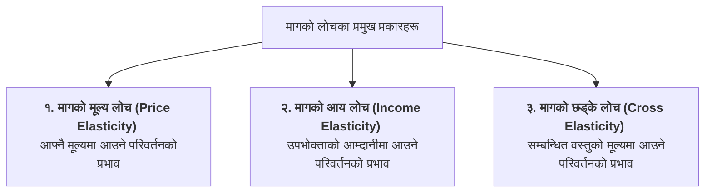

## १. मागको लोचको अर्थ र अवधारणा (Concept of Elasticity of Demand)

मागको नियमले मूल्य र माग परिमाण बीचको **दिशात्मक सम्बन्ध (Qualitative Relationship)** मात्र बताउँछ—अर्थात् मूल्य घट्दा माग बढ्छ र मूल्य बढ्दा माग घट्छ। तर मूल्यमा कति प्रतिशत परिवर्तन हुँदा माग परिमाणमा कति प्रतिशतले घटबढ हुन्छ भन्ने **मात्रात्मक नाप (Quantitative Measurement)** मागको नियमले दिन सक्दैन। यो मात्रात्मक मापन **मागको लोच (Elasticity of Demand)** ले गर्दछ।

> **परिभाषा:** कुनै वस्तुको मागलाई प्रभाव पार्ने तत्वहरू (जस्तै: वस्तुको आफ्नै मूल्य, उपभोक्ताको आम्दानी, सम्बन्धित वस्तुको मूल्य आदि) मा आउने प्रतिशत परिवर्तनका कारण उक्त वस्तुको **माग परिमाणमा आउने प्रतिक्रियात्मकता वा संवेदनशीलताको दरलाई** मागको लोच भनिन्छ।

---

## २. मागको मूल्य लोच (Price Elasticity of Demand - $E_p$)

> **परिभाषा:** अन्य कुराहरू स्थिर रहँदा (Ceteris Paribus), कुनै वस्तुको **मूल्यमा आएको प्रतिशत परिवर्तनका कारण** त्यस वस्तुको **माग परिमाणमा आउने प्रतिशत परिवर्तनको अनुपातलाई** मागको मूल्य लोच भनिन्छ।

### सूत्र (Formula):
$$E_p = \frac{\text{माग परिमाणमा प्रतिशत परिवर्तन}}{\text{मूल्यमा प्रतिशत परिवर्तन}} = \frac{\%\Delta Q}{\%\Delta P}$$

$$E_p = \frac{\Delta Q}{\Delta P} \times \frac{P}{Q}$$

जहाँ,  
* $\Delta Q = Q_1 - Q_0$ (माग परिमाणमा आएको परिवर्तन)  
* $\Delta P = P_1 - P_0$ (मूल्यमा आएको परिवर्तन)  
* $P = P_0$ (सुरुको वा प्रारम्भिक मूल्य)  
* $Q = Q_0$ (सुरुको वा प्रारम्भिक माग परिमाण)  

*(नोट: मूल्य र माग परिमाणबीच विपरीत सम्बन्ध हुने भएकाले सूत्रमा सामान्यतया माइनस चिन्ह '$-$' राखिन्छ वा लोचको निरपेक्ष मान $|E_p|$ लिइन्छ।)*

---

## ३. मागको मूल्य लोचका पाँच प्रकारहरू वा डिग्रीहरू (Five Degrees of Price Elasticity)

मागको मूल्य लोचको मान $0$ देखि $\infty$ (अनन्त) सम्म हुन सक्छ। यसका आधारमा मूल्य लोचलाई ५ वटा डिग्रीहरूमा वर्गीकरण गरिन्छ:

---

### १. पूर्ण लोचदार माग (Perfectely Elastic Demand: $E_p = \infty$)
* **अवधारणा:** जब वस्तुको मूल्यमा अत्यन्तै सूक्ष्म वा शून्य परिवर्तन हुँदा पनि माग परिमाणमा असीमित वा अनन्त परिवर्तन आउँछ भने त्यसलाई पूर्ण लोचदार माग भनिन्छ।

* **माग वक्ररेखाको प्रकृति:** यो X-अक्षसँग समानान्तर हुने **तेर्सो क्षितिज रेखा (Horizontal Line)** हुन्छ।
* **तालिका:**

| मूल्य ($P$ रु. मा) | माग परिमाण ($Q$ एकाइमा) |
| :---: | :---: |
| १० | २० |
| १० | ४० |
| १० | ६० (अनन्त) |

* **उदाहरण:** पूर्ण प्रतिस्पर्धा बजार (Perfect Competition) मा व्यक्तिगत फर्मले सामना गर्ने माग रेखा।

---

### २. पूर्ण बेलोचदार माग (Perfectely Inelastic Demand: $E_p = 0$)
* **अवधारणा:** जब वस्तुको मूल्यमा जतिसुकै ठूलो प्रतिशत परिवर्तन भए तापनि माग परिमाणमा कुनै पनि परिवर्तन आउँदैन (माग स्थिर रहन्छ) भने त्यसलाई पूर्ण बेलोचदार माग भनिन्छ।

* **माग वक्ररेखाको प्रकृति:** यो Y-अक्षसँग समानान्तर हुने **ठाडो लम्ब रेखा (Vertical Line)** हुन्छ।
* **तालिका:**

| मूल्य ($P$ रु. मा) | माग परिमाण ($Q$ एकाइमा) |
| :---: | :---: |
| १० | ५० |
| २० | ५० |
| ३० | ५० (स्थिर) |

* **उदाहरण:** जीवनरक्षक औषधि (Life-saving Drugs), नुन।

---

### ३. एकाइ लोचदार माग (Unitary Elastic Demand: $E_p = 1$)
* **अवधारणा:** जब वस्तुको मूल्यमा जति प्रतिशतले परिवर्तन हुन्छ, त्यस वस्तुको माग परिमाणमा पनि **ठ्याक्कै त्यति नै प्रतिशतले** परिवर्तन आउँछ भने त्यसलाई एकाइ लोचदार माग भनिन्छ ($\%\Delta Q = \%\Delta P$)।

* **माग वक्ररेखाको प्रकृति:** यो **आयताकार अतिपरवलय (Rectangular Hyperbola)** आकारको हुन्छ, जहाँ प्रत्येक बिन्दुमा कुल खर्च स्थिर रहन्छ।
* **तालिका:**

| मूल्य ($P$ रु. मा) | माग परिमाण ($Q$ एकाइमा) | कुल खर्च ($P \times Q$) |
| :---: | :---: | :---: |
| २० | १० | रु. २०० |
| १० (५०% कमी) | १५ (५०% वृद्धि) | रु. २०० |

---

### ४. सापेक्षिक लोचदार माग (Relatively Elastic Demand: $E_p > 1$)
* **अवधारणा:** जब मूल्यको प्रतिशत परिवर्तनको तुलनामा **माग परिमाणको प्रतिशत परिवर्तन बढी** हुन्छ भने त्यसलाई सापेक्षिक लोचदार माग भनिन्छ ($\%\Delta Q > \%\Delta P$)।

* **माग वक्ररेखाको प्रकृति:** यो कम ठाडो अर्थात् **चेप्टो वा समथर (Flatter Demand Curve)** हुन्छ।
* **तालिका:**

| मूल्य ($P$ रु. मा) | माग परिमाण ($Q$ एकाइमा) |
| :---: | :---: |
| २० | १०० |
| १८ (१०% कमी) | १३० (३०% वृद्धि) |

* **उदाहरण:** विलासिताका वस्तुहरू (Luxuries जस्तै: सुन, महँगा स्मार्टफोन, टेलिभिजन, गाडी)।

---

### ५. सापेक्षिक बेलोचदार माग (Relatively Inelastic Demand: $E_p < 1$)
* **अवधारणा:** जब मूल्यको प्रतिशत परिवर्तनको तुलनामा **माग परिमाणको प्रतिशत परिवर्तन कम** हुन्छ भने त्यसलाई सापेक्षिक बेलोचदार माग भनिन्छ ($\%\Delta Q < \%\Delta P$)।

* **माग वक्ररेखाको प्रकृति:** यो बढी **ठाडो (Steeper Demand Curve)** हुन्छ।
* **तालिका:**

| मूल्य ($P$ रु. मा) | माग परिमाण ($Q$ एकाइमा) |
| :---: | :---: |
| २० | १०० |
| १० (५०% कमी) | १२० (२०% वृद्धि) |

* **उदाहरण:** दैनिक उपभोगका अत्यावश्यक वस्तुहरू (Necessities जस्तै: चामल, दाल, गहुँ, बिजुली, पानी)।

---

## ४. मूल्य लोचका पाँच डिग्रीहरूको तुलनात्मक सारांश (Summary Table)

| डिग्री (Degrees) | संख्यात्मक मान ($E_p$) | प्रतिशत सम्बन्ध | वक्ररेखाको आकार (Shape) | वस्तुको प्रकृति |
| :--- | :---: | :---: | :--- | :--- |
| **१. पूर्ण लोचदार** | $E_p = \infty$ | मूल्यमा शून्य परिवर्तन, मागमा अनन्त परिवर्तन | तेर्सो क्षितिज रेखा (Horizontal) | पूर्ण प्रतिस्पर्धात्मक बजार |
| **२. पूर्ण बेलोचदार** | $E_p = 0$ | मूल्य परिवर्तन हुँदा मागमा शून्य परिवर्तन | ठाडो लम्ब रेखा (Vertical) | जीवनरक्षक औषधि, नुन |
| **३. एकाइ लोचदार** | $E_p = 1$ | $\%\Delta Q = \%\Delta P$ | आयताकार अतिपरवलय (Rectangular Hyperbola) | सामान्य वस्तुहरू |
| **४. सापेक्षिक लोचदार** | $E_p > 1$ | $\%\Delta Q > \%\Delta P$ | कम ठाडो / चेप्टो (Flatter) | विलासिताका वस्तुहरू (कार, सुन) |
| **५. सापेक्षिक बेलोचदार** | $E_p < 1$ | $\%\Delta Q < \%\Delta P$ | बढी ठाडो (Steeper) | अत्यावश्यक वस्तुहरू (खाद्यान्न) |

---

## ५. उदाहरणीय संख्यात्मक समस्या (Solved Numerical Example)

**प्रश्न:** कुनै वस्तुको प्रति एकाइ मूल्य रु. ४० बाट घटेर रु. ३० हुँदा त्यसको माग परिमाण २०० एकाइबाट बढेर ३०० एकाइ पुग्छ। मागको मूल्य लोच ($E_p$) गणना गर्नुहोस् र यसको डिग्री/प्रकृति छुट्याउनुहोस्।

### 💡 समाधान (Step-by-Step Solution):
दिइएको छ:
* प्रारम्भिक मूल्य ($P$) = रु. ४०, \quad नयाँ मूल्य ($P_1$) = रु. ३०  
  $$\Delta P = P_1 - P = 30 - 40 = -10$$
* प्रारम्भिक माग ($Q$) = २०० एकाइ, \quad नयाँ माग ($Q_1$) = ३०० एकाइ  
  $$\Delta Q = Q_1 - Q = 300 - 200 = 100$$

मागको मूल्य लोचको सूत्र अनुसार:
$$E_p = -\left(\frac{\Delta Q}{\Delta P} \times \frac{P}{Q}\right)$$
$$E_p = -\left(\frac{100}{-10} \times \frac{40}{200}\right) = -(-10 \times 0.2) = \mathbf{2.0}$$

**निष्कर्ष तथा प्रकृतिको व्याख्या:**
* मागको मूल्य लोचको निरपेक्ष मान **$|E_p| = 2.0 > 1$** छ।
* त्यसैले यो **सापेक्षिक लोचदार माग (Relatively Elastic Demand)** हो। यसले मूल्यमा २५% कमी हुँदा मागमा ५०% को ठूलो वृद्धि भएको देखाउँछ।

---

## 📌 परीक्षा उपयोगी सारांश (Key Takeaways)
* **मागको मूल्य लोच ($E_p$)** ले मूल्यमा आउने परिवर्तनप्रति माग परिमाणको संवेदनशीलता दरलाई मात्रात्मक रूपमा नाप्छ।
* लोचको मान सधैं $0$ देखि $\infty$ को बीचमा रहन्छ।
* **अत्यावश्यक वस्तुहरूको माग बेलोचदार ($E_p < 1$)** हुन्छ भने **विलासिताका वस्तुहरूको माग लोचदार ($E_p > 1$)** हुन्छ।
