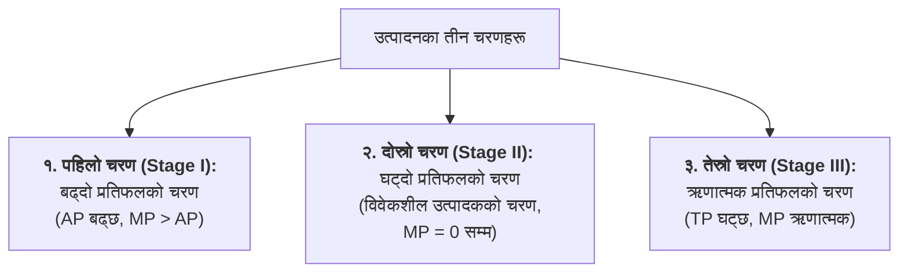

## १. उत्पादनको अर्थ र उत्पादन फलन (Meaning of Production & Production Function)

### क) उत्पादनको अर्थ (Meaning of Production)
साधारण भाषामा कुनै नयाँ वस्तु बनाउनुलाई उत्पादन भनिन्छ। तर अर्थशास्त्रमा मानिसले कुनै नयाँ पदार्थ सिर्जना गर्न सक्दैन, केवल वस्तुमा **उपयोगिता सिर्जना वा अभिवृद्धि (Creation or Addition of Utility)** गर्न सक्छ।

> **परिभाषा:** उत्पादनका साधनहरू (साधन आगत - Inputs) लाई प्रयोग गरी मानवीय आवश्यकता पूरा गर्ने वस्तु तथा सेवाहरू (उत्पादन निर्गत - Output) मा रूपान्तरण गर्ने प्रक्रियालाई **उत्पादन (Production)** भनिन्छ।

### ख) उत्पादन फलन (Production Function)
उत्पादन गर्न प्रयोग गरिने **साधनका भौतिक परिमाणहरू (Inputs)** र त्यसबाट प्राप्त हुने **कुल उत्पादनको भौतिक परिमाण (Output)** बीचको प्राविधिक वा भौतिक सम्बन्धलाई उत्पादन फलन भनिन्छ।

$$Q = f(L, K, T, E)$$
जहाँ,  
* $Q$ = कुल उत्पादन परिमाण (Output)  
* $L$ = श्रम (Labour)  
* $K$ = पुँजी (Capital)  
* $T$ = प्रविधि/भूमि (Technology/Land)  
* $f$ = फलनात्मक सम्बन्ध (Functional Relationship)  

---

## २. अल्पकालीन र दीर्घकालीन उत्पादन फलन (Short-run vs. Long-run Production Function)

| आधार | अल्पकालीन उत्पादन फलन (Short-run) | दीर्घकालीन उत्पादन फलन (Long-run) |
| :--- | :--- | :--- |
| **साधनको प्रकृति** | केही साधन स्थिर (Fixed, जस्तै: भवन, मेसिन) र केही परिवर्तनशील (Variable, जस्तै: श्रम, कच्चा पदार्थ) हुन्छन्। | सम्पूर्ण साधनहरू परिवर्तनशील (Variable) हुन्छन्; कुनै पनि साधन स्थिर हुँदैन। |
| **उत्पादन फलन** | $Q = f(L, \bar{K})$ | $Q = f(L, K)$ |
| **लागू हुने नियम** | **परिवर्तनशील अनुपातको नियम (Law of Variable Proportions)** | **पैमानाको प्रतिफलको नियम (Law of Returns to Scale)** |
| **उत्पादनको पैमाना** | स्थिर रहन्छ (Scale of plant is constant)। | परिवर्तन हुन्छ (Scale of production changes)। |

---

## ३. कुल, औसत र सीमान्त उत्पादन (TP, AP and MP)

### १. कुल उत्पादन (Total Product - TP)
परिवर्तनशील साधन (श्रम) का निश्चित एकाइहरूलाई स्थिर साधनसँग प्रयोग गर्दा प्राप्त हुने **कुल भौतिक उत्पादनलाई** कुल उत्पादन भनिन्छ।
$$TP = \sum MP$$

### २. औसत उत्पादन (Average Product - AP)
परिवर्तनशील साधनको **प्रति एकाइबाट प्राप्त हुने उत्पादनलाई** औसत उत्पादन भनिन्छ।
$$AP = \frac{TP}{L}$$

### ३. सीमान्त उत्पादन (Marginal Product - MP)
परिवर्तनशील साधनको **थप एक एकाइ थप्दा कुल उत्पादनमा आउने परिवर्तनलाई** सीमान्त उत्पादन भनिन्छ।
$$MP_n = TP_n - TP_{n-1} \quad \text{वा} \quad MP = \frac{\Delta TP}{\Delta L}$$

---

## ४. परिवर्तनशील अनुपातको नियम (Law of Variable Proportions)

यो अल्पकालीन उत्पादन सिद्धान्तको सबैभन्दा महत्त्वपूर्ण नियम हो। यसलाई **ह्रासमान प्रतिफलको नियम (Law of Diminishing Returns)** पनि भनिन्छ।

> **नियमको भनाइ:** *"अन्य साधनहरू स्थिर राखी कुनै एक परिवर्तनशील साधन (श्रम) का एकाइहरू क्रमिक रूपमा बढाउँदै जाँदा, सुरुमा सीमान्त उत्पादन बढ्छ, त्यसपछि घट्छ र अन्त्यमा ऋणात्मक हुन पुग्छ।"*

### उत्पादन तालिका (Production Schedule):

| स्थिर साधन (जमिन) | परिवर्तनशील साधन (श्रम - L) | कुल उत्पादन ($TP$) | औसत उत्पादन ($AP = \frac{TP}{L}$) | सीमान्त उत्पादन ($MP$) | उत्पादनको चरण (Stages) |
| :---: | :---: | :---: | :---: | :---: | :--- |
| १ बिघा | ० | ० | ० | - | सुरुको अवस्था |
| १ बिघा | १ | १० | १० | १० | **पहिलो चरण:** बढ्दो प्रतिफल |
| १ बिघा | २ | २५ | १२.५ | १५ | ($TP$ बढ्दो दरमा बढ्छ, $MP > AP$) |
| १ बिघा | ३ | ४५ | १५ | २० ($MP$ अधिकतम) | पहिलो चरणको अन्त्य ($AP$ अधिकतम, $AP=MP$) |
| १ बिघा | ४ | ६० | १५ | १५ | **दोस्रो चरण:** घट्दो प्रतिफल |
| १ बिघा | ५ | ७० | १४ | १० | ($TP$ घट्दो दरमा बढ्छ) |
| १ बिघा | ६ | ७५ | १२.५ | ५ | |
| **१ बिघा** | **७** | **७५ ($TP$ अधिकतम)** | **१०.७** | **० ($MP = 0$)** | **दोस्रो चरणको अन्त्य (सन्तुलन बिन्दु)** |
| १ बिघा | ८ | ७० | ८.७५ | -५ | **तेस्रो चरण:** ऋणात्मक प्रतिफल |
| १ बिघा | ९ | ६० | ६.६७ | -१० | ($TP$ घट्छ, $MP < 0$) |

---

## ५. उत्पादनका तीन चरणहरू (Three Stages of Production)

### क) पहिलो चरण (Stage I: Increasing Returns)
* यस चरणमा $TP$ बढ्दो दरमा बढ्छ, $MP$ र $AP$ दुवै बढ्छन् र $MP > AP$ हुन्छ।
* $AP$ अधिकतम हुने बिन्दुमा पहिलो चरण समाप्त हुन्छ, जहाँ $AP = MP$ हुन्छ।

### ख) दोस्रो चरण (Stage II: Diminishing Returns - The Rational Stage)
* यस चरणमा $TP$ घट्दो दरमा बढ्छ, $AP$ र $MP$ दुवै घट्छन् तर दुवै धनात्मक रहन्छन्।
* जब $TP$ अधिकतम ($TP = 75$) हुन्छ, तब $MP = 0$ हुन्छ। यहाँ दोस्रो चरण समाप्त हुन्छ।
* **निष्कर्ष:** कुनै पनि **विवेकशील उत्पादकले सधैं दोस्रो चरणमै उत्पादन गर्दछ**, किनभने यहाँ साधनहरूको अधिकतम र कुशल प्रयोग हुन्छ।

### ग) तेस्रो चरण (Stage III: Negative Returns)
* यस चरणमा स्थिर साधनको तुलनामा परिवर्तनशील साधन अत्यधिक हुने भएकाले भीडभाड र अकुशलताका कारण $TP$ घट्न थाल्छ र $MP$ ऋणात्मक (Negative) हुन्छ।
* कुनै पनि उत्पादक यस चरणमा उत्पादन गर्दैन।

---

## ६. पैमानाको प्रतिफलको नियम (Law of Returns to Scale - Long-run)

दीर्घकालमा जब उत्पादनका सबै साधनहरू एउटै अनुपातमा बढाइन्छ, तब उत्पादनमा आउने परिवर्तनलाई पैमानाको प्रतिफल भनिन्छ। यसका ३ रूपहरू हुन्छन्:

1. **बढ्दो पैमानाको प्रतिफल (Increasing Returns to Scale - IRS):** साधनहरू १०% ले बढाउँदा उत्पादन १५% ले बढ्ने ($\%\Delta Q > \%\Delta \text{Inputs}$)।
2. **स्थिर पैमानाको प्रतिफल (Constant Returns to Scale - CRS):** साधनहरू १०% ले बढाउँदा उत्पादन ठ्याक्कै १०% ले नै बढ्ने ($\%\Delta Q = \%\Delta \text{Inputs}$)।
3. **घट्दो पैमानाको प्रतिफल (Diminishing Returns to Scale - DRS):** साधनहरू १०% ले बढाउँदा उत्पादन केवल ५% ले मात्र बढ्ने ($\%\Delta Q < \%\Delta \text{Inputs}$)।

---

## 📌 परीक्षा उपयोगी सारांश (Exam Summary Points)
1. **$TP$ अधिकतम हुँदा $MP = 0$** हुन्छ।
2. **$AP$ अधिकतम हुँदा $AP = MP$** हुन्छ।
3. **परिवर्तनशील अनुपातको नियमका तीन चरणहरू:** बढ्दो प्रतिफल, घट्दो प्रतिफल, र ऋणात्मक प्रतिफल।
4. **उत्पादकको सन्तुलन दोस्रो चरण (Stage II)** मा हुन्छ जहाँ साधनहरूको दक्षता उच्चतम हुन्छ।
