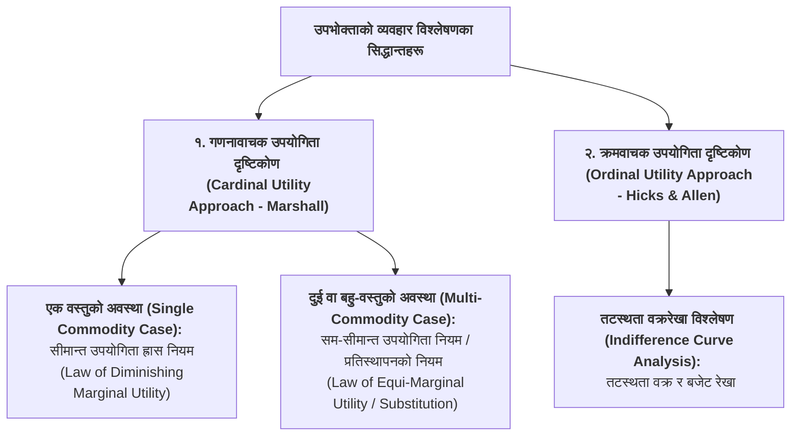
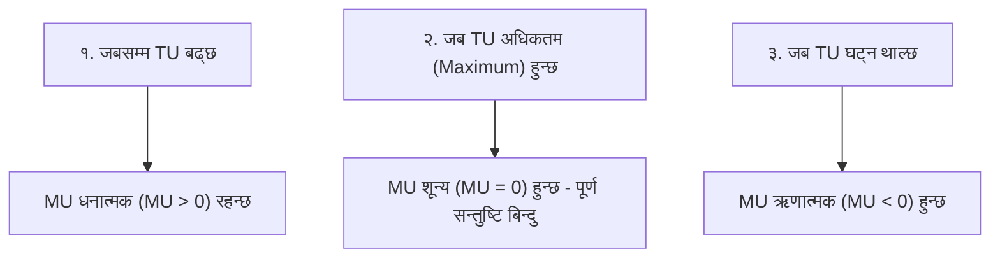

## १. उपयोगिताको विस्तृत स्वरूप र आयामहरू

उपयोगिताको आधारभूत अवधारणालाई निम्न ६ वटा मुख्य आयामहरूबाट बुझ्न सकिन्छ:

| आयाम (Dimension) | मुख्य प्रश्न | सारसंक्षेप र अवधारणा |
| :--- | :---: | :--- |
| **१. अर्थ र परिभाषा** | *What?* | कुनै वस्तुमा निहित मानव आवश्यकता वा चाहना पूरा गर्ने क्षमता। |
| **२. प्रतिपादकहरू** | *Who?* | मार्शल, जेभोन्स (गणनावाचक) र हिक्स, एलेन (क्रमवाचक)। |
| **३. अध्ययनको महत्त्व** | *Why?* | उपभोक्ताको सन्तुष्टि, मागको नियम र छनोट व्यवहार बुझ्न। |
| **४. सन्तुष्टिको समय** | *When?* | उपभोग गर्दा वा उपभोगको प्रत्यक्ष अनुभवबाट। |
| **५. मनोवैज्ञानिक स्रोत** | *Where?* | उपभोक्ताको मन, मस्तिष्क र आत्मगत (Subjective) अनुभूतिमा। |
| **६. मापन विधिहरू** | *How?* | संख्यात्मक युटिल्स ($Utils$) वा प्राथमिकता क्रम ($Ranks$) द्वारा। |

---

### क) उपयोगिता के हो? (What is Utility?)
साधारण अर्थमा उपयोगिता भन्नाले वस्तुको फाइदा वा उपयोगितालाई बुझिन्छ। तर अर्थशास्त्रमा नैतिकता, स्वास्थ्य वा फाइदासँग यसको कुनै प्रत्यक्ष सम्बन्ध हुँदैन।
> **परिभाषा:** कुनै वस्तु वा सेवामा निहित **मानव आवश्यकता वा चाहना पूरा गर्ने क्षमता (Want Satisfying Power of a Commodity)** लाई **उपयोगिता (Utility)** भनिन्छ।  
> *उदाहरण:* तिर्खाएको मानिसका लागि पानीमा उपयोगिता हुन्छ; बिरामीका लागि औषधिमा उपयोगिता हुन्छ; रक्सी पिउने व्यक्तिका लागि रक्सीमा पनि उपयोगिता हुन्छ (चाहे त्यो स्वास्थ्यका लागि हानिकारक नै किन नहोस्)।

---

### ख) उपयोगिता विश्लेषणका प्रतिपादक को हुन्? (Who Developed Utility Analysis?)
* **गणनावाचक दृष्टिकोण (Cardinal Utility):** १८औं र १९औं शताब्दीका क्लासिकल तथा नव-क्लासिकल अर्थशास्त्रीहरू **स्ट्यान्ली जेभोन्स (Jevons)**, **कार्ल मेङ्गर (Menger)**, **लियोन वाल्रास (Walras)**, र विशेषगरी **प्रा. अल्फ्रेड मार्शल (Alfred Marshall)** ले विकास गरे।
* **क्रमवाचक दृष्टिकोण (Ordinal Utility):** २०औं शताब्दीमा **एजवर्थ (Edgeworth)**, **भिल्फ्रेडो परेटो (Pareto)**, र पछि **जे. आर. हिक्स (J.R. Hicks)** तथा **आर. जी. डी. एलेन (R.G.D. Allen)** ले सन् १९३४ मा वैज्ञानिक रूपमा विकास गरे।

---

### ग) उपयोगिताको अध्ययन किन गरिन्छ? (Why Study Utility?)
उपभोक्ताले कुनै वस्तु खरिद गर्दा त्यसको मूल्य तिर्न किन तयार हुन्छ? किनभने उसले त्यसबाट उपयोगिता प्राप्त गर्दछ। उपयोगिताको अध्ययनले मागको नियमको वैज्ञानिक आधार, उपभोक्ताको बचत (Consumer Surplus) र बजार माग निर्माण बुझ्न मद्दत गर्दछ।

---

### घ) उपयोगिता कहिले महसुस हुन्छ? (When is Utility Realized?)
उपयोगिता वस्तु उपभोग गर्नुअघिको **अपेक्षित सन्तुष्टि (Expected Satisfaction)** र उपभोग गर्दाको **वास्तविक अनुभूति (Realized Satisfaction)** को समयमा उत्पन्न हुन्छ। तीव्रता जति बढी हुन्छ, उपयोगिता त्यति नै उच्च हुन्छ (जस्तै: धेरै भोकाएको बेला पहिलो गाँस खानाबाट अत्यधिक उपयोगिता प्राप्त हुनु)।

---

### ङ) उपयोगिता कहाँ रहन्छ? (Where does Utility Reside?)
उपयोगिता कुनै वस्तुको भौतिक गुण होइन, यो **उपभोक्ताको मन र मस्तिष्क (Subjective Psychological Feeling)** मा रहन्छ। एउटै वस्तु कुनै व्यक्तिका लागि उपयोगी हुन सक्छ तर अर्को व्यक्तिका लागि निरर्थक हुन सक्छ (जस्तै: शाकाहारीका लागि मासुको उपयोगिता शून्य हुन्छ)।

---

### च) उपयोगिता कसरी मापन गरिन्छ? (How is Utility Measured?)
उपयोगिता मापनका दुई प्रमुख दृष्टिकोणहरू छन्:
1. **गणनावाचक दृष्टिकोण (Cardinal Utility):** उपयोगितालाई संख्यात्मक एकाइहरू (१, २, ३ Utils) मा नापिन्छ।
2. **क्रमवाचक दृष्टिकोण (Ordinal Utility):** उपयोगितालाई संख्यामा नाप्न असम्भव मानेर केवल पहिलो, दोस्रो, तेस्रो प्राथमिकता (Ranks) दिइन्छ।

---

## २. उपभोक्ता व्यवहार विश्लेषणको गुरु-फ्लोचार्ट (Master Flowchart of Approaches)

---

## ३. गणनावाचक बनाम क्रमवाचक उपयोगिता दृष्टिकोण (Cardinal vs. Ordinal Utility)

| तुलनाको आधार | गणनावाचक दृष्टिकोण (Cardinal Approach) | क्रमवाचक दृष्टिकोण (Ordinal Approach) |
| :--- | :--- | :--- |
| **प्रतिपादक अर्थशास्त्री** | अल्फ्रेड मार्शल, जेभोन्स, गोसेन | जे. आर. हिक्स र आर. जी. डी. एलेन |
| **मापन विधि** | उपयोगितालाई **संख्या (१, २, ३...)** मा नाप्न सकिन्छ। | उपयोगितालाई संख्यामा होइन, केवल **क्रम वा प्राथमिकता (१st, २nd, ३rd)** मा राखिन्छ। |
| **मापन एकाइ** | **Utils (युटिल्स)** वा मुद्राको एकाइ। | कुनै काल्पनिक एकाइ छैन; प्राथमिकताको क्रम। |
| **मुद्राको सीमान्त उपयोगिता** | स्थिर ($MU_m = \text{Constant}$) रहन्छ भन्ने मान्यता। | स्थिर रहनु पर्दैन। |
| **यथार्थपरकता** | कम यथार्थपरक र मनोवैज्ञानिक रूपमा कमजोर। | बढी वैज्ञानिक, यथार्थपरक र आधुनिक। |
| **प्रयोग हुने विश्लेषण औजार** | सीमान्त उपयोगिता ($MU$) र कुल उपयोगिता ($TU$)। | तटस्थता वक्ररेखा ($IC$) र बजेट रेखा ($BL$)। |

---

## ४. कुल उपयोगिता र सीमान्त उपयोगिता (Total Utility & Marginal Utility)

### क) कुल उपयोगिता (Total Utility - $TU$)
कुनै निश्चित समयमा कुनै वस्तुका विभिन्न एकाइहरू उपभोग गर्दा प्राप्त हुने **समग्र सन्तुष्टि वा उपयोगिताको योगफललाई** कुल उपयोगिता भनिन्छ।
$$TU = \sum MU = MU_1 + MU_2 + MU_3 + \dots + MU_n$$

### ख) सीमान्त उपयोगिता (Marginal Utility - $MU$)
कुनै वस्तुको **थप एक एकाइ (अन्तिम एकाइ) उपभोग गर्दा कुल उपयोगितामा आउने थप अंश वा परिवर्तनलाई** सीमान्त उपयोगिता भनिन्छ।
$$MU_n = TU_n - TU_{n-1} \quad \text{वा} \quad MU = \frac{\Delta TU}{\Delta Q}$$

---

## ५. कुल उपयोगिता ($TU$) र सीमान्त उपयोगिता ($MU$) बीचको सम्बन्ध

| उपभोग एकाइ (स्याउ) | कुल उपयोगिता ($TU$ Utils मा) | सीमान्त उपयोगिता ($MU$ Utils मा) | सम्बन्ध र अवस्था |
| :---: | :---: | :---: | :--- |
| १ | १० | १० | $TU$ बढ्छ, $MU$ धनात्मक |
| २ | १८ | ८ ($18 - 10$) | $TU$ बढ्दो दरमा, $MU$ घट्दो तर धनात्मक |
| ३ | २४ | ६ ($24 - 18$) | $TU$ बढ्दो, $MU > 0$ |
| ४ | २८ | ४ ($28 - 24$) | $TU$ बढ्दो, $MU > 0$ |
| **५** | **३०** | **० ($30 - 30$)** | **$TU$ अधिकतम (Peak), $MU = 0$ (पूर्ण सन्तुष्टि बिन्दु - Point of Satiety)** |
| ६ | २८ | -२ ($28 - 30$) | $TU$ घट्न थाल्छ, $MU$ ऋणात्मक (Disutility) |

---

## ६. $TU$ र $MU$ गणना अभ्यास (Calculation Practice)

### ✍️ अभ्यास समस्या १: खाली ठाउँ भर्नुहोस् (Fill in the Missing Values)
**प्रश्न:** तल दिइएको तालिकामा छुटेका $TU$ र $MU$ का मानहरू गणना गरी तालिका पूरा गर्नुहोस्:

| उपभोग एकाइ ($Q$) | कुल उपयोगिता ($TU$) | सीमान्त उपयोगिता ($MU$) |
| :---: | :---: | :---: |
| १ | १२ | **?** |
| २ | **?** | १० |
| ३ | ३० | **?** |
| ४ | ३४ | **?** |
| ५ | **?** | ० |
| ६ | ३० | **?** |

#### 💡 समाधान (Step-by-Step Solution):
1. एकाइ १ मा: $MU_1 = TU_1 = \mathbf{12}$
2. एकाइ २ मा: $TU_2 = TU_1 + MU_2 = 12 + 10 = \mathbf{22}$
3. एकाइ ३ मा: $MU_3 = TU_3 - TU_2 = 30 - 22 = \mathbf{8}$
4. एकाइ ४ मा: $MU_4 = TU_4 - TU_3 = 34 - 30 = \mathbf{4}$
5. एकाइ ५ मा: $TU_5 = TU_4 + MU_5 = 34 + 0 = \mathbf{34}$ (अधिकतम $TU$)
6. एकाइ ६ मा: $MU_6 = TU_6 - TU_5 = 30 - 34 = \mathbf{-4}$

#### पूर्ण तालिका:
| उपभोग एकाइ ($Q$) | कुल उपयोगिता ($TU$) | सीमान्त उपयोगिता ($MU$) |
| :---: | :---: | :---: |
| १ | १२ | १२ |
| २ | २२ | १० |
| ३ | ३० | ८ |
| ४ | ३४ | ४ |
| **५** | **३४** | **० (पूर्ण सन्तुष्टि)** |
| ६ | ३० | -४ |

---

## 📌 परीक्षा उपयोगी सारांश (Key Takeaways)
* **उपयोगिता** भनेको मानव आवश्यकता पूरा गर्ने वस्तुको आन्तरिक क्षमता हो।
* **गणनावाचक (मार्शल):** संख्यामा नापिन्छ ($Utils$); **क्रमवाचक (हिक्स):** प्राथमिकतामा राखिन्छ ($Ranks$)।
* **$TU = \sum MU$** र **$MU = TU_n - TU_{n-1}$**।
* **जब $TU$ अधिकतम हुन्छ, तब $MU = 0$ हुन्छ** (Point of Satiety)।
