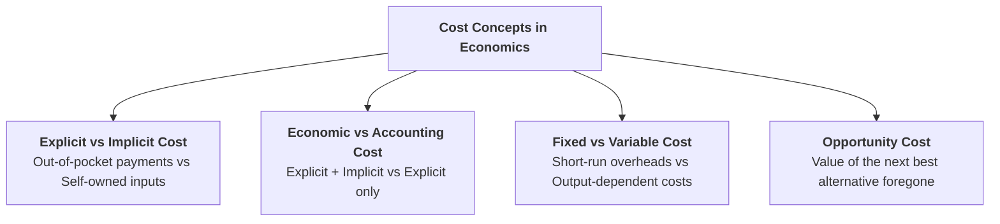
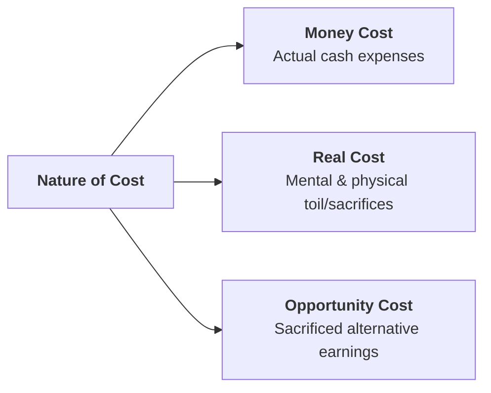
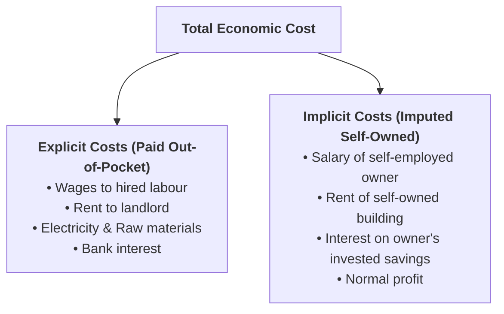
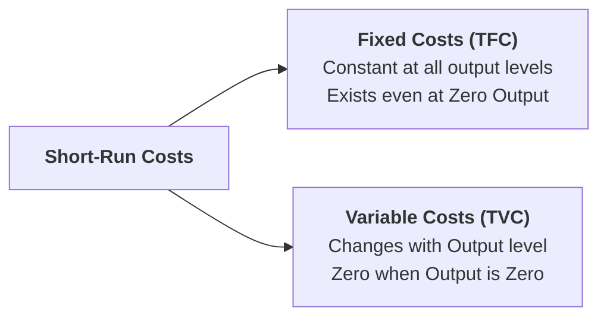

## Overview

To produce goods and services, a business must employ factors of production (land, labour, capital, entrepreneurship) and raw materials. The total expenditure incurred on these productive resources is known as the **Cost of Production**. Understanding different cost concepts is vital for pricing decisions, measuring profitability, and determining the optimal output level of a firm.

---

## Part 1: Meaning and Primary Types of Cost

### Q1. Define Cost of Production in economics.
**Answer:**
**Definition:**
> In economics, **Cost of Production** refers to the total monetary expenses, sacrifices, and resource payments incurred by a producer or firm to purchase, hire, or organize the factors of production and intermediate goods needed to produce a specific quantity of output.

It includes payments for raw materials, wages for workers, rent for land/factory buildings, interest on borrowed capital, depreciation of machinery, and normal profits for the entrepreneur.

---

### Q2. Distinguish between Money Cost, Real Cost, and Opportunity Cost.
**Answer:**

1. **Money Cost (Nominal Cost):**
   * The actual total cash expenditure incurred by a firm in producing a commodity, expressed in monetary units (e.g., spending Rs. 50,000 on raw materials and Rs. 30,000 on wages).
2. **Real Cost (Philosophical Cost - Alfred Marshall):**
   * Refers to the physical exertions, mental pains, discomfort, and personal sacrifices made by workers and savers in the process of production. It is a psychological, subjective concept that cannot be measured directly in monetary terms.
3. **Opportunity Cost (Alternative Cost):**
   * The value of the next best alternative product or income foregone when resources are committed to producing a specific good.

---

## Part 2: Explicit Cost vs. Implicit Cost

---

### Q3. What is the difference between Explicit Cost and Implicit Cost?
**Answer:**

#### Detailed Comparison Table:

| Comparison Basis | Explicit Cost (Out-of-Pocket Cost) | Implicit Cost (Imputed / Book Cost) |
| :--- | :--- | :--- |
| **Meaning** | Direct cash payments made by the firm to outside suppliers of factors and inputs. | The estimated (imputed) monetary value of self-owned and self-employed resources used by the owner. |
| **Cash Outflow** | Involves an **actual, direct cash outflow** from the firm's bank account. | Involves **no direct cash payment** to external parties. |
| **Accounting Entry** | Recorded in standard accounting books, receipts, and income tax statements. | Not recorded in formal accounting books; considered only in economic analysis. |
| **Examples** | • Wages paid to hired workers • Raw material purchase expenses • Factory electricity bills • Transport charges | • Foregone salary of the owner working in their own business • Foregone rent of the owner's own building used as an office • Foregone interest on the owner's personal capital invested |

---

## Part 3: Economic Cost vs. Accounting Cost (and Profit)

---

### Q4. Explain the relationship between Accounting Cost, Economic Cost, Accounting Profit, and Economic Profit.
**Answer:**

#### 1. Definitions of Cost:
* **Accounting Cost:** Includes only **Explicit Costs** (actual contractual money payments recorded in ledgers):
  $$\text{Accounting Cost} = \text{Explicit Costs}$$
* **Economic Cost:** Includes both **Explicit Costs** and **Implicit Costs** (including normal profit):
  $$\text{Economic Cost} = \text{Explicit Costs} + \text{Implicit Costs}$$

#### 2. Definitions of Profit:
* **Accounting Profit:**
  $$\text{Accounting Profit} = \text{Total Revenue (TR)} - \text{Explicit Costs}$$
* **Economic Profit (Pure Profit):**
  $$\text{Economic Profit} = \text{Total Revenue (TR)} - \text{Economic Cost} = \text{Total Revenue} - (\text{Explicit} + \text{Implicit Costs})$$
  $$\text{or}$$
  $$\text{Economic Profit} = \text{Accounting Profit} - \text{Implicit Costs}$$

#### Practical Example:
Suppose a business owner earns **Total Revenue of Rs. 10,00,000**.
* Explicit Costs (wages, raw materials, rent): **Rs. 6,00,000**.
* Implicit Costs (owner's foregone salary in another job): **Rs. 2,50,000**.
* **Accounting Profit:** $10,00,000 - 6,00,000 = \mathbf{\text{Rs. 4,00,000}}$.
* **Economic Profit:** $10,00,000 - (6,00,000 + 2,50,000) = \mathbf{\text{Rs. 1,50,000}}$.

---

## Part 4: Fixed Costs vs. Variable Costs in the Short Run

---

### Q5. What is the difference between Fixed Cost and Variable Cost?
**Answer:**
In the short run, production inputs are divided into **fixed inputs** (which cannot be changed quickly) and **variable inputs** (which can be increased or decreased immediately with output).

#### Detailed Comparison Table:

| Feature / Basis | Total Fixed Cost ($TFC$) / Supplementary Cost | Total Variable Cost ($TVC$) / Prime Cost |
| :--- | :--- | :--- |
| **Meaning** | Costs that do not change with changes in the level of output in the short run. | Costs that vary directly with changes in the level of output produced. |
| **At Zero Output ($Q = 0$)** | **Remains positive ($TFC > 0$)**; cannot be avoided even if production is halted. | **Becomes zero ($TVC = 0$)** when production stops. |
| **Time Period** | Exists only in the **Short Run** (all costs become variable in the long run). | Exists in both the **Short Run** and **Long Run**. |
| **Nature of Curve** | A horizontal straight line parallel to the output axis. | An upward-sloping, inverse S-shaped curve starting from the origin. |
| **Control by Management** | Unavoidable overheads in the short run. | Controllable expenses; adjusted with daily production decisions. |
| **Examples** | • Factory building rent • Permanent staff salaries • Property taxes & insurance • Depreciation of heavy machinery | • Raw material expenses • Wages of daily-wage labourers • Fuel, electricity, and water bills • Packaging and transport charges |

---

## Quick Revision Check

1. **What is an Explicit Cost?**  
   *Direct out-of-pocket cash payments made to external suppliers for goods and services.*
2. **What is an Implicit Cost?**  
   *The imputed monetary value of self-owned resources used in the business without cash payment.*
3. **What is the formula for Economic Cost?**  
   *$\text{Economic Cost} = \text{Explicit Cost} + \text{Implicit Cost}$.*
4. **Give two examples of Total Fixed Cost ($TFC$).**  
   *Factory building rent and permanent manager salaries.*
5. **What is the value of Total Variable Cost ($TVC$) when output is zero?**  
   *Zero ($TVC = 0$).*
