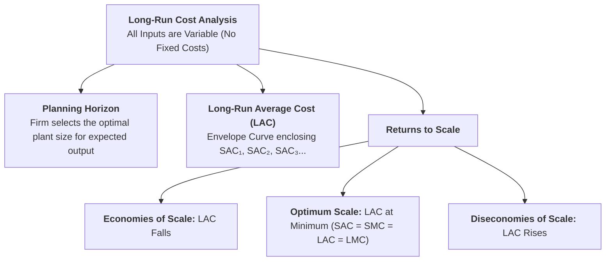
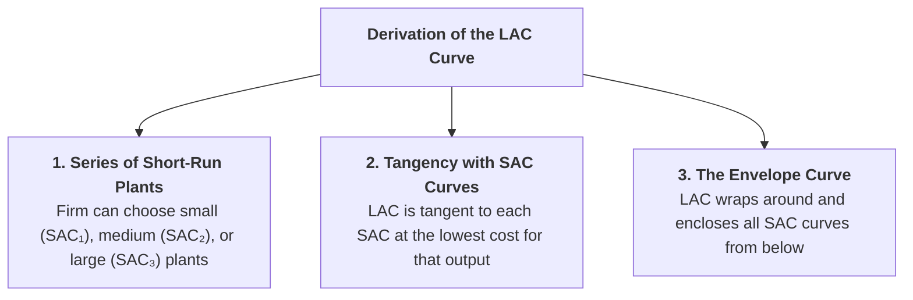
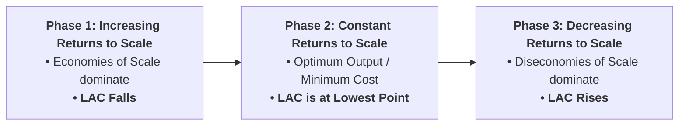
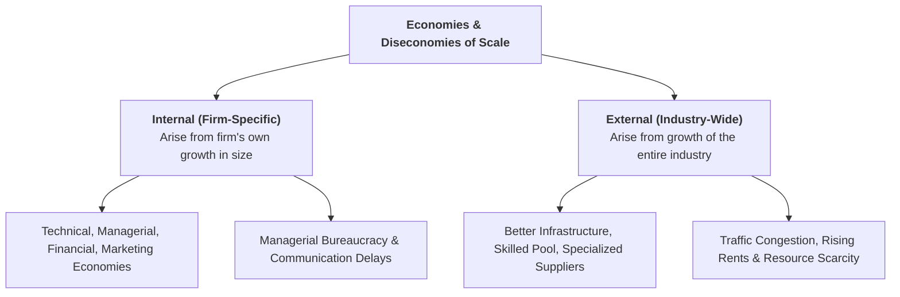

## Overview

In the **long run**, all factors of production are variable. A firm is not restricted to a single fixed factory; it can build larger plants, adopt new production technologies, and adjust its entire scale of operation. This lesson explores how the **Long-Run Average Cost ($LAC$)** curve is derived as an **Envelope Curve** from short-run plant choices, and why it is shaped by **Economies and Diseconomies of Scale**.



---

## Part 1: Meaning of the Long Run and the Planning Horizon

### Q1. What is the 'Long Run' in economics? Why are there no fixed costs in the long run?
**Answer:**
**Definition:**
> The **Long Run** is a planning time horizon long enough for a firm to change and adjust all its productive inputs—including factory buildings, heavy machinery, land, plant capacity, and organizational structure.

#### Key Features of the Long Run:
1. **No Fixed Factors / No Fixed Costs:**
   * In the long run, all inputs are variable. The firm can build a second factory, replace old machinery, or downsize operations. Therefore, **$TFC = 0$** and **$\text{Total Cost} = \text{Total Variable Cost}$**.
2. **The 'Planning Horizon':**
   * The long run is a planning horizon in which an entrepreneur evaluates various alternative plant sizes and technological layouts to choose the most cost-efficient scale for future production.
   * *Note:* While planning is long-run, actual day-to-day operation always takes place in the short run on the chosen plant size.

---

## Part 2: Derivation of the Long-Run Average Cost ($LAC$) Curve

---

### Q2. Explain how the Long-Run Average Cost ($LAC$) Curve is derived. Why is it called an 'Envelope Curve' and 'Planning Curve'?
**Answer:**
Suppose a firm has the option to choose among different plant sizes represented by short-run average cost curves: $SAC_1$ (small plant), $SAC_2$ (medium plant), $SAC_3$ (optimal plant), and $SAC_4$ (large plant).

```
Cost (Rs.)
   |
   |     SAC1             SAC4
   |    \    /   SAC2     \  /
   |     \  /   \   /      \/     SAC3 (Optimum Plant)
   |      \/     \ /       /
   |       \------*-------/----------------- LAC Curve (Envelope Curve)
   |              |
   |              Min LAC (Optimum Scale: Q*)
 0 +--------------+-----------------------------> Output (Q)
```



#### Why it is called an 'Envelope Curve':
* The $LAC$ curve **surrounds and wraps around (envelopes)** all the individual Short-Run Average Cost ($SAC$) curves from below without any $SAC$ curve falling below it.
* It traces the minimum per-unit cost of producing any given level of output when the firm is free to build the optimal plant size.

#### Why it is called a 'Planning Curve':
* It guides the firm’s long-term investment planning decisions regarding which plant size will yield the lowest average cost for expected market demand.

---

### Q3. Is the $LAC$ curve tangent to the minimum points of all $SAC$ curves? Explain.
**Answer:**
**No.** The $LAC$ curve is tangent to the minimum point of **only one $SAC$ curve**—the optimum plant size ($SAC_3$) at the very bottom of the $LAC$ curve.

* **On the Falling Portion of $LAC$ (Left of Minimum):** The $LAC$ curve is tangent to the $SAC$ curves on their **falling segments** (to the left of their minimum points). It is cheaper to produce on a slightly underutilized larger plant than on an overloaded smaller plant.
* **At the Minimum Point of $LAC$ (Optimum Output):** The $LAC$ curve is tangent to the **exact minimum point** of the optimum plant ($SAC$). Here, **$SAC = SMC = LAC = LMC$**.
* **On the Rising Portion of $LAC$ (Right of Minimum):** The $LAC$ curve is tangent to the $SAC$ curves on their **rising segments** (to the right of their minimum points).

---

## Part 3: Why is the Long-Run Average Cost Curve U-Shaped?

---

### Q4. Explain the shape of the $LAC$ curve in terms of Economies and Diseconomies of Scale (Laws of Returns to Scale).
**Answer:**
While the short-run $AC$ curve is U-shaped due to the *Law of Variable Proportions*, the $LAC$ curve is U-shaped due to the **Laws of Returns to Scale**:



1. **Phase 1: Economies of Scale (Falling LAC):**
   * As the firm expands its scale of production and builds larger plants, it enjoys technical, managerial, and financial efficiencies.
   * Output increases more than proportionately to inputs $\implies$ **$LAC$ decreases**.
2. **Phase 2: Optimum Scale of Plant (Minimum LAC):**
   * The firm reaches the **Minimum Efficient Scale ($MES$)**, where average cost is at its lowest possible level.
3. **Phase 3: Diseconomies of Scale (Rising LAC):**
   * If the firm expands beyond its optimum capacity, management becomes unwieldy, coordination weakens, communication delays emerge, and bureaucracy grows.
   * Output increases less than proportionately to inputs $\implies$ **$LAC$ rises**.

---

## Part 4: Internal and External Economies and Diseconomies of Scale

---

### Q5. What are Internal and External Economies and Diseconomies of Scale?
**Answer:**



#### 1. Internal Economies (Benefits unique to an expanding firm):
* **Technical Economies:** Ability to use large-scale, automated, high-precision machinery.
* **Managerial Economies:** Ability to hire specialized department managers (Finance, Marketing, HR).
* **Financial Economies:** Large firms can borrow money from banks at lower interest rates and issue shares.
* **Marketing / Commercial Economies:** Bulk purchasing of raw materials with substantial discounts and large-scale advertising.

#### 2. Internal Diseconomies (Costs unique to an over-expanded firm):
* **Managerial Inefficiencies:** Difficulty in supervising thousands of workers across multiple branches.
* **Communication Bottlenecks:** Delays in corporate decision-making and loss of employee motivation.

#### 3. External Economies (Benefits shared by all firms as the industry grows):
* **Localization Benefits:** Development of specialized transport networks, repair services, and technical training institutes near the industrial cluster.
* **Cheaper Raw Materials & Information:** Emergence of dedicated component suppliers and trade journals.

#### 4. External Diseconomies (Costs imposed on all firms as the industry over-concentrates):
* **Overcrowding & Congestion:** Heavy traffic delays and overloaded local transport.
* **Factor Price Escalation:** Rising local land rents, higher wages due to local labour shortages, and environmental pollution taxes.

---

## Part 5: Long-Run Marginal Cost ($LMC$) Curve

---

### Q6. What is the Long-Run Marginal Cost ($LMC$) Curve? What is its relationship with $LAC$?
**Answer:**
**Definition:**
> **Long-Run Marginal Cost ($LMC$)** is the additional cost incurred in producing one more unit of output when the firm is free to adjust all productive factors and plant sizes optimally.

#### Relationship Between $LAC$ and $LMC$:
1. When **$LMC < LAC$**, the $LAC$ curve is **falling** (downward sloping).
2. When **$LMC = LAC$**, the $LAC$ curve is at its **minimum lowest point** ($LMC$ cuts $LAC$ from below).
3. When **$LMC > LAC$**, the $LAC$ curve is **rising** (upward sloping).
4. **Long-Run Equilibrium of the Firm:** At the optimum scale of production:
   $$\mathbf{SAC = SMC = LAC = LMC}$$

---

## Part 6: Comparison Table: Short-Run vs. Long-Run Cost Curves

---

### Q7. Summary Comparison of $SAC$ and $LAC$ Curves

| Comparison Basis | Short-Run Average Cost ($SAC$) | Long-Run Average Cost ($LAC$) |
| :--- | :--- | :--- |
| **Factor Mobility** | Some factors are fixed, some are variable. | All factors are completely variable ($TFC = 0$). |
| **Governing Law** | **Law of Variable Proportions** (Diminishing Returns). | **Laws of Returns to Scale** (Economies & Diseconomies of Scale). |
| **Shape** | Sharper, narrower **U-shape**. | Flatter, wider **Dish-shape / U-shape**. |
| **Nature of Curve** | Represents cost for a single fixed plant. | **Envelope Curve / Planning Curve** wrapping multiple $SAC$s. |
| **Minimum Point** | Represents optimum capacity for that specific plant. | Represents the **Optimum Scale of the Firm** ($SAC = SMC = LAC = LMC$). |

---

## Quick Revision Check

1. **Why is the $LAC$ curve called an 'Envelope Curve'?**  
   *Because it envelopes and touches all the short-run average cost ($SAC$) curves from below.*
2. **Which law explains the U-shape of the $LAC$ curve?**  
   *The Laws of Returns to Scale (Economies and Diseconomies of Scale).*
3. **What are Internal Economies of Scale?**  
   *Cost savings and efficiency gains achieved directly by an individual firm as it expands its own plant size.*
4. **Where does the $LMC$ curve cut the $LAC$ curve?**  
   *At the minimum point of the $LAC$ curve from below.*
5. **What condition holds at the optimum scale of output in the long run?**  
   *$SAC = SMC = LAC = LMC$.*
