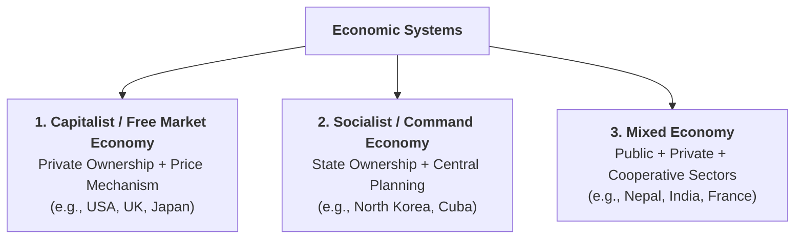
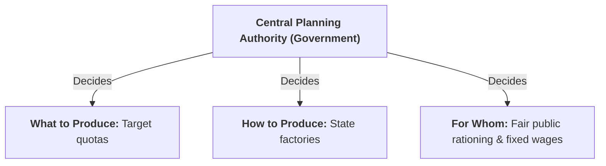
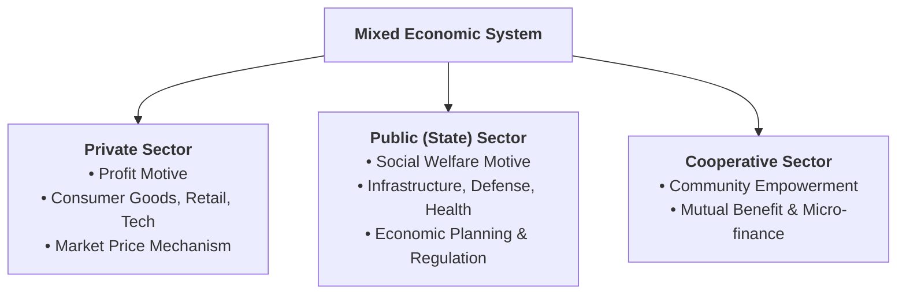
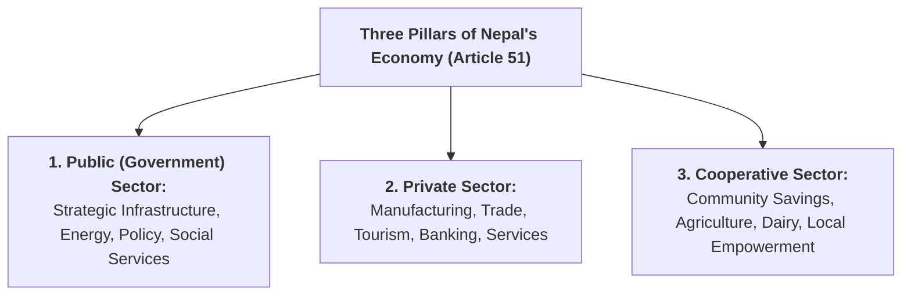

## Overview

An **economic system** is the organized framework of laws, institutions, and customs that a society uses to solve the fundamental questions of *What, How, and For Whom to Produce*. This lesson examines the three major world economic systems and explores the mixed economic model adopted by Nepal.

---

## Part 1: Capitalist (Free Market) Economy

### Q1. What is a Capitalist / Market Economy? Explain its core features.
**Answer:**
**Definition:**
> A **Capitalist Economy** (also known as a **Free Market Economy** or **Laissez-faire Economy**) is an economic system in which all means of production are owned and operated by private individuals and businesses, and economic decisions are guided by the forces of market demand and supply (**Price Mechanism**) with minimal government interference.
> *Examples:* United States, United Kingdom, Singapore, Japan.

#### Key Features:
1. **Right to Private Property:**
   * Individuals and private corporations have the legal right to own, accumulate, buy, sell, and inherit land, machinery, factories, shares, and money.
2. **Freedom of Enterprise and Choice:**
   * Entrepreneurs are free to enter any legal business, invest capital, and produce any commodity they choose without government permission or quotas.
3. **Profit Motive:**
   * Profit is the primary driving force behind all economic activities. Producers bear all business risks in pursuit of profit.
4. **Price Mechanism (The 'Invisible Hand'):**
   * Prices of goods, services, and wages are determined automatically by the interaction of demand and supply in competitive markets.
5. **Consumer Sovereignty:**
   * The consumer is the "king" of the market. What gets produced depends entirely on what consumers are willing and able to buy.
6. **Minimal Role of Government (Laissez-Faire):**
   * The government’s role is restricted to maintaining national defense, law and order, enforcing contracts, and basic public administration.

---

### Q2. What are the Merits and Demerits of a Capitalist Economy?
**Answer:**

#### Merits (Advantages):
* **High Efficiency and Innovation:** Fierce business competition drives firms to adopt advanced technology and reduce production costs.
* **Consumer Freedom & Variety:** Consumers enjoy a vast selection of high-quality goods and services tailored to their preferences.
* **Automatic Operation:** The price mechanism allocates resources smoothly without the need for expensive government bureaucracy.
* **High Rate of Capital Accumulation:** Strong profit incentives encourage investment, research, and economic growth.

#### Demerits (Disadvantages):
* **Severe Economic Inequality:** Wealth tends to concentrate in the hands of a few wealthy industrialists and investors, widening the gap between rich and poor.
* **Neglect of Social Welfare:** Unprofitable public goods (such as free rural health clinics, basic schooling, public parks) are neglected by private businesses.
* **Risk of Monopolies:** Large corporations may merge to form monopolies, exploiting consumers through higher prices and artificial shortages.
* **Economic Instability:** Unregulated market forces can lead to recurrent business cycles (inflation, recessions, and sudden unemployment).

---

## Part 2: Socialist (Command) Economy

---

### Q3. What is a Socialist / Command Economy? Explain its core features.
**Answer:**
**Definition:**
> A **Socialist Economy** (also known as a **Centrally Planned Economy** or **Command Economy**) is an economic system in which all major means of production (land, factories, natural resources, transport) are owned and controlled by the state on behalf of society, and all economic decisions are made by a **Central Planning Authority**.
> *Historical & Modern Examples:* Former Soviet Union, North Korea, Cuba.

#### Key Features:
1. **State / Public Ownership of Resources:**
   * Private ownership of factories, farms, and mines is abolished. All productive assets belong to the state.
2. **Central Economic Planning:**
   * A central planning commission sets national production targets, allocates resources among industries, and determines employment quotas according to long-term social goals.
3. **Social Welfare Motive:**
   * The primary objective of economic activity is collective social welfare and public need, rather than private commercial profit.
4. **Administered Prices:**
   * Prices of commodities, essential food items, and utilities are fixed by government decree (price fixing), rather than market supply and demand.
5. **Absence of Private Competition:**
   * The government is the sole producer and distributor; private market competition does not exist.
6. **Economic Equality:**
   * The state guarantees employment, housing, healthcare, and education to every citizen, minimizing income disparities.

---

### Q4. What are the Merits and Demerits of a Socialist Economy?
**Answer:**

#### Merits (Advantages):
* **Reduced Inequality:** Eradicates the exploitation of workers by private capitalists and prevents wealth accumulation by a small elite.
* **Planned Resource Allocation:** Resources are systematically directed toward urgent national priorities (e.g., basic food security, heavy industry, universal healthcare).
* **Guaranteed Employment & Social Security:** Every citizen is provided with work, basic shelter, and healthcare.
* **Absence of Wasteful Competition:** Eliminates unnecessary advertising expenses and duplicated corporate overheads.

#### Demerits (Disadvantages):
* **Bureaucratic Inefficiency and Red Tape:** Centralized decision-making is slow, rigid, and prone to bureaucratic corruption.
* **Lack of Consumer Choice:** Consumers must accept standard, uniform products produced by state factories without variety.
* **Lack of Individual Incentive:** Since private profit is prohibited, workers and managers have little motivation to innovate or improve productivity.
* **Misallocation of Resources:** Without price signals, central planners often miscalculate demand, leading to chronic shortages of daily consumer goods.

---

## Part 3: Mixed Economy

---

### Q5. What is a Mixed Economy? Explain its core features.
**Answer:**
**Definition:**
> A **Mixed Economy** is an economic system that combines the best elements of both capitalism and socialism. It allows the **co-existence of both the private sector and the public (government) sector**, working together under state regulation and national economic planning.
> *Examples:* Nepal, India, France, Sweden, United Kingdom.

#### Key Features:
1. **Co-existence of Public and Private Sectors:**
   * The **public sector** manages strategic, heavy, and social infrastructure (highways, electricity, public health, national defense).
   * The **private sector** operates freely in consumer goods, retail, agriculture, tourism, and services.
2. **Dual Pricing Mechanism:**
   * Prices of general commodities are determined by market supply and demand (**price mechanism**).
   * However, the government intervenes to regulate the prices of essential goods (fuel, medicines, basic grains) via subsidies, price ceilings, and fair-price shops.
3. **Harmony of Profit Motive and Social Welfare:**
   * Private entrepreneurs work for financial profit, while the government implements progressive taxation and social security programs to protect vulnerable citizens.
4. **Economic Planning:**
   * The government formulates national periodic development plans (e.g., Five-Year Plans) to guide overall economic growth, while allowing private enterprise to operate within that framework.
5. **Control of Monopoly and Consumer Protection:**
   * The state enacts laws to prevent unfair trade practices, cartels, and black-marketing.

---

### Q6. Comprehensive Comparison of the Three Economic Systems

| Feature | Capitalist Economy | Socialist Economy | Mixed Economy |
| :--- | :--- | :--- | :--- |
| **Ownership of Resources** | Exclusively private individuals and corporations. | Exclusively owned by the state / society. | Co-existence of private, public, and cooperative sectors. |
| **Guiding Motive** | Maximum private profit. | Maximum collective social welfare. | Balance of private profit and social welfare. |
| **Price Determination** | Free **Price Mechanism** (Demand and Supply). | **Administered Prices** fixed by the government. | Price mechanism supplemented by state price regulations & subsidies. |
| **Role of Government** | Minimal (Laissez-faire / Law & order only). | Complete (Central Planner, Sole Producer). | Active (Planner, Regulator, Investor, and Facilitator). |
| **Consumer Sovereignty** | Complete (Consumer is King). | Absent (State decides what is produced). | Present in private goods; regulated in essential utilities. |
| **Income Distribution** | Highly unequal; wide rich-poor gap. | Relatively equal; state-managed wages. | Moderate; reduced through progressive taxation and welfare schemes. |

---

## Part 4: The Economic System of Nepal

---

### Q7. Which economic system is adopted by Nepal? Explain its constitutional basis and primary characteristics.
**Answer:**
**System Adopted:**
Nepal has adopted a **Mixed Economic System**. 

Under **Article 51 of the Constitution of Nepal**, the economic policy of the state is officially founded on the **Three-Pillar Development Model**:
> The state's economic objective is to develop a self-reliant, sustainable, and socialism-oriented economy through the mutual coordination, partnership, and participation of the **Public Sector**, the **Private Sector**, and the **Cooperative Sector**.

---

### Q8. What are the Main Features of the Nepalese Mixed Economy?
**Answer:**
1. **Three-Pillar Model (Public, Private, Cooperatives):**
   * **Public Sector:** Government bodies (such as Nepal Electricity Authority, Nepal Oil Corporation, Nepal Telecom, public hospitals, and municipal road agencies) build strategic national infrastructure and provide public goods.
   * **Private Sector:** Private businesses drive the majority of agricultural processing, hotel/tourism industries, retail trade, airlines, commercial banks, and industrial manufacturing.
   * **Cooperative Sector:** Thousands of agricultural, saving and credit, and dairy cooperatives empower rural households and small entrepreneurs with local capital.
2. **Dual Price Mechanism with State Intervention:**
   * Market prices of most day-to-day goods and services are determined by competitive demand and supply.
   * However, the Government of Nepal intervenes through the **Ministry of Industry, Commerce and Supplies** to monitor market cartels, set **Minimum Support Prices (MSP)** for paddy and wheat farmers, provide chemical fertilizer subsidies, and regulate petroleum and electricity tariffs.
3. **Periodic Economic Planning:**
   * The **National Planning Commission (NPC)** formulates periodic national development plans (such as the 15th and 16th Periodic Plans) that establish national growth targets, poverty alleviation programs, and public investment allocations.
4. **Commitment to Social Welfare and Security:**
   * The state provides free basic education, social security allowances (senior citizen pensions, single woman allowances, disability stipends), and government-subsidized health insurance programs.
5. **Private Property Rights with Progressive Taxation:**
   * Citizens enjoy the constitutional right to own property, establish businesses, and earn profits, while the state levies progressive income tax, VAT, and custom duties to fund public welfare and reduce regional inequalities.
6. **Encouragement of Foreign Direct Investment (FDI):**
   * Nepal actively welcomes private foreign investment in high-priority national sectors such as hydropower, tourism, information technology, and transport infrastructure.

---

## Quick Revision Check

1. **What are the three main types of economic systems?**  
   *Capitalist (Market), Socialist (Command), and Mixed Economies.*
2. **What is 'Consumer Sovereignty'?**  
   *The market principle in capitalism where consumer preferences determine what goods and services are produced.*
3. **Which economic system does Nepal follow?**  
   *A Mixed Economic System.*
4. **What are the three pillars of Nepal's economy according to Article 51 of the Constitution?**  
   *The Public (State) sector, the Private sector, and the Cooperative sector.*
5. **What is the primary role of the National Planning Commission (NPC) in Nepal?**  
   *To formulate periodic national economic development plans and guide resource allocation.*
