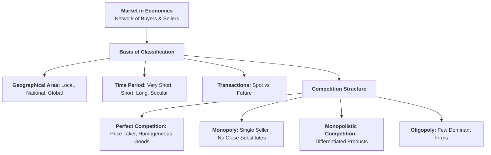
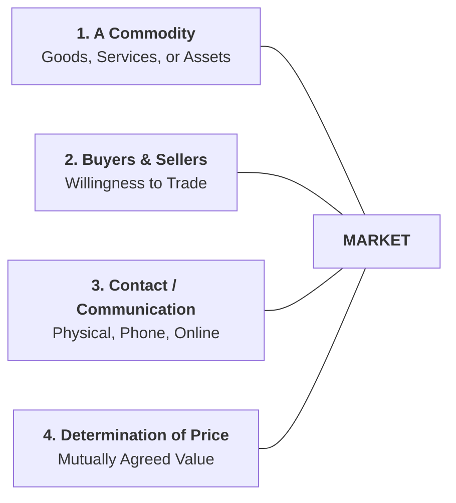
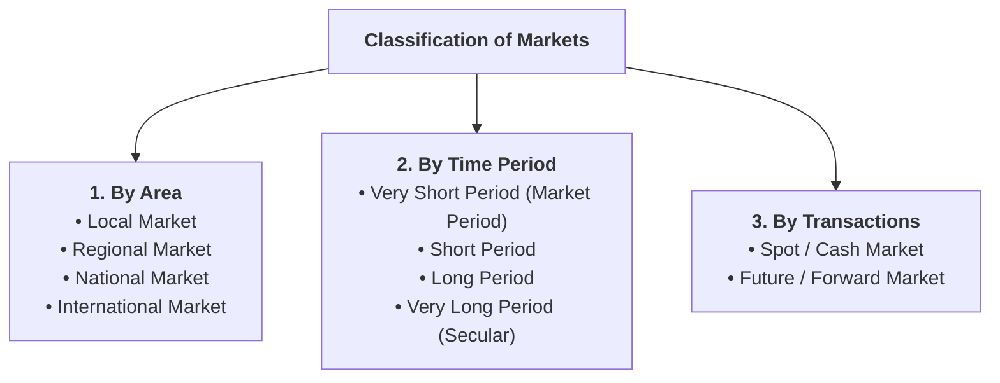
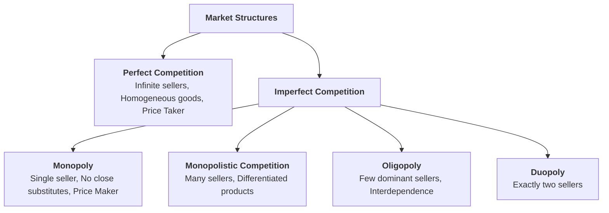

## Overview

In ordinary language, a "market" refers to a specific physical shopping centre or bazaar. In economics, however, a market is defined much more broadly as the entire mechanism or network through which buyers and sellers interact to determine prices and exchange goods. This lesson covers the definition, essential elements, and structural classifications of markets.

---

## Part 1: Meaning and Essential Elements of a Market

### Q1. Define 'Market' in economics. Why is a physical location not necessary?
**Answer:**
**Definition:**
> In economics, a **market** is not confined to a particular geographical place or building. It refers to the **entire arrangement, network, or platform** (both offline and online) through which potential buyers and sellers come into close contact with one another to exchange goods, services, or productive resources at mutually agreed prices.

**Why a Physical Location is Not Necessary:**
* In modern commerce, buyers and sellers do not need to meet face-to-face in a physical shop.
* Transactions can take place via telephone, internet e-commerce portals (e.g., Daraz, Amazon), stock exchanges, digital payment apps, or emails.
* As long as buyers and sellers can communicate, agree on a price, and execute the exchange of a commodity, a market exists.

---

### Q2. What are the essential elements (characteristics) of a market?
**Answer:**
An economic market requires four fundamental components:

1. **A Commodity or Service:** There must be a specific good, service, raw material, or financial asset (e.g., rice, smartphones, medical care, shares) to be bought and sold.
2. **Presence of Buyers and Sellers:** There must be economic agents willing to purchase (demand) and sell (supply) the commodity.
3. **Contact and Communication:** Buyers and sellers must be in direct or indirect communication (through shops, brokers, letters, phone calls, or websites) to negotiate transactions.
4. **Determination of a Single or Prevailing Price:** Through the interaction of market demand and market supply, a price is established at which the transaction occurs.

---

## Part 2: Broad Classification of Markets

---

### Q3. Explain the classification of markets on the basis of Area, Time, and Nature of Transactions.
**Answer:**

#### 1. On the Basis of Geographical Area:
* **Local Market:** Limited to a specific local village, town, or district. Usually involves perishable or bulky goods with high transport costs (e.g., fresh milk, leafy vegetables, clay bricks).
* **Regional / Provincial Market:** Covers a larger geographical region or province within a country (e.g., traditional Dhaka fabric in eastern Nepal).
* **National Market:** Commodities traded throughout the entire nation, facilitated by national transport networks and legal standards (e.g., cement, packaged tea, national newspapers).
* **International / Global Market:** Goods traded across international borders among multiple countries (e.g., crude petroleum oil, gold, software, commercial aircraft).

#### 2. On the Basis of Time Period (Alfred Marshall’s Classification):
* **Very Short Period (Market Period):** Supply of the good is completely fixed ($E_s = 0$). Price is determined solely by changes in demand (e.g., daily fish or perishable flower market).
* **Short Period:** Supply can be adjusted slightly by changing variable inputs (labour, raw materials), but fixed plant capacity remains unchanged.
* **Long Period:** Supply can be fully adjusted to changes in demand by expanding factory sizes, installing new machines, or new firms entering the industry.
* **Very Long Period (Secular Period):** Spans decades; factors like population size, consumer tastes, raw material discoveries, and major technological inventions change completely.

#### 3. On the Basis of Nature of Transactions:
* **Spot / Cash Market:** Goods are physically delivered and payments are settled immediately at the current spot price.
* **Future / Forward Market:** Contracts are signed today to buy or sell commodities or currencies at a specified future date at an agreed price.

---

## Part 3: Classification by Market Structure (Competition)

The most important economic classification of markets is based on the **degree of competition** among sellers.

---

### Q4. What is a Perfect Competition Market? What are its main features?
**Answer:**
**Definition:**
> A **Perfect Competition Market** is an ideal market structure in which a very large number of buyers and sellers exchange a completely **homogeneous (identical) product** at a single uniform price determined by overall market demand and supply. Each individual firm is a **price taker**.
> *Real-world approximations:* Agricultural commodity markets (e.g., standard raw wheat or rice markets), stock exchanges.

#### Main Features:
1. **Large Number of Buyers and Sellers:**
   * The number of sellers is so massive that an individual firm's output is an insignificant fraction of total market supply. No single firm can influence the market price.
2. **Homogeneous (Identical) Products:**
   * All firms sell identical goods in terms of quality, shape, size, color, packaging, and chemical composition. Hence, buyers have no preference between sellers.
3. **Price Taker Firm:**
   * The market price is established at the industry level where Market Demand = Market Supply. Individual firms must accept this prevailing price ($P = AR = MR$).
4. **Free Entry and Free Exit of Firms:**
   * There are no legal, financial, or technological barriers preventing new firms from entering the industry during supernormal profits, or existing firms from leaving during losses.
5. **Perfect Knowledge of Market Conditions:**
   * Both buyers and sellers have complete information about product quality, prevailing prices, and input costs. No seller can charge a higher price.
6. **No Transportation or Selling Costs:**
   * Assumes zero transport expenses and no need for advertising or promotional expenditures.

---

### Q5. What is a Monopoly Market? What are its main features?
**Answer:**
**Definition:**
> A **Monopoly Market** is a market structure in which there is **only one single seller or producer** of a product that has **no close substitutes**, and there are strong barriers preventing new competitors from entering the market.
> *Etymology:* Greek words *"Mono"* (single) + *"Polus"* (seller).
> *Examples:* Nepal Electricity Authority (NEA) for national grid power transmission, patent-protected pharmaceutical drugs.

#### Main Features:
1. **Single Seller and Large Number of Buyers:**
   * The single firm constitutes the entire industry.
2. **No Close Substitutes:**
   * The monopolist's product has no viable alternative available in the market. Cross elasticity of demand with other goods is close to zero ($E_{xy} \approx 0$).
3. **Price Maker:**
   * The monopolist has the market power to set either the price of the commodity or the quantity to be sold (though not both simultaneously).
4. **Strong Barriers to Entry:**
   * Competitors cannot enter the industry due to legal patents, government franchises, massive capital requirements, or exclusive control over essential raw materials.
5. **Downward-Sloping Demand Curve:**
   * To sell a higher volume of output, the monopolist must reduce the selling price ($AR > MR$).
6. **Possibility of Price Discrimination:**
   * The monopolist can charge different prices for the same product to different consumers or in different markets.

---

### Q6. What is Monopolistic Competition? What are its main features?
**Answer:**
**Definition:**
> **Monopolistic Competition** is a market structure in which a large number of sellers sell products that are **close substitutes but differentiated** from one another through branding, quality, design, or packaging.
> *Examples:* Toothpaste brands (Colgate, Close-Up, Sensodyne), soap brands, restaurants, shampoo, clothing brands.

#### Main Features:
1. **Large Number of Buyers and Sellers:** Many independent producers compete in the market.
2. **Product Differentiation (Core Feature):**
   * Products are similar but not identical. Differentiation is achieved through trade names, trademarks, packaging, scent, flavour, durability, and after-sales service.
3. **Heavy Selling Costs (Advertising):**
   * Firms spend substantial amounts on marketing, television commercials, celebrity endorsements, and discount offers to attract consumers.
4. **Freedom of Entry and Exit:** Easy entry and exit of firms in the long run.
5. **Partial Control over Price:** Because of brand loyalty, each firm has some degree of pricing power over its specific differentiated product.

---

### Q7. What is an Oligopoly Market? What is a Duopoly?
**Answer:**
**Definition of Oligopoly:**
> An **Oligopoly** is a market structure in which **a few large and dominant firms** control the majority of the market supply, selling either homogeneous products (Pure Oligopoly, e.g., cement, steel) or differentiated products (Differentiated Oligopoly, e.g., automobiles, telecommunications).
> *Examples:* Telecom operators in Nepal (Ncell, NTC), airline companies, automobile manufacturers.

#### Key Characteristics of Oligopoly:
1. **Few Sellers:** A small number of large corporations dominate the entire industry.
2. **Mutual Interdependence (Core Feature):** Any price or output decision made by one firm directly triggers reactions and counter-strategies from its rival firms.
3. **Price Rigidity & Kinked Demand Curve:** Firms tend to avoid frequent price wars; prices remain sticky or rigid.
4. **Non-Price Competition:** Firms compete heavily through advertising, loyalty points, warranties, and quality improvements rather than price cuts.

**Definition of Duopoly:**
> A **Duopoly** is a special sub-category of oligopoly in which **exactly two competing sellers** dominate the entire market supply (e.g., Boeing vs. Airbus in global wide-body commercial airplanes; Visa vs. Mastercard in international payment processing networks).

---

## Part 4: Comprehensive Comparison Table of Market Structures

---

### Q8. Comparative Summary of the Four Major Market Structures

| Feature / Dimension | Perfect Competition | Monopolistic Competition | Oligopoly | Monopoly |
| :--- | :--- | :--- | :--- | :--- |
| **Number of Sellers** | Very large (Infinite) | Large | A few dominant firms | One single seller |
| **Nature of Product** | Completely Homogeneous (Identical) | Differentiated (Close Substitutes) | Homogeneous (Pure) or Differentiated | Unique (No close substitutes) |
| **Control Over Price** | **None** (Price Taker, $P = \text{const}$) | **Partial** (Limited pricing power) | **High** (Strategic interdependence) | **Full** (Price Maker) |
| **Entry / Exit Barriers** | Completely Free | Free | Significant / High barriers | Absolute / Blocked entry |
| **Demand Curve ($AR$)** | Perfectly Elastic (Horizontal line) | Downward sloping (Relatively Elastic) | Kinked / Indeterminate demand | Downward sloping (Relatively Inelastic) |
| **Selling / Ad Costs** | None | Extremely High (Brand competition) | High (Non-price competition) | Minimal / Informative only |

---

## Quick Revision Check

1. **What is the economic definition of a market?**  
   *A network/mechanism through which buyers and sellers interact to exchange goods at agreed prices without requiring a physical location.*
2. **Why is a firm under Perfect Competition called a 'Price Taker'?**  
   *Because it has an insignificant market share and must accept the industry-determined price.*
3. **What is the defining feature of Monopolistic Competition?**  
   *Product differentiation among close substitutes.*
4. **What is Mutual Interdependence in an Oligopoly?**  
   *A situation where each firm's pricing and output decisions directly depend on and affect the actions of its rival competitors.*
5. **What is a Duopoly?**  
   *A market structure with exactly two dominant sellers.*
