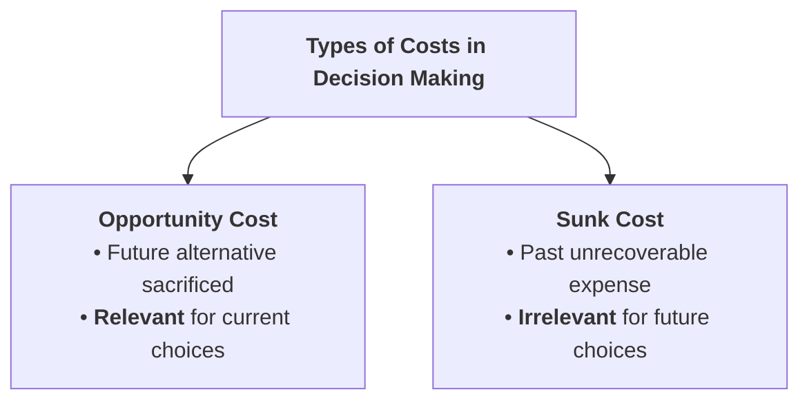
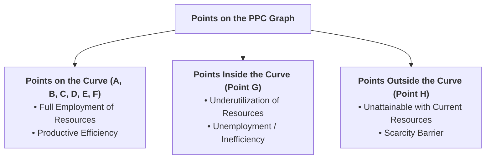
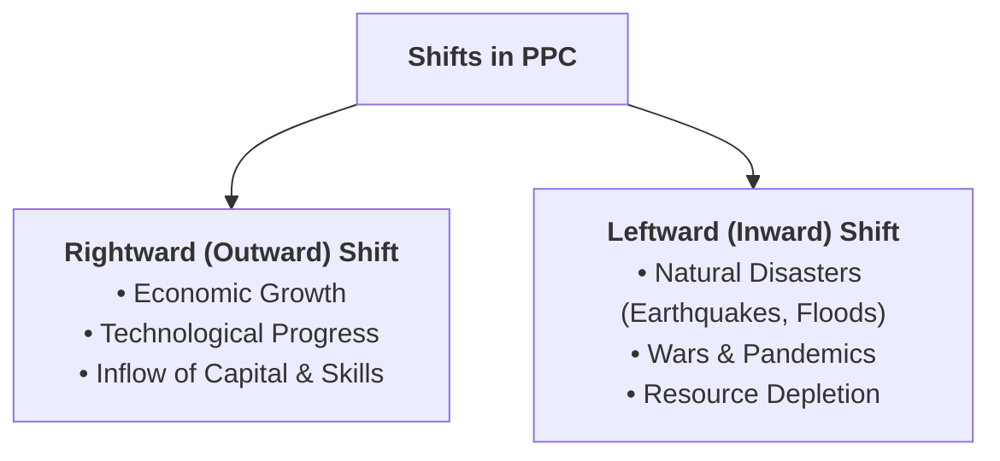
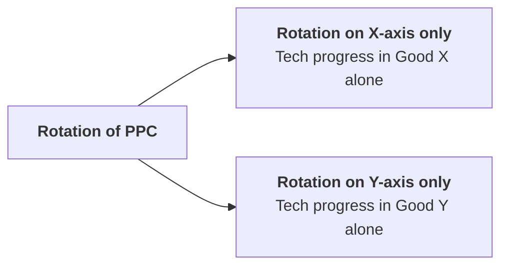

## Overview

Because resources are scarce, producing more of one good inevitably requires sacrificing some quantity of another good. The **Production Possibility Curve (PPC)** is the primary analytical tool used by economists to illustrate scarcity, choice, opportunity cost, and economic growth.


---

## Part 1: Concept of Opportunity Cost

### Q1. Define Opportunity Cost. Explain with a clear everyday example.
**Answer:**
**Definition:**
> **Opportunity cost** is defined as the **value of the next best alternative foregone** (sacrificed) when a choice is made between mutually exclusive alternatives.

Whenever resources (money, time, land, labour) are committed to one use, the opportunity to use them for the next best purpose is sacrificed.

#### Everyday Examples:
1. **Student's Time:** If a student has 3 hours of free evening time and chooses to study economics instead of watching a movie, the opportunity cost of studying is the **enjoyment of watching the movie**.
2. **Farmer's Land:** If a farmer uses a 1-hectare plot of land to produce 40 quintals of wheat instead of 30 quintals of paddy (rice), the opportunity cost of producing 40 quintals of wheat is the **30 quintals of paddy sacrificed**.
3. **Business Investment:** If a firm invests Rs. 10,00,000 of its own funds in purchasing a new machine instead of depositing it in a commercial bank earning 8% interest per year (Rs. 80,000), the opportunity cost of the machine purchase is the **Rs. 80,000 annual interest foregone**.

---

### Q2. Why is Opportunity Cost important in economic decision-making?
**Answer:**
1. **Determines Real Economic Cost:** Accounting cost considers only explicit monetary expenses, whereas economic decision-making must include the value of sacrificed alternatives to find the true cost of an action.
2. **Guides Resource Allocation:** Helps producers allocate scarce capital, labour, and raw materials to the most productive and profitable industries.
3. **Determines Factor Pricing:** The price paid to employ a factor of production (like hiring a worker or renting land) must at least equal what that factor could earn in its next best alternative employment (its transfer earnings).
4. **Foundation of International Trade:** David Ricardo’s Theory of Comparative Cost Advantage relies directly on comparative opportunity costs.

---

### Q3. Difference between Opportunity Cost and Sunk Cost



| Comparison Basis | Opportunity Cost | Sunk Cost |
| :--- | :--- | :--- |
| **Definition** | The prospective return or benefit of the next best alternative given up. | A cost that has already been incurred in the past and cannot be recovered by any future action. |
| **Time Orientation** | **Forward-looking** (evaluates future possibilities). | **Backward-looking** (refers to past completed payments). |
| **Decision Relevance** | **Highly relevant**; must guide every rational economic decision. | **Completely irrelevant**; rational decision-makers ignore sunk costs. |
| **Example** | Choosing to study for exams instead of doing a paid shift. | A non-refundable, non-transferable cinema ticket purchased yesterday. |

---

## Part 2: Production Possibility Curve (PPC)

---

### Q4. What is the Production Possibility Curve (PPC)?
**Answer:**
**Definition:**
> The **Production Possibility Curve (PPC)**—also known as the **Production Possibility Frontier (PPF)** or **Transformation Curve**—is a graphical representation that shows all the **maximum possible combinations of two goods or services** that an economy can produce by fully and efficiently utilizing its given resources and available technology.

---

### Q5. State the main assumptions of the Production Possibility Curve.
**Answer:**
The PPC model is built on four core simplifying assumptions:
1. **Two Goods Only:** The economy produces only two commodities (e.g., Mobile Phones and Laptops, or Consumer Goods and Capital Goods).
2. **Fixed Quantity of Resources:** The total supply of productive resources (land, labour, capital) is fixed and given. However, resources can be shifted from the production of one good to the other.
3. **Full and Efficient Employment of Resources:** All available resources are fully employed without any waste or idle capacity.
4. **Constant State of Technology:** The level of technology and production techniques remains unchanged during the period of analysis.
5. **Resources are not Equally Efficient in all uses:** When resources are shifted from one industry to another, their productivity varies, leading to increasing opportunity costs.

---

### Q6. Explain the concept of PPC with the help of a Production Possibility Schedule and calculate Marginal Rate of Transformation (MRT).
**Answer:**

#### Production Possibility Schedule (Mobile Phones vs. Laptops):

Suppose an economy uses all its fixed resources to produce varying combinations of **Laptops** (Good X) and **Mobile Phones** (Good Y):

| Production Combination | Laptops (Units in 1,000s) $[X]$ | Mobile Phones (Units in 1,000s) $[Y]$ | Change in Laptops $[\Delta X]$ | Change in Mobiles $[\Delta Y]$ | Marginal Rate of Transformation ($MRT_{xy} = \frac{\Delta Y}{\Delta X}$) |
| :---: | :---: | :---: | :---: | :---: | :---: |
| **A** | $0$ | $15$ | — | — | — |
| **B** | $1$ | $14$ | $1$ | $1$ | $\frac{1}{1} = 1.0$ |
| **C** | $2$ | $12$ | $1$ | $2$ | $\frac{2}{1} = 2.0$ |
| **D** | $3$ | $9$ | $1$ | $3$ | $\frac{3}{1} = 3.0$ |
| **E** | $4$ | $5$ | $1$ | $4$ | $\frac{4}{1} = 4.0$ |
| **F** | $5$ | $0$ | $1$ | $5$ | $\frac{5}{1} = 5.0$ |

#### Explanation of the Schedule:
* **Combination A:** If the economy puts all its resources exclusively into producing Mobile Phones, it produces **15,000 Mobiles** and **0 Laptops**.
* **Combination F:** If all resources are shifted exclusively to Laptops, it produces **5,000 Laptops** and **0 Mobiles**.
* **Intermediate Combinations (B, C, D, E):** As the economy produces each additional 1,000 Laptops, it must sacrifice an **increasing number of Mobile Phones** (1, then 2, then 3, then 4, then 5 thousand units).

---

### Q7. What is Marginal Rate of Transformation (MRT) / Marginal Opportunity Cost (MOC)? Why is the PPC Concave to the Origin?
**Answer:**
**Definition of MRT:**
> **Marginal Rate of Transformation ($MRT$)** measures the amount of Good Y that must be sacrificed to produce one additional unit of Good X:
> $$MRT_{xy} = \frac{\Delta Y}{\Delta X} = \frac{\text{Loss of Good Y}}{\text{Gain of Good X}}$$

**Why the PPC is Concave (Bowed Outward) to the Origin:**
* The PPC is **downward sloping from left to right** because resources are scarce; producing more of Good X requires reducing the output of Good Y.
* The PPC is **concave to the origin** because of the **Law of Increasing Marginal Opportunity Cost**.
* Resources are specialized and **not equally efficient in all employments**. When resources are initially transferred from Mobile manufacturing to Laptop manufacturing, the most adaptable workers and tools are transferred first (low sacrifice). As more Laptops are demanded, less suitable workers and machinery must be transferred, resulting in progressively higher sacrifices of Mobile Phones for each extra unit of Laptops.
* As $MRT$ increases ($1 \rightarrow 2 \rightarrow 3 \rightarrow 4 \rightarrow 5$), the slope of the curve becomes steeper, giving the PPC its characteristic **concave shape**.

---

### Q8. Graphical Diagram of PPC and Interpretation of Points

```
 Mobile Phones (Y)
    |
 15 + A
    |  \
 12 +   \  B
    |    \
  9 +     \   C
    |      * G (Inefficient / Underemployment)
  6 +       \
    |        \   D          * H (Unattainable / Scarcity)
  3 +         \
    |          \   E
  0 +-----------+----+----+----+----+----+---> Laptops (X)
    0           1    2    3    4    5    6 (F)
```



#### Interpretation of Points:
1. **Points on the Curve ($A, B, C, D, E, F$):** Represent **optimum combinations**, full employment of resources, and maximum productive efficiency.
2. **Point Inside the Curve ($G$):** Represents **underemployment, idle resources, or technological inefficiency** (e.g., factory closures, high unemployment). The economy can produce more of both goods without sacrificing anything simply by putting idle resources to work.
3. **Point Outside the Curve ($H$):** Represents an **unattainable combination** under current conditions due to scarcity of resources and existing technological limits. It can only be reached in the future through economic growth.

---

## Part 3: Shifts and Rotations of the PPC

---

### Q9. Explain the causes and effects of Shifts in the PPC.
**Answer:**
A shift occurs when there is a change in the economy's total productive capacity that affects the production of **both goods**.



#### 1. Rightward / Outward Shift (Economic Growth):
* **Meaning:** The entire curve shifts to the right (from $AB$ to $A'B'$), indicating an expansion of national productive capacity.
* **Causes:**
  * Discovery of new natural resources (e.g., minerals, hydropower).
  * Advancement in technology in both sectors.
  * Increase in the size and skill level of the labour force.
  * Growth in capital stock (factories, infrastructure, modern machinery).

#### 2. Leftward / Inward Shift (Economic Contraction):
* **Meaning:** The entire curve shifts to the left (from $AB$ to $A''B''$), indicating a destruction or decline in productive capacity.
* **Causes:**
  * Severe natural disasters (earthquakes, devastating floods, landslides).
  * Outbreak of war or civil unrest destroying factories and infrastructure.
  * Major epidemic or pandemic causing loss of labour force.
  * Severe brain drain and capital flight.

---

### Q10. What is a Rotation of the PPC? How does it differ from a Shift?
**Answer:**



* **Shift in PPC:** Occurs when resource changes or technological improvements affect **both goods simultaneously**, moving the entire curve parallel outward or inward.
* **Rotation in PPC:** Occurs when technological progress or resource growth happens in the production of **only one specific good**, keeping the other good's maximum output unchanged:
  * *Rotation on X-axis (Laptops):* If a technological breakthrough occurs only in Laptop manufacturing, the PPC pivots outward along the horizontal axis while remaining fixed at point A on the vertical axis.
  * *Rotation on Y-axis (Mobiles):* If a breakthrough occurs only in Mobile manufacturing, the PPC pivots outward along the vertical axis while remaining fixed at point F on the horizontal axis.

---

## Quick Revision Check

1. **What is Opportunity Cost?**  
   *The value of the next best alternative foregone.*
2. **What does a point inside the PPC signify?**  
   *Underutilization of resources or economic inefficiency/unemployment.*
3. **Why is the PPC concave to the origin?**  
   *Due to increasing Marginal Rate of Transformation (MRT) / increasing opportunity cost.*
4. **Name two factors that cause the PPC to shift to the right.**  
   *Technological advancement and an increase in productive resources (labour, capital, raw materials).*
