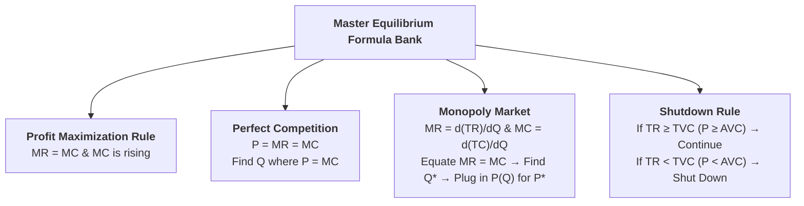

## Overview

Numerical problems on price and output determination require applying the **profit-maximization conditions ($MR = MC$)**, distinguishing between competitive price-taking ($P = MC$) and monopoly pricing, and making rational **short-run shutdown decisions ($TR \ge TVC$)**. This guide provides the master formula bank, step-by-step worked solutions, and practice exercises with full answer keys.

---

## Part 1: Quick Formula Bank & Decision Rules

### 1. Key Formulas and Calculus Identities

| Economic Measure | Competitive Firm | Monopoly Firm |
| :--- | :--- | :--- |
| **Demand Function** | $P = \text{Constant}$ | $P = a - bQ$ |
| **Total Revenue ($TR$)** | $TR = P \times Q$ | $TR = (a - bQ)Q = aQ - bQ^2$ |
| **Marginal Revenue ($MR$)** | $MR = P = \text{Constant}$ | $MR = \frac{d(TR)}{dQ} = a - 2bQ$ |
| **Marginal Cost ($MC$)** | $MC = \frac{d(TC)}{dQ}$ | $MC = \frac{d(TC)}{dQ}$ |
| **Equilibrium Condition** | $\mathbf{P = MC}$ | $\mathbf{MR = MC}$ |
| **Total Profit ($\pi$)** | $\pi = TR - TC$ | $\pi = TR - TC$ |

### 2. Short-Run Shutdown Decision Rule:
* **Total Variable Cost ($TVC$):** $TVC = TC - TFC$
* **Rule:**
  * If $\mathbf{TR \ge TVC}$ (or $P \ge AVC$): **Continue in business** in the short run (loss is $\le TFC$).
  * If $\mathbf{TR < TVC}$ (or $P < AVC$): **Shut down immediately** (operating loss would exceed $TFC$).

---

## Part 2: Step-by-Step Fully Solved Problems

---

### Solved Example 1: Equilibrium Output from MR and MC Equations

**Question:**  
A firm's Marginal Revenue and Marginal Cost functions are given by:
$$MR = 42$$
$$MC = 60 - 2Q^2$$
Find the profit-maximizing equilibrium level of output ($Q$).

---

**Step-by-Step Solution:**
* At equilibrium, Marginal Revenue must equal Marginal Cost:
  $$MR = MC$$
  $$42 = 60 - 2Q^2$$
* Rearranging the terms:
  $$2Q^2 = 60 - 42$$
  $$2Q^2 = 18$$
  $$Q^2 = \frac{18}{2} = 9$$
  $$Q = \sqrt{9} = \mathbf{3 \text{ units}}$$
* *(Reject negative root $Q = -3$ as quantity cannot be negative).*
* **Answer:** The equilibrium level of output is **$Q = 3 \text{ units}$**.

---

### Solved Example 2: Short-Run Continuation vs. Shutdown Decision

**Question:**  
A firm operating in the short run generates **Total Revenue of Rs. 20,000**. Its **Total Cost is Rs. 25,000**, and its **Total Fixed Cost is Rs. 10,000**.  
1. Should the firm continue in business or shut down in the short run?  
2. Give economic justification for your answer.

---

**Step-by-Step Solution:**

1. **Calculate Total Variable Cost ($TVC$):**
   $$TVC = TC - TFC = 25,000 - 10,000 = \mathbf{\text{Rs. 15,000}}$$

2. **Evaluate the Continuation Condition:**
   * $TR = \text{Rs. 20,000}$
   * $TVC = \text{Rs. 15,000}$
   * Since **$TR > TVC$** ($\text{Rs. 20,000} > \text{Rs. 15,000}$), the firm covers all its variable costs and has **Rs. 5,000 surplus** to help cover part of its fixed costs.

3. **Loss Comparison:**
   * **If the firm continues operating:**
     $$\text{Loss} = TC - TR = 25,000 - 20,000 = \mathbf{\text{Rs. 5,000}}$$
   * **If the firm shuts down completely ($Q = 0$):**
     $$\text{Loss} = TFC = \mathbf{\text{Rs. 10,000}}$$

4. **Conclusion:**  
   The firm should **continue operating in the short run** because operating reduces its total loss from Rs. 10,000 to Rs. 5,000.

---

### Solved Example 3: Monopoly Profit Maximization (Demand & Cost Functions)

**Question:**  
A monopolist faces the demand function **$P = 50 - 2Q$** and total cost function **$TC = 50 + 2Q + Q^2$**.  
Calculate:  
1. Total Revenue ($TR$) and Marginal Revenue ($MR$) functions.  
2. Marginal Cost ($MC$) function.  
3. Profit-maximizing equilibrium output ($Q$) and price ($P$).  
4. Maximum total economic profit ($\pi$).

---

**Step-by-Step Solution:**

1. **Total Revenue & Marginal Revenue:**
   $$TR = P \times Q = (50 - 2Q)Q = \mathbf{50Q - 2Q^2}$$
   $$MR = \frac{d(TR)}{dQ} = \mathbf{50 - 4Q}$$

2. **Marginal Cost:**
   $$MC = \frac{d(TC)}{dQ} = \frac{d}{dQ}(50 + 2Q + Q^2) = \mathbf{2 + 2Q}$$

3. **Equilibrium Output ($Q$):**
   Setting $MR = MC$:
   $$50 - 4Q = 2 + 2Q$$
   $$50 - 2 = 2Q + 4Q$$
   $$48 = 6Q \implies \mathbf{Q = 8 \text{ units}}$$

4. **Equilibrium Price ($P$):**
   Substitute $Q = 8$ into the demand function:
   $$P = 50 - 2(8) = 50 - 16 = \mathbf{\text{Rs. 34}}$$

5. **Maximum Total Profit ($\pi$):**
   * $TR = P \times Q = 34 \times 8 = \text{Rs. 272}$
   * $TC = 50 + 2(8) + (8)^2 = 50 + 16 + 64 = \text{Rs. 130}$
   * $\text{Profit } (\pi) = TR - TC = 272 - 130 = \mathbf{\text{Rs. 142}}$

---

### Solved Example 4: Derivation of Functions and Equilibrium Values

**Question:**  
A firm’s cost function and revenue function are given as:
$$TC = 20 + 2Q^2$$
$$TR = 42Q - Q^2$$
Find:  
1. The $MC$ and $MR$ functions.  
2. The equilibrium output and equilibrium price.  
3. Total profit at equilibrium.

---

**Step-by-Step Solution:**

1. **Derive $MC$ and $MR$:**
   $$MC = \frac{d(TC)}{dQ} = \mathbf{4Q}$$
   $$MR = \frac{d(TR)}{dQ} = \mathbf{42 - 2Q}$$

2. **Equilibrium Output ($Q$):**
   $$MR = MC \implies 42 - 2Q = 4Q$$
   $$6Q = 42 \implies \mathbf{Q = 7 \text{ units}}$$

3. **Equilibrium Price ($P$):**
   $$P = \frac{TR}{Q} = \frac{42Q - Q^2}{Q} = 42 - Q$$
   $$P = 42 - 7 = \mathbf{\text{Rs. 35}}$$

4. **Total Profit ($\pi$):**
   * $TR = 42(7) - (7)^2 = 294 - 49 = \text{Rs. 245}$
   * $TC = 20 + 2(7)^2 = 20 + 2(49) = 20 + 98 = \text{Rs. 118}$
   * $\pi = TR - TC = 245 - 118 = \mathbf{\text{Rs. 127}}$

---

### Solved Example 5: Competitive Firm Equilibrium

**Question:**  
A perfectly competitive firm sells its output at the market price of **$P = \text{Rs. 50}$**. Its Total Cost function is:
$$TC = 100 + 10Q + 2Q^2$$
1. Find the profit-maximizing output ($Q$).  
2. Calculate Total Profit at this output.

---

**Step-by-Step Solution:**

1. **Equilibrium Output:**
   * Under perfect competition, $MR = P = \text{Rs. 50}$.
   * $MC = \frac{d(TC)}{dQ} = 10 + 4Q$.
   * Setting $P = MC$:
     $$50 = 10 + 4Q$$
     $$4Q = 40 \implies \mathbf{Q = 10 \text{ units}}$$

2. **Calculate Profit ($\pi$):**
   * $TR = P \times Q = 50 \times 10 = \text{Rs. 500}$
   * $TC = 100 + 10(10) + 2(10)^2 = 100 + 100 + 200 = \text{Rs. 400}$
   * $\pi = TR - TC = 500 - 400 = \mathbf{\text{Rs. 100}}$

---

## Part 3: Self-Practice Exercises with Solutions

---

### Exercise 1 (Continuation Decision)
A firm in the short run has $TR = \text{Rs. 12,000}$, $TC = \text{Rs. 18,000}$, and $TVC = \text{Rs. 14,000}$. Should the firm continue or shut down?

* **Answer Key:**
  * $TR (12,000) < TVC (14,000)$.
  * The firm cannot cover even its variable costs. Operating loss $=$ Rs. 6,000, while shutdown loss $= TFC = 18,000 - 14,000 = \text{Rs. 4,000}$.
  * **Decision:** The firm should **shut down immediately** to minimize losses.

---

### Exercise 2 (Monopoly Optimization)
A monopolist has demand $P = 60 - 3Q$ and cost $TC = 50 + 6Q + 3Q^2$.
Find:
1. $MR$ and $MC$ functions.
2. Equilibrium output and price.
3. Total profit.

* **Answer Key:**
  1. $MR = 60 - 6Q$; $MC = 6 + 6Q$
  2. $60 - 6Q = 6 + 6Q \implies 12Q = 54 \implies Q = 4.5 \text{ units}$; $P = 60 - 3(4.5) = \text{Rs. 46.50}$
  3. $TR = 46.5 \times 4.5 = 209.25$; $TC = 50 + 6(4.5) + 3(4.5)^2 = 50 + 27 + 60.75 = 137.75 \implies \pi = \mathbf{\text{Rs. 71.50}}$

---

### Exercise 3 (Competitive Firm Pricing)
A competitive firm sells at $P = \text{Rs. 70}$. Its cost function is $TC = 200 + 10Q + 3Q^2$. Find equilibrium output and maximum profit.

* **Answer Key:**
  * $MC = 10 + 6Q = 70 \implies 6Q = 60 \implies Q = 10 \text{ units}$
  * $TR = 70 \times 10 = 700$; $TC = 200 + 100 + 300 = 600 \implies \pi = \mathbf{\text{Rs. 100}}$
