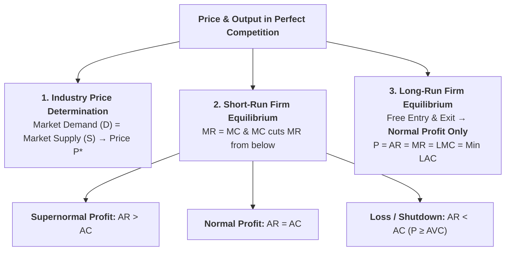
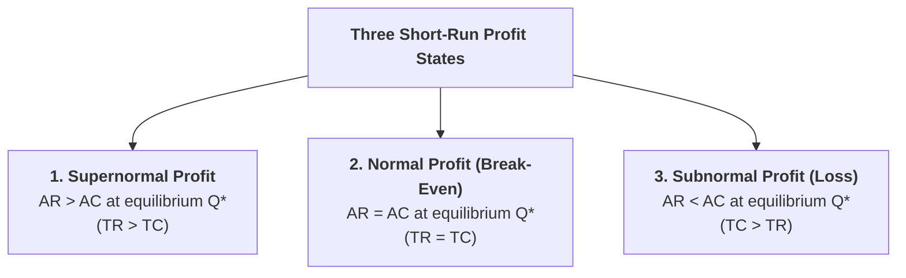
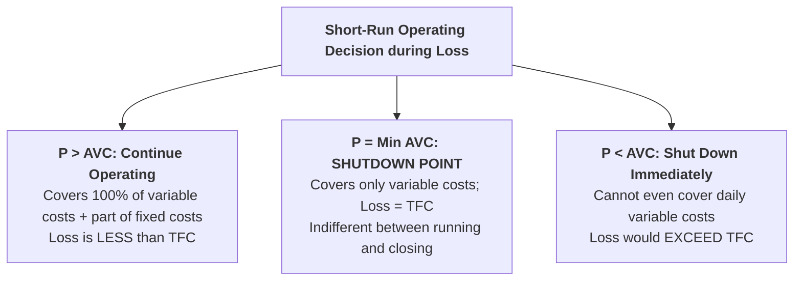
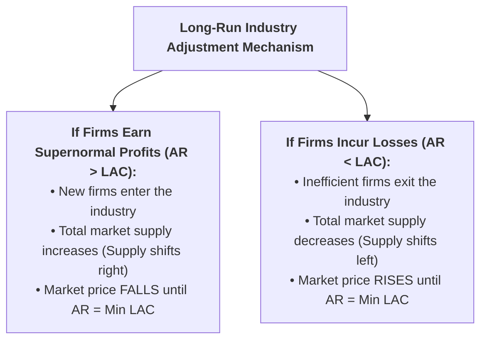

## Overview

Under **Perfect Competition**, a very large number of firms sell identical products. The market price is determined solely by the interaction of **Industry Demand and Industry Supply**. Each individual firm takes this industry price as given ($P = AR = MR$). This lesson explains how a competitive firm determines its profit-maximizing price and output in both the **short run** and the **long run**.



---

## Part 1: Industry Price Determination and Firm Demand

### Q1. How is price determined in a Perfectly Competitive Market?
**Answer:**
* **At the Industry Level:** Price is determined by the intersection of aggregate **Market Demand ($DD$)** and aggregate **Market Supply ($SS$)** at equilibrium point $E$. This establishes the market equilibrium price **$OP$** and total market output **$OQ$**.
* **At the Individual Firm Level:** The individual firm is a **price taker**. It cannot alter the price. It faces a **perfectly elastic horizontal demand curve** where:
  $$\mathbf{P = AR = MR}$$

```
Panel A: Industry (Price Maker)        Panel B: Firm (Price Taker)
Price (Rs.)                            Price (Rs.)
   |         SS                           |             SMC
   | \      /                             |            \   /
 P +--\-*E-/-*-------------------------- P +------------\-/---------- P = AR = MR
   |   / \                                |              * E (MR = MC)
   |  /   \ DD                            |             /
 0 +---+---+--------------------------> Q 0 +----------+-------------> Q
   0       Q (Industry Output)            0            Q* (Firm Output)
```

---

## Part 2: Short-Run Equilibrium of the Competitive Firm

---

### Q2. What are the equilibrium conditions for a competitive firm in the short run?
**Answer:**
A competitive firm maximizes profit and reaches short-run equilibrium when:
1. **$MR = MC$** (since $P = MR$, this means **$P = MC$**).
2. **$MC$ curve cuts the $MR$ curve from below** at the equilibrium output level.

---

### Q3. Explain the three short-run profit situations of a competitive firm with diagrams.
**Answer:**
In the short run, fixed plant capacity cannot be changed, and new firms cannot enter. Depending on its cost efficiency relative to the market price, a firm may experience one of **three profit states**:



#### 1. Supernormal (Abnormal) Profit ($AR > AC$):
* **Condition:** When the prevailing market price ($P = AR$) is **higher than the Average Cost ($AC$)** at the equilibrium output ($Q^*$).
* **Profit Calculation:**
  $$\text{Per-unit Profit} = AR - AC = P - C$$
  $$\text{Total Supernormal Profit} = \text{Area of Rectangle } P E C B = (P - C) \times Q^*$$

```
Price / Cost
   |                SMC
   |               /     SAC
 P +--------------* E ------------- AR = MR = P
   |             /|
 C +-------* B--/ |                 (Supernormal Profit = Area PECB)
   |       |   /  |
 0 +-------+---+--+---------------> Output (Q)
   0              Q*
```

#### 2. Normal Profit / Break-Even State ($AR = AC$):
* **Condition:** When market price ($P = AR$) is **exactly equal to the minimum of Average Cost ($AC$)** at equilibrium output.
* **Profit Calculation:**
  $$\text{Total Revenue (TR)} = \text{Total Cost (TC)} \implies \text{Economic Profit } \pi = 0$$
* *(Note: Normal profit is already included in $AC$ as the minimum reward for entrepreneurship).*

```
Price / Cost
   |                SMC
   |               /     SAC
 P +--------------* E ------------- AR = MR = P = Min SAC
   |             /|
   |            / |                 (Normal Profit: TR = TC)
 0 +-----------+--+---------------> Output (Q)
   0              Q*
```

#### 3. Minimum Loss ($AR < AC$):
* **Condition:** When market price ($P = AR$) is **lower than Average Cost ($AC$)** at equilibrium output ($Q^*$).
* **Loss Calculation:**
  $$\text{Per-unit Loss} = AC - AR = C - P$$
  $$\text{Total Loss} = \text{Area of Rectangle } C B E P = (C - P) \times Q^*$$

```
Price / Cost
   |                SMC    SAC
 C +-------* B-----/------/
   |       |      /      /
 P +-------+-----* E ---/---------- AR = MR = P
   |       |    /|                  (Loss Area = Area CBEP)
 0 +-------+---+-+----------------> Output (Q)
   0             Q*
```

---

### Q4. What is the 'Shutdown Point' of a firm in the short run? When should a firm continue operating during a loss?
**Answer:**
In the short run, a firm with fixed costs cannot avoid $TFC$ even if it shuts down ($Q = 0$).



* **Rule 1 (Continue Business if $P > AVC$):** The firm covers all its variable costs and has surplus revenue left over to pay off part of its fixed costs. Closing down would produce a bigger loss (all of $TFC$).
* **Rule 2 (The Shutdown Point if $P = \text{Min } AVC$):** The price barely covers average variable cost. Total loss equals Total Fixed Cost ($TFC$). This is the critical minimum threshold called the **Shutdown Point**.
* **Rule 3 (Shut Down if $P < AVC$):** The firm loses money on every single unit produced in addition to fixed overheads. The firm must cease operations immediately to limit losses to $TFC$.

---

## Part 3: Long-Run Equilibrium of Perfect Competition

---

### Q5. How is price and output determined under Perfect Competition in the long run? Why do firms earn only Normal Profit?
**Answer:**
In the **long run**, all inputs are variable, and there is **completely free entry and exit of firms**.



#### Long-Run Equilibrium Condition:
Through this automatic entry-and-exit process, the long-run equilibrium is established where:
$$\mathbf{P = AR = MR = LMC = \text{Minimum } LAC = SMC = \text{Minimum } SAC}$$

```
Price / Cost (Rs.)
   |                 LMC
   |                /     LAC
 P +---------------* E ------------- P = AR = MR = Min LAC = LMC
   |              /|
   |             / |                 (Long-Run Normal Profit Only)
 0 +------------+--+---------------> Output (Q)
   0               Q* (Optimum Scale)
```

#### Why Only Normal Profit is Earned in the Long Run:
* Any supernormal profit is competed away by new entrants.
* Any loss is eliminated by firm departures.
* Therefore, in the long run, a competitive firm always operates at the **minimum point of its $LAC$ curve (the optimum plant capacity)**, earning **purely Normal Profit ($\pi = 0$)**.

---

## Quick Revision Check

1. **What is the firm's demand curve under perfect competition?**  
   *A perfectly elastic horizontal straight line where $P = AR = MR$.*
2. **What are the three possible profit states of a competitive firm in the short run?**  
   *Supernormal Profit ($AR > AC$), Normal Profit ($AR = AC$), and Loss ($AR < AC$).*
3. **What is the Shutdown Point for a firm?**  
   *The point where Price equals Minimum Average Variable Cost ($P = \text{Min } AVC$).*
4. **Why do competitive firms earn ONLY normal profit in the long run?**  
   *Because of free entry and exit of firms, which adjusts industry supply until price equals minimum $LAC$.*
