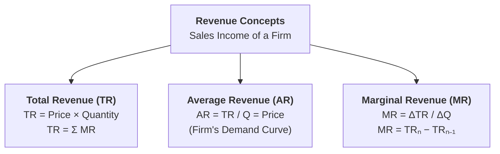
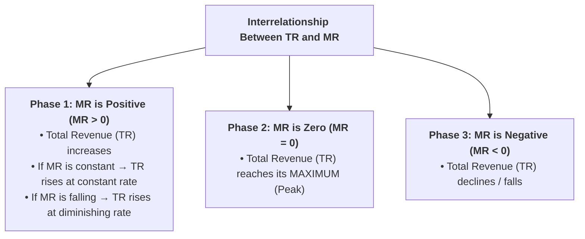

## Overview

In economics and business, a firm incurs costs to produce goods and sells them in the market to earn income. The money received by a producer from selling its output is called **Revenue**. Understanding the three revenue concepts—**Total Revenue ($TR$)**, **Average Revenue ($AR$)**, and **Marginal Revenue ($MR$)**—is essential for analyzing firm profits and market behavior.



---

## Part 1: Definitions and Mathematical Formulas

### Q1. What is Total Revenue ($TR$)? State its formula.
**Answer:**
**Definition:**
> **Total Revenue ($TR$)** is the total gross money receipts or income that a firm earns from selling a given total quantity ($Q$) of its output at a given price ($P$) in the market.

#### Formula:
$$TR = P \times Q$$
$$\text{or}$$
$$TR = \sum MR = MR_1 + MR_2 + \dots + MR_n$$

Where:
* $TR$ = Total Revenue
* $P$ = Selling price per unit of the commodity
* $Q$ = Total quantity of units sold
* $\sum MR$ = Sum of marginal revenues from all units sold

**Example:** If a bakery sells **50 cakes** at a price of **Rs. 400 per cake**, the Total Revenue is:
$$TR = 400 \times 50 = \text{Rs. 20,000}$$

---

### Q2. What is Average Revenue ($AR$)? Prove mathematically that Average Revenue is always equal to Price ($AR = P$).
**Answer:**
**Definition:**
> **Average Revenue ($AR$)** is the revenue earned per unit of output sold. It is obtained by dividing Total Revenue by the total number of units sold.

#### Formula:
$$AR = \frac{TR}{Q}$$

#### Mathematical Proof that $AR = P$:
We know that:
$$TR = P \times Q$$
Substituting this definition of $TR$ into the $AR$ formula:
$$AR = \frac{P \times Q}{Q}$$
Cancelling $Q$ from both numerator and denominator:
$$AR = P$$

#### Economic Significance:
* Because $AR$ is always equal to the unit price ($P$), the **Average Revenue curve is identical to the firm's Demand Curve**.
* It shows the relationship between the price charged by the seller and the quantity demanded by buyers at that price.

---

### Q3. What is Marginal Revenue ($MR$)? Explain its formula and economic meaning.
**Answer:**
**Definition:**
> **Marginal Revenue ($MR$)** is the **net addition made to Total Revenue** by selling **one additional (extra) unit** of output.

#### Formulas for Calculation:

1. **When output changes unit by unit ($\Delta Q = 1$):**
   $$MR_n = TR_n - TR_{n-1}$$
   Where:
   * $MR_n$ = Marginal Revenue from the $n^{\text{th}}$ unit
   * $TR_n$ = Total Revenue from selling $n$ units
   * $TR_{n-1}$ = Total Revenue from selling $(n-1)$ units

2. **When output changes in larger discrete steps ($\Delta Q > 1$):**
   $$MR = \frac{\Delta TR}{\Delta Q} = \frac{TR_1 - TR_0}{Q_1 - Q_0}$$
   Where:
   * $\Delta TR$ = Change in Total Revenue
   * $\Delta Q$ = Change in Quantity Sold

**Example:**
* If selling **4 units** yields $TR = \text{Rs. 40}$, and selling **5 units** yields $TR = \text{Rs. 45}$:
  $$MR_5 = TR_5 - TR_4 = 45 - 40 = \text{Rs. 5}$$
* The marginal revenue of the 5th unit is **Rs. 5**.

---

## Part 2: Comprehensive Revenue Schedule Demonstration

### Q4. Construct a general revenue schedule to illustrate the calculation of $TR$, $AR$, and $MR$.
**Answer:**

Let us consider a firm selling units of a commodity where price is lowered to sell more output:

| Output / Units Sold ($Q$) | Price per Unit ($P = AR$) [Rs.] | Total Revenue ($TR = P \times Q$) [Rs.] | Marginal Revenue ($MR_n = TR_n - TR_{n-1}$) [Rs.] |
| :---: | :---: | :---: | :---: |
| **0** | $12$ | $0$ | — |
| **1** | $10$ | $10$ | $10 - 0 = \mathbf{10}$ |
| **2** | $9$ | $18$ | $18 - 10 = \mathbf{8}$ |
| **3** | $8$ | $24$ | $24 - 18 = \mathbf{6}$ |
| **4** | $7$ | $28$ | $28 - 24 = \mathbf{4}$ |
| **5** | $6$ | $30$ | $30 - 28 = \mathbf{2}$ |
| **6** | $5$ | $30$ | $30 - 30 = \mathbf{0}$ |
| **7** | $4$ | $28$ | $28 - 30 = \mathbf{-2}$ |

#### Observations from the Schedule:
* At $Q = 1$ to $5$, $MR$ is **positive** ($10, 8, 6, 4, 2$), so $TR$ **keeps rising** from Rs. $0 \rightarrow 30$.
* At $Q = 6$, $MR$ becomes **zero** ($MR = 0$), so $TR$ reaches its **maximum peak** of **Rs. 30**.
* At $Q = 7$, $MR$ becomes **negative** ($MR = -2$), so $TR$ **begins to decline** from Rs. $30 \rightarrow 28$.
* Notice that $TR$ at any level equals the cumulative sum of $MR$: for $Q = 3$, $TR = 10 + 8 + 6 = \text{Rs. } 24$.

---

## Part 3: General Interrelationship Among TR, AR, and MR

---

### Q5. Explain the fundamental relationships among Total Revenue ($TR$), Average Revenue ($AR$), and Marginal Revenue ($MR$).
**Answer:**
The relationship between $TR$ and $MR$ follows three universal phases:



#### Summary Table of Relationships:

| Condition of Marginal Revenue ($MR$) | Behavior of Total Revenue ($TR$) |
| :--- | :--- |
| **$MR > 0$ (Positive)** | $TR$ is **increasing** (rising). |
| **$MR = 0$ (Zero)** | $TR$ is at its **maximum and constant**. |
| **$MR < 0$ (Negative)** | $TR$ is **diminishing** (falling). |
| **$MR$ is constant ($MR = c$)** | $TR$ increases at a **constant rate** (linear straight line). |
| **$MR$ is declining ($MR$ falls)** | $TR$ increases at a **diminishing rate** (curved upward). |

---

### Q6. What is the relationship between AR, MR, and Price Elasticity of Demand ($E_d$)?
**Answer:**
Economists **Joan Robinson** and **Alfred Marshall** established the exact mathematical formula connecting Average Revenue ($AR$), Marginal Revenue ($MR$), and the Price Elasticity of Demand ($E_d$):

$$MR = AR \left( 1 - \frac{1}{E_d} \right) = P \left( 1 - \frac{1}{E_d} \right)$$
$$\text{or}$$
$$AR = MR \left( \frac{E_d}{E_d - 1} \right)$$

#### Key Insights from the Formula:

```mermaid
flowchart LR
    E["<b>Elasticity of Demand (E_d)</b>"]
    E -->|E_d &gt; 1 (Elastic)| MRpos["<b>MR &gt; 0</b><br>(Positive)"]
    E -->|E_d = 1 (Unitary)| MRzero["<b>MR = 0</b><br>(TR is Maximum)"]
    E -->|E_d &lt; 1 (Inelastic)| MRneg["<b>MR &lt; 0</b><br>(Negative)"]
```

1. **When Demand is Elastic ($E_d > 1$):**
   * $\left(1 - \frac{1}{E_d}\right)$ is positive $\implies \mathbf{MR > 0}$. Lowering price increases Total Revenue.
2. **When Demand is Unitary Elastic ($E_d = 1$):**
   * $\left(1 - \frac{1}{1}\right) = 0 \implies \mathbf{MR = 0}$. Total Revenue is at its **maximum**.
3. **When Demand is Inelastic ($E_d < 1$):**
   * $\left(1 - \frac{1}{E_d}\right)$ is negative $\implies \mathbf{MR < 0}$. Lowering price decreases Total Revenue.

---

## Quick Revision Check

1. **State the formula for Total Revenue ($TR$).**  
   *$TR = P \times Q$ or $TR = \sum MR$.*
2. **Why does $AR$ always equal Price ($P$)?**  
   *Because $AR = \frac{TR}{Q} = \frac{P \times Q}{Q} = P$.*
3. **What is Marginal Revenue ($MR$)?**  
   *The additional revenue earned by selling one more unit of output ($MR_n = TR_n - TR_{n-1}$).*
4. **What happens to $TR$ when $MR = 0$?**  
   *$TR$ reaches its absolute maximum level.*
5. **If $E_d = 1$, what will be the value of Marginal Revenue?**  
   *$MR = 0$.*
