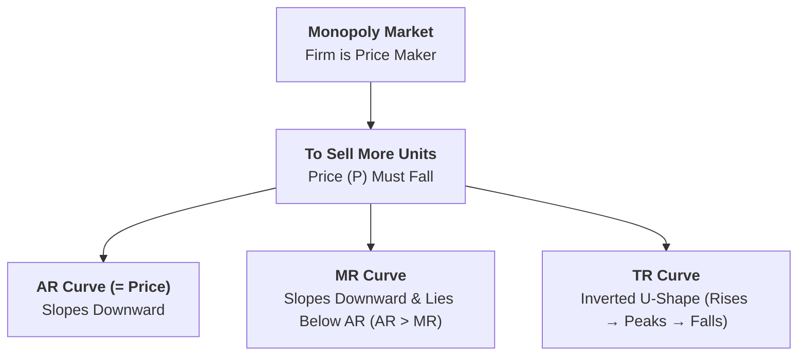
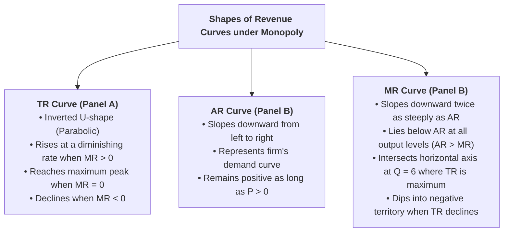
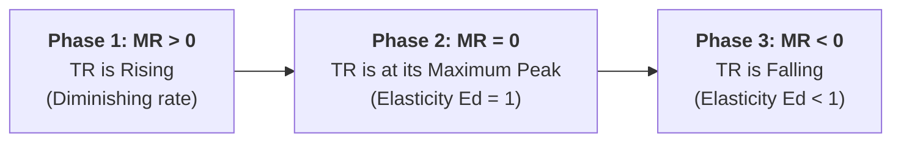

## Overview

Unlike a firm in perfect competition, a **Monopolist** (or any firm in imperfect competition) is a **Price Maker**. Because the monopolist is the sole supplier in the entire market, the firm’s demand curve is the industry market demand curve. To sell a larger quantity of output, the monopolist must lower its price. This downward price adjustment gives rise to downward-sloping $AR$ and $MR$ curves and an inverted U-shaped $TR$ curve.



---

## Part 1: Why Does Price Fall with Output in a Monopoly?

### Q1. Why does a monopolist have to lower its price to sell more units?
**Answer:**
* In a monopoly, the single firm represents the **entire market supply**.
* The firm faces the downward-sloping market demand curve of consumers. According to the **Law of Demand**, consumers buy more quantity only when the price is reduced.
* If the monopolist wants to expand sales volume from $Q_1$ to $Q_2$, it must lower the selling price from $P_1$ to $P_2$.
* While the monopolist can set either the price or the output, it **cannot fix both simultaneously**. If it sets a high price, sales volume will shrink; if it wants high sales volume, it must accept a lower price per unit.

---

## Part 2: Revenue Schedule Under Monopoly

### Q2. Construct a Revenue Schedule for a firm under Monopoly / Imperfect Competition.
**Answer:**

Suppose a monopolist can sell more output only by reducing the unit price progressively:

| Output / Quantity Sold ($Q$) | Price per Unit ($P = AR$) [Rs.] | Total Revenue ($TR = P \times Q$) [Rs.] | Marginal Revenue ($MR_n = TR_n - TR_{n-1}$) [Rs.] | Phase / Status |
| :---: | :---: | :---: | :---: | :---: |
| **0** | $12$ | $0$ | — | Initial |
| **1** | $10$ | $10 \times 1 = \mathbf{10}$ | $10 - 0 = \mathbf{10}$ | Phase 1: $MR > 0 \implies TR$ rises |
| **2** | $9$ | $9 \times 2 = \mathbf{18}$ | $18 - 10 = \mathbf{8}$ | Phase 1: $MR > 0 \implies TR$ rises |
| **3** | $8$ | $8 \times 3 = \mathbf{24}$ | $24 - 18 = \mathbf{6}$ | Phase 1: $MR > 0 \implies TR$ rises |
| **4** | $7$ | $7 \times 4 = \mathbf{28}$ | $28 - 24 = \mathbf{4}$ | Phase 1: $MR > 0 \implies TR$ rises |
| **5** | $6$ | $6 \times 5 = \mathbf{30}$ | $30 - 28 = \mathbf{2}$ | Phase 1: $MR > 0 \implies TR$ rises |
| **6** | $5$ | $5 \times 6 = \mathbf{30}$ | $30 - 30 = \mathbf{0}$ | **Phase 2: $MR = 0 \implies TR$ Maximum** |
| **7** | $4$ | $4 \times 7 = \mathbf{28}$ | $28 - 30 = \mathbf{-2}$ | **Phase 3: $MR < 0 \implies TR$ Falls** |

#### Key Observations from the Schedule:
1. **$AR$ (Price) is Decreasing:** Falls steadily from Rs. $10 \rightarrow 9 \rightarrow 8 \rightarrow 7 \rightarrow 6 \rightarrow 5 \rightarrow 4$.
2. **$MR$ Lies Below $AR$ ($AR > MR$):** At every output level (after $Q = 1$), $MR$ is smaller than $AR$ (e.g., at $Q = 3$, $AR = 8$ while $MR = 6$).
3. **$MR$ Falls Faster than $AR$:** $AR$ decreases by Rs. 1 per unit, whereas $MR$ decreases by Rs. 2 per unit (twice as fast).
4. **$MR$ Can Be Zero and Negative:** At $Q = 6$, $MR = 0$; at $Q = 7$, $MR = -2$. But $AR$ remains positive as long as price is positive.

---

## Part 3: Graphical Derivation of Revenue Curves

---

### Q3. Draw and explain the shapes of $TR$, $AR$, and $MR$ curves under Monopoly.
**Answer:**

```
Panel A: Total Revenue (TR) Curve
Revenue (Rs.)
   |                 Peak (TR Max = 30)
30 +                  /------\
   |                 /        \
20 +                /          \   TR Curve (Inverted U-shape)
   |               /            \
10 +              /              \
 0 +-------------+---+---+---+---+---+---> Q (Output)
   0             1   2   3   4   5   6   7

Panel B: AR and MR Curves
Revenue (Rs.)
   |
10 + \
 8 +   \           AR Curve (Demand, P = AR)
 6 +     \       \
 4 +       \       \
 2 +         \       \
 0 +----------\-------+------------------> Q (Output)
   |           \ 3    5   6 (MR = 0)
-2 +             \ MR Curve (MR < 0)
```



---

## Part 4: Key Interrelationships Under Monopoly

---

### Q4. Why does the Marginal Revenue ($MR$) curve lie below the Average Revenue ($AR$) curve under Monopoly? ($AR > MR$)
**Answer:**
**Reason:**
When a monopolist lowers the price to sell an additional unit of output, the lower price applies **not only to the additional (marginal) unit, but to all previously sold units (intra-marginal units)** as well.

#### Mathematical Explanation with Example:
* Suppose the firm is currently selling **2 units at Rs. 9 each** ($TR = 18$).
* To sell **3 units**, it must lower the price to **Rs. 8 each** for all 3 units ($TR = 24$).
* The revenue gained from the 3rd unit is **+Rs. 8**.
* However, the firm loses **Rs. 1 on each of the first 2 units** ($2 \times \text{Rs. } 1 = \text{Rs. } 2$ loss).
* Therefore, the net additional revenue ($MR$) is:
  $$MR = 8 - 2 = \text{Rs. 6}$$
* Notice that $AR = \text{Rs. 8}$, while $MR = \text{Rs. 6}$. Thus:
  $$\mathbf{AR > MR}$$
* Because the price reduction penalty on earlier units increases with volume, **$MR$ is always less than $AR$ and lies strictly below it**.

---

### Q5. Why does $MR$ fall twice as fast as $AR$ under linear downward-sloping demand?
**Answer:**
If the firm faces a linear downward-sloping demand (Average Revenue) equation:
$$P = AR = a - bQ$$
Where $a$ is the price intercept and $b$ is the slope ($\frac{\Delta P}{\Delta Q}$).

Total Revenue is:
$$TR = P \times Q = (a - bQ) \times Q = aQ - bQ^2$$

Taking the first derivative with respect to quantity $Q$ gives Marginal Revenue:
$$MR = \frac{d(TR)}{dQ} = a - 2bQ$$

#### Comparison of Slopes:
* Slope of $AR = -b$
* Slope of $MR = -2b$
* This proves that the **slope of $MR$ is exactly twice the slope of $AR$**.
* Graphically, a straight-line $MR$ curve always **bisects the horizontal distance** between the vertical axis and the $AR$ curve at any given price level.

---

### Q6. Explain the 3-Phase relationship between $TR$ and $MR$ under Monopoly.
**Answer:**



1. **Phase 1: When $MR$ is Positive ($MR > 0$):**
   * As long as $MR$ is greater than zero (from $Q = 1$ to $5$), Total Revenue **continues to increase**, but at a decreasing rate because $MR$ is diminishing.
2. **Phase 2: When $MR$ is Zero ($MR = 0$):**
   * At output $Q = 6$, $MR = 0$. At this exact output point, Total Revenue reaches its **highest maximum level (Rs. 30)**. The slope of the $TR$ curve becomes horizontal ($\text{Slope} = 0$).
3. **Phase 3: When $MR$ is Negative ($MR < 0$):**
   * At output $Q = 7$, $MR = -2$. When marginal additions become negative, Total Revenue **begins to fall** (from Rs. $30 \rightarrow 28$).

---

## Part 5: Comparison Table: Perfect Competition vs. Monopoly Revenue Curves

---

### Q7. Comprehensive Comparison of Revenue Curves

| Feature | Perfect Competition | Monopoly / Imperfect Competition |
| :--- | :--- | :--- |
| **Pricing Power** | Firm is **Price Taker** ($P = \text{const}$). | Firm is **Price Maker** ($P$ falls to sell more). |
| **Shape of $AR$ Curve** | Horizontal straight line parallel to X-axis. | Downward-sloping straight line / curve. |
| **Relationship of $AR$ & $MR$** | **$AR = MR = P$** (Curves coincide). | **$AR > MR$** ($MR$ curve lies below $AR$). |
| **Shape of $TR$ Curve** | Straight upward-sloping ray from origin. | **Inverted U-shaped** curve (rises, peaks, falls). |
| **Rate of Fall** | Neither falls; both are constant. | $MR$ falls **twice as fast** as $AR$ ($\text{Slope } MR = 2 \times \text{Slope } AR$). |
| **Values of $MR$** | $MR$ is always constant and positive. | $MR$ can be positive, **zero**, or **negative**. |
| **Price Elasticity ($E_d$)** | Perfectly elastic ($E_d = \infty$). | Elasticity varies along the curve ($E_d > 1, E_d = 1, E_d < 1$). |

---

## Quick Revision Check

1. **Why does $MR$ lie below $AR$ in a monopoly?**  
   *Because to sell one more unit, the price must be reduced on all units sold, making the net gain ($MR$) less than the price ($AR$).*
2. **What is the shape of the Total Revenue ($TR$) curve under monopoly?**  
   *Inverted U-shaped (parabolic).*
3. **At what output level does Total Revenue reach its maximum under monopoly?**  
   *At the output level where Marginal Revenue equals zero ($MR = 0$).*
4. **Can $AR$ ever be negative?**  
   *No, because price cannot be negative in a real market. However, $MR$ can become negative.*
5. **How does the slope of $MR$ compare to the slope of $AR$ for linear demand?**  
   *The slope of $MR$ is twice as steep as the slope of $AR$.*
