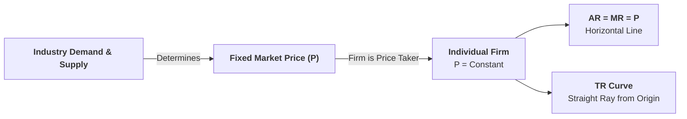
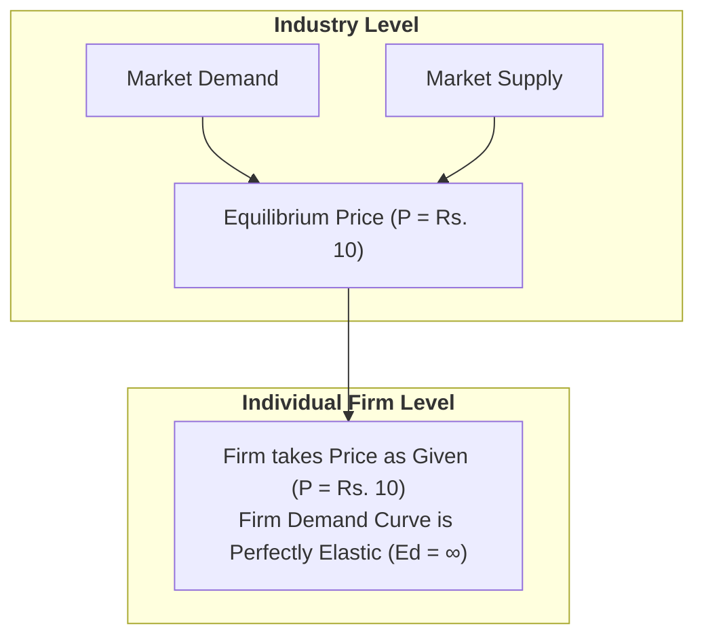
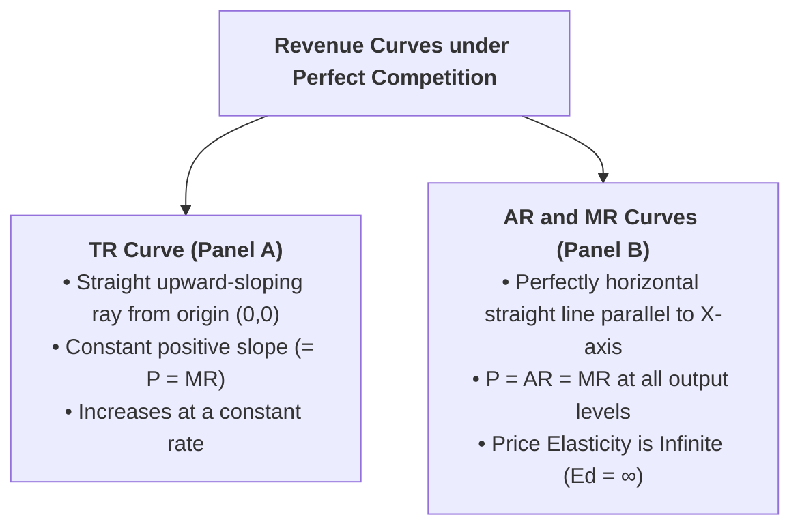

## Overview

Under **Perfect Competition**, a very large number of firms sell identical products. Because no individual firm produces enough to influence the market price, the price is determined by the whole industry and accepted by every firm. This lesson explains how this constant price shapes the **Total Revenue ($TR$)**, **Average Revenue ($AR$)**, and **Marginal Revenue ($MR$)** curves.



---

## Part 1: Why is Price Constant for a Competitive Firm?

### Q1. Why is an individual firm under Perfect Competition called a 'Price Taker'?
**Answer:**
* In a perfectly competitive market, the industry consists of thousands of small, independent sellers producing completely identical (homogeneous) products.
* An individual firm's output represents an **infinitesimally small fraction** of total market supply.
* If a single firm increases its output, total market supply does not change noticeably; if it shuts down completely, market supply does not drop noticeably.
* Therefore, no individual firm has the power to raise or lower the market price.
* The price is determined in the market by the equilibrium of **Industry Demand and Industry Supply**. Every individual firm must accept this price as given and can sell as much output as it wishes at this constant price.



---

## Part 2: Revenue Schedule Under Perfect Competition

### Q2. Construct a Revenue Schedule for a firm under Perfect Competition and explain the calculations.
**Answer:**

Suppose the market price determined by the industry is fixed at **Rs. 10 per unit**. The firm's revenue schedule across different levels of output ($Q = 0$ to $5$) is constructed below:

| Output / Quantity Sold ($Q$) | Price per Unit ($P$) [Rs.] | Total Revenue ($TR = P \times Q$) [Rs.] | Average Revenue ($AR = \frac{TR}{Q}$) [Rs.] | Marginal Revenue ($MR_n = TR_n - TR_{n-1}$) [Rs.] |
| :---: | :---: | :---: | :---: | :---: |
| **0** | $10$ | $0$ | — | — |
| **1** | $10$ | $10 \times 1 = \mathbf{10}$ | $\frac{10}{1} = \mathbf{10}$ | $10 - 0 = \mathbf{10}$ |
| **2** | $10$ | $10 \times 2 = \mathbf{20}$ | $\frac{20}{2} = \mathbf{10}$ | $20 - 10 = \mathbf{10}$ |
| **3** | $10$ | $10 \times 3 = \mathbf{30}$ | $\frac{30}{3} = \mathbf{10}$ | $30 - 20 = \mathbf{10}$ |
| **4** | $10$ | $10 \times 4 = \mathbf{40}$ | $\frac{40}{4} = \mathbf{10}$ | $40 - 30 = \mathbf{10}$ |
| **5** | $10$ | $10 \times 5 = \mathbf{50}$ | $\frac{50}{5} = \mathbf{10}$ | $50 - 40 = \mathbf{10}$ |

#### Observations from the Schedule:
1. **Price ($P$) is Constant:** Fixed at Rs. 10 for every unit sold.
2. **$TR$ Increases Uniformly:** Increases by exactly Rs. 10 for every additional unit sold ($0 \rightarrow 10 \rightarrow 20 \rightarrow 30 \rightarrow 40 \rightarrow 50$).
3. **$AR$ is Constant:** Always equals Rs. 10 ($AR = P$).
4. **$MR$ is Constant:** Always equals Rs. 10 ($MR = AR = P$).

---

## Part 3: Graphical Derivation of Revenue Curves

---

### Q3. Draw and explain the shapes of $TR$, $AR$, and $MR$ curves under Perfect Competition.
**Answer:**

```
Panel A: Total Revenue (TR) Curve      Panel B: AR and MR Curves
Revenue (Rs.)                          Revenue (Rs.)
   |                                      |
50 +                 / TR                 |
40 +               /                      |
30 +             /                     10 +------------------- P = AR = MR = d
20 +           /                          | (Perfectly Elastic, Ed = ∞)
10 +         /                            |
 0 +--------+----+----+----+----+-> Q     0 +----+----+----+----+----+---> Q
   0        1    2    3    4    5           0    1    2    3    4    5
```



#### Detailed Diagrammatic Explanation:
1. **Total Revenue ($TR$) Curve:**
   * Starts from the origin $(0, 0)$ because when output $Q = 0$, $TR = 0$.
   * It is a **straight, upward-sloping ray** rising at a constant angle.
   * The slope of the $TR$ curve is constant and equals the market price ($\text{Slope} = \frac{\Delta TR}{\Delta Q} = MR = P = \text{Rs. 10}$).
2. **Average Revenue ($AR$) and Marginal Revenue ($MR$) Curves:**
   * Because price is constant, both $AR$ and $MR$ are identical at all output levels ($AR = MR = \text{Rs. 10}$).
   * They merge into a single **horizontal straight line parallel to the horizontal (quantity) axis**.
   * This horizontal line represents the individual firm's **demand curve ($d$)**, which is **perfectly elastic ($E_d = \infty$)**.

---

## Part 4: Key Relationships Among TR, AR, and MR

---

### Q4. Describe the specific relationships among $TR$, $AR$, and $MR$ under Perfect Competition.
**Answer:**

Under Perfect Competition, the revenue relationships have distinct characteristics:

1. **Equality of Price, Average Revenue, and Marginal Revenue ($P = AR = MR$):**
   * Since the firm can sell any amount of output at the prevailing market price without reducing it, the addition made to total revenue by selling one more unit ($MR$) is always equal to the price ($P$) and the average revenue ($AR$).
   $$\mathbf{P = AR = MR}$$
2. **$TR$ Increases at a Constant Proportional Rate:**
   * Because $MR$ is constant ($MR = \text{Rs. 10}$), every extra unit sold adds the exact same amount to total receipts. Hence, $TR$ grows at a steady, linear rate.
3. **Slope of the $TR$ Curve is Constant:**
   * The slope of the Total Revenue curve ($\frac{\Delta TR}{\Delta Q}$) is constant at all points and numerically equals the height of the horizontal $AR = MR$ line.
4. **Coincidence of AR and MR Curves:**
   * In imperfect markets, $MR$ lies below $AR$. But in perfect competition, because price does not fall to sell more, the $MR$ curve **coincides exactly** with the $AR$ curve on the same horizontal line.

---

## Quick Revision Check

1. **Why is the $AR$ curve horizontal under Perfect Competition?**  
   *Because price is determined by the industry and remains constant for the individual firm at all output levels.*
2. **What is the mathematical relationship between $P$, $AR$, and $MR$ in perfect competition?**  
   *$P = AR = MR$.*
3. **What is the shape of the Total Revenue ($TR$) curve under perfect competition?**  
   *A straight, upward-sloping line originating from the origin with a constant positive slope.*
4. **What is the price elasticity of demand for a competitive firm?**  
   *Perfectly elastic ($E_d = \infty$).*
