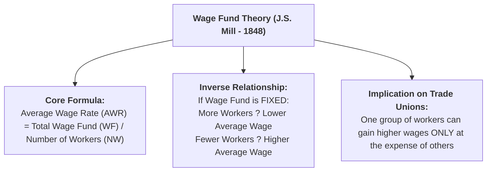
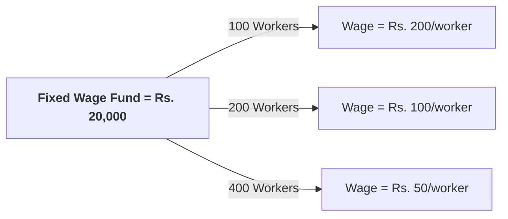
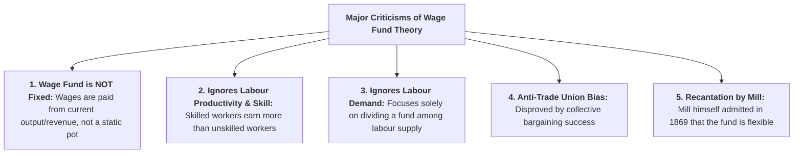

## Overview

The **Wage Fund Theory of Wages** is a prominent classical theory of wage determination developed by the British economist **John Stuart Mill (J. S. Mill)** in his book *Principles of Political Economy* (1848), building upon ideas from Adam Smith. The theory explains how average wages are determined by the ratio between a fixed capital fund and the total working population.



---

## Part 1: Meaning and Mathematical Formula

### Q1. What is the Wage Fund Theory of Wages? State its formula.
**Answer:**
**Definition:**
> The **Wage Fund Theory** states that wages depend on the proportion between the physical capital and funds set aside by employers for the direct payment of labour (**the Wage Fund**) and the total number of labourers seeking employment (**Number of Workers**).

#### The Formula:
$$\mathbf{	ext{Average Wage Rate (AWR)} = rac{	ext{Total Wage Fund (WF)}}{	ext{Number of Workers (NW)}}}$$
$$	ext{or} \quad W = rac{WF}{N}$$

Where:
* **$W$ (or $AWR$):** Average Wage Rate per worker
* **$WF$:** Predetermined Total Wage Fund allocated by capitalists
* **$N$ (or $NW$):** Total number of workers employed in the economy

---

## Part 2: Working Mechanism and Schedule

### Q2. Explain the working mechanism of the Wage Fund Theory with the help of a schedule and diagram.
**Answer:**
According to J.S. Mill, the total wage fund is fixed in advance at the beginning of the production period. Therefore, there is an **exact inverse relationship** between the size of the working population and the average wage rate:

#### Schedule Demonstrating the Wage Fund Mechanism:

Suppose the predetermined Wage Fund is fixed at **Rs. 20,000**:

| Total Wage Fund ($WF$) [Rs.] | Number of Workers ($NW$) | Average Wage Rate ($W = rac{WF}{NW}$) [Rs.] | Impact on Living Standard |
| :---: | :---: | :---: | :---: |
| **Rs. 20,000** | $100$ | $rac{20,000}{100} = \mathbf{	ext{Rs. 200}}$ | High living standard |
| **Rs. 20,000** | $200$ | $rac{20,000}{200} = \mathbf{	ext{Rs. 100}}$ | Moderate living standard |
| **Rs. 20,000** | $400$ | $rac{20,000}{400} = \mathbf{	ext{Rs. 50}}$ | Low living standard |

```
Average Wage (Rs.)
   |
200 +  * (100, 200)
    |   100 +    \   * (200, 100)
    |      50 +      \--------* (400, 50)  Downward-Sloping Wage Curve
    |
  0 +------+--------+--------+----------> Number of Workers (NW)
    0     100      200      400
```



#### Ways to Increase Wages (According to Mill):
Under this theory, the average wage rate can be increased in only two ways:
1. **By expanding the Total Wage Fund ($WF$):** Accumulating more national capital and savings.
2. **By reducing the Number of Workers ($NW$):** Controlling population growth or family size.

---

## Part 3: Key Assumptions of the Theory

### Q3. State the main assumptions of the Wage Fund Theory.
**Answer:**
1. **Fixed Wage Fund in Advance:** The total fund available for paying wages is predetermined and fixed before hiring takes place.
2. **Homogeneous Labour:** All labourers are identical in physical capability, skill, and productivity.
3. **Uniform Wage Rate:** Every worker receives an identical average wage rate ($W$).
4. **Perfect Wage Flexibility:** Wages can adjust freely up or down to ensure all available workers are employed.
5. **Money as a Medium of Exchange:** Money functions solely as a means to distribute the predetermined physical fund.

---

## Part 4: Critical Evaluation of the Theory

### Q4. What are the major criticisms of the Wage Fund Theory? Why did J. S. Mill himself recant it?
**Answer:**



1. **The Wage Fund is Not Fixed:**
   * In modern business, wages are paid out of **current production and sales revenues**, not from an unchangeable, rigid fund set aside in advance. When business expands, the wage bill expands.
2. **Ignores Labour Productivity and Skill Differences:**
   * It assumes all workers receive the same wage. In reality, a surgeon, pilot, or software architect earns significantly more than an unskilled labourer because of differences in **education, productivity, and skill**.
3. **One-Sided Supply Approach:**
   * The theory treats labour demand as a passive arithmetic division, ignoring that the demand for labour depends on **Marginal Revenue Productivity ($MRP$)** and consumer demand for the final goods.
4. **False Belief on Trade Unions:**
   * The theory claimed trade unions could never raise overall wages (arguing that higher wages for one union would leave less for non-union workers). Modern history proves collective bargaining can increase labour's share of national income by reducing excessive corporate profits.
5. **J. S. Mill's Recantation (1869):**
   * In 1869, J. S. Mill publicly retracted his own theory after economist W. T. Thornton demonstrated that capital funds are flexible and employers can adjust profits and prices to accommodate higher wages.

---

## Quick Revision Check

1. **Who formulated the Wage Fund Theory of Wages?**  
   *John Stuart Mill (J. S. Mill) in 1848.*
2. **What is the mathematical formula of the Wage Fund Theory?**  
   *$	ext{Average Wage Rate} = rac{	ext{Total Wage Fund}}{	ext{Number of Workers}}$.*
3. **According to the theory, what happens to wages when the labour force doubles under a constant fund?**  
   *The average wage rate is cut in half ($50\%$ decrease).*
4. **Why did J.S. Mill recant the theory in 1869?**  
   *Because he recognized that the wage fund is not fixed and employers can adjust profits to pay higher wages.*
