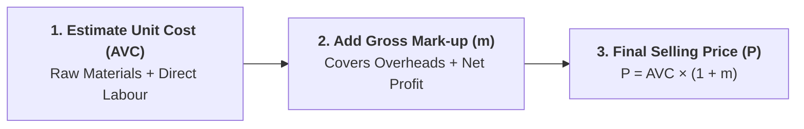

## 1. What is Cost-Plus / Mark-Up Pricing?

**Cost-Plus Pricing** (also termed **Mark-Up Pricing**, **Full-Cost Pricing**, or **Average-Cost Pricing**) is the most common practical pricing technique used in manufacturing, retailing, restaurant catering, and construction contracting.

Under this method, a business estimates the average variable cost of producing a standard unit of output and adds a pre-determined percentage profit margin (**the mark-up**) to establish the final selling price.

> **Definition:** **Cost-Plus Pricing** is the practice of setting prices by calculating unit cost of production and adding a fixed percentage mark-up to guarantee the recovery of fixed overheads and earn a target rate of return.

---

## 2. Fundamental Algebraic Formulas & Step-by-Step Conversion

### Core Price Equation:
$$P = AVC + \text{Gross Mark-Up} = AVC(1 + m)$$

Where:
* $P$ = Selling Price per unit
* $AVC$ = Average Variable Cost per unit
* $m$ = Percentage mark-up on cost (expressed as a decimal)

---

### 💡 Mark-Up on Cost vs. Profit Margin on Price (Quick Comparison):

Students often confuse **Mark-up on Cost** with **Profit Margin on Price**. Here is the clear mathematical distinction:

$$\text{Mark-Up on Cost } (m) = \frac{P - AVC}{AVC} \times 100\%$$

$$\text{Profit Margin on Price} = \frac{P - AVC}{P} \times 100\%$$

| Basis | Calculation Formula | Example (Cost = Rs. 100, Price = Rs. 125) |
| :--- | :---: | :---: |
| **Mark-Up on Cost ($m$)** | $\frac{P - AVC}{AVC} \times 100\%$ | $\frac{125 - 100}{100} \times 100\% = \mathbf{25\%}$ |
| **Profit Margin on Price** | $\frac{P - AVC}{P} \times 100\%$ | $\frac{125 - 100}{125} \times 100\% = \mathbf{20\%}$ |

> **Key Rule:** A 25% mark-up on cost corresponds to a 20% margin on the final selling price. The gross mark-up covers **Average Fixed Overheads ($AFC$)** plus target **Net Profit Margin ($NPM$)**:
> $$AVC \times m = AFC + NPM$$

---

## 3. Optimal Mark-Up and Price Elasticity of Demand (Lerner Index)

In economic theory, profit maximization occurs where **Marginal Revenue equals Marginal Cost ($MR = MC$)**. By relating marginal revenue to the price elasticity of demand ($E_d$), we derive the **Optimal Economic Mark-Up Rule**:

$$MR = P \left(1 + \dfrac{1}{E_d}\right) = MC \implies \mathbf{P = \dfrac{MC}{1 + \dfrac{1}{E_d}}} = \mathbf{\dfrac{MC}{1 - \dfrac{1}{|E_d|}}}$$

Rearranging this gives the famous **Lerner Index of Market Power**:

$$\mathbf{\dfrac{P - MC}{P} = \dfrac{1}{|E_d|}}$$

### Strategic Rule of Thumb for Managers:
* **Highly Elastic Demand ($|E_d| = 10$, e.g., Supermarket Groceries):**  
  Consumers have many close substitutes. The firm must apply a **very small mark-up** ($P = 1.11 \times MC \implies 11\%$ mark-up).
* **Inelastic Demand ($|E_d| = 1.5$, e.g., Luxury Designer Perfume, Boutique Restaurant):**  
  Consumers have few alternatives. The firm can apply a **very high mark-up** ($P = 3.0 \times MC \implies 200\%$ mark-up).

---

## 4. Solved Numerical Problems

### 📌 Problem 1: Restaurant Buffet Menu Pricing
**Question:** A hotel restaurant calculates the variable cost per guest dinner plate as **Rs. 600**. The management applies a **50% mark-up on cost** to cover restaurant fixed overheads and earn target profit.
1. Calculate the final selling price of the buffet dinner.
2. Calculate the profit margin percentage on the selling price.

#### 💡 Solution:
1. **Selling Price ($P$):**
   $$P = AVC(1 + m) = 600 \times (1 + 0.50) = 600 \times 1.50 = \mathbf{\text{Rs. } 900\text{ per guest}}$$
2. **Profit Margin on Selling Price:**
   $$\text{Margin on Price} = \left(\dfrac{P - AVC}{P}\right) \times 100\% = \left(\dfrac{900 - 600}{900}\right) \times 100\% = \left(\dfrac{300}{900}\right) \times 100\% = \mathbf{33.33\%}$$

---

### 📌 Problem 2: Electronics Retailer Elasticity Mark-Up
**Question:** A consumer electronics retailer estimates that the marginal cost of a branded wireless headphone is **Rs. 4,000**. The price elasticity of demand for this model is **$|E_d| = 2.0$**.
1. What is the profit-maximizing optimal selling price?
2. What is the percentage mark-up over marginal cost?

#### 💡 Solution:
1. **Optimal Selling Price ($P$):**
   $$P = \dfrac{MC}{1 - \dfrac{1}{|E_d|}} = \dfrac{4000}{1 - \dfrac{1}{2.0}} = \dfrac{4000}{0.5} = \mathbf{\text{Rs. } 8,000}$$
2. **Mark-up on Cost ($m$):**
   $$m = \left(\dfrac{P - MC}{MC}\right) \times 100\% = \left(\dfrac{8000 - 4000}{4000}\right) \times 100\% = \mathbf{100\%}$$

---

## 5. Advantages and Limitations of Cost-Plus Pricing

| Advantages | Limitations &amp; Criticisms |
| :--- | :--- |
| **Simplicity &amp; Practicality:** Relies on readily available internal accounting data without requiring complex econometric demand estimations. | **Ignores Demand &amp; Elasticity:** Assumes buyers will purchase whatever is produced at the cost-plus price, ignoring competition. |
| **Price Stability:** When all firms in an industry use similar mark-up conventions, destructive price wars are minimized. | **Circular Logic Fallacy:** Average cost depends on volume ($AC = TC/Q$), but sales volume depends on price ($Q = f(P)$). |
| **Fairness &amp; Transparency:** Buyers and regulatory bodies accept cost-justified price increases as ethical and reasonable. | **Historical Cost Bias:** Uses historical accounting book values rather than forward-looking opportunity costs. |
| **Guarantees Overhead Recovery:** Ensures fixed operating costs are recovered when planned sales volume targets are met. | **Inflexible in Downturns:** Maintaining rigid mark-ups during recessions leads to severe sales drops and unsold inventory. |

---

## 📌 Exam Summary Points
* **Formula:** $P = AVC(1 + m)$ where $m$ is mark-up percentage on cost.
* **Mark-up on Cost $\ne$ Margin on Price:** $m = \frac{P - AVC}{AVC} \times 100\%$, whereas $\text{Margin} = \frac{P - AVC}{P} \times 100\%$.
* **Elasticity Linkage:** Inelastic products command high mark-ups; highly elastic products command low mark-ups.

