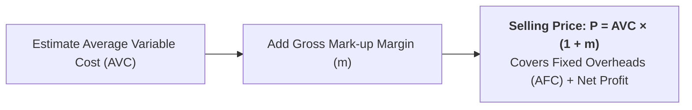

## 1. What is Cost-Plus / Mark-Up Pricing?

**Cost-Plus Pricing** (also called **Mark-Up Pricing**, **Full-Cost Pricing**, or **Average Cost Pricing**) is the most widely practiced pricing method in manufacturing, retail, and hospitality management.

Under this method, the business estimates the average cost of producing a standard level of output and adds a pre-determined percentage profit margin (**mark-up**) to establish the selling price.

---

## 2. Fundamental Algebraic Formulas

1. **Price Equation:**
   $$P = AVC + \text{Gross Margin} = AVC(1 + m)$$
   *(Where $P = \text{Price}$, $AVC = \text{Average Variable Cost}$, and $m = \text{Mark-up percentage on cost}$).*
2. **Mark-Up Percentage on Cost ($m$):**
   $$m = \left(\dfrac{P - AVC}{AVC}\right) \times 100\%$$
3. **Mark-Up Percentage on Price (Profit Margin):**
   $$\text{Margin on Price} = \left(\dfrac{P - AVC}{P}\right) \times 100\%$$

> **Purpose of the Mark-Up ($m$):** The gross mark-up is calculated to cover **Average Fixed Costs ($AFC$)** plus a targeted **Net Profit Margin ($NPM$)**:
> $$AVC \times m = AFC + NPM$$

---

## 3. Optimal Mark-Up and Price Elasticity of Demand

In economic theory, profit maximization requires $MR = MC$. We can link the profit-maximizing mark-up directly to the price elasticity of demand ($E_d$):

$$MR = P \left(1 + \dfrac{1}{E_d}\right) = MC \implies \mathbf{P = \dfrac{MC}{1 + \dfrac{1}{E_d}}}$$

Expressed as the **Lerner Index of Monopoly Power**:

$$\mathbf{\dfrac{P - MC}{P} = -\dfrac{1}{E_d}}$$

### Strategic Rule of Thumb:
* **Inelastic Market Demand ($|E_d| = 1.5$):** The firm applies a **high mark-up** ($P = 3.0 \times MC$, e.g., luxury restaurant dining, designer cosmetics).
* **Highly Elastic Market Demand ($|E_d| = 10$):** The firm applies a **small mark-up** ($P = 1.11 \times MC$, e.g., retail supermarket groceries).

---

## 4. Step-by-Step Solved Numerical Problem

**Question:**  
A hotel restaurant prepares a buffet dinner package. The variable cost per guest plate is **Rs. 500**. The hotel management applies a **40% mark-up on cost** to cover restaurant fixed overheads and earn target profit.
1. Calculate the selling price of the buffet dinner.
2. Calculate the profit margin percentage on the selling price.

### Solution:

**Part (1): Calculate Selling Price**  
$$P = AVC(1 + m) = 500 \times (1 + 0.40) = 500 \times 1.40 = \mathbf{\text{Rs. } 700\text{ per guest}}$$

**Part (2): Calculate Margin on Selling Price**  
$$\text{Margin on Price} = \left(\dfrac{P - AVC}{P}\right) \times 100\% = \left(\dfrac{700 - 500}{700}\right) \times 100\% = \left(\dfrac{200}{700}\right) \times 100\% = \mathbf{28.57\%}$$

---

## 5. Advantages and Limitations of Cost-Plus Pricing

| Advantages | Limitations &amp; Criticisms |
| :--- | :--- |
| **Simplicity &amp; Ease of Calculation:** Relies on readily available internal accounting cost data. | **Ignores Demand &amp; Buyer Elasticity:** Completely ignores customer willingness to pay and competitive market conditions. |
| **Price Stability:** When all firms in an industry use similar mark-up rules, destructive price wars are minimized. | **Historical Cost Fallacy:** Relies on historical accounting book values rather than forward-looking opportunity costs. |
| **Fairness Perception:** Consumers and regulatory agencies view cost-justified price increases as ethical and fair. | **Circular Logic:** Average cost depends on output volume ($AC = TC/Q$), but sales volume depends on price ($Q = f(P)$). |
| **Guarantees Overhead Recovery:** Ensures fixed costs are fully recovered at standard operating volume. | **Inflexible in Recessions:** Maintaining rigid mark-ups during market downturns can destroy sales volume. |

---

## 6. Review & Exam Practice Questions

### Very Short Questions (1-2 Marks):
1. **What is Mark-Up Pricing?**  
   *Answer:* A cost-based method where selling price is set by adding a fixed profit percentage to average cost ($P = AVC(1+m)$).
2. **In cost-plus pricing, what is the mark-up added to?**  
   *Answer:* Average Variable Cost (or Average Total Cost).
3. **State the formula connecting optimal price with price elasticity of demand.**  
   *Answer:* $P = \dfrac{MC}{1 + 1/E_d}$.

### Short Questions (3-5 Marks):
1. Explain the procedure and formulas used in Cost-Plus / Mark-Up pricing with a numerical example.
2. Discuss the main advantages and limitations of Cost-Plus pricing in business decision-making.
