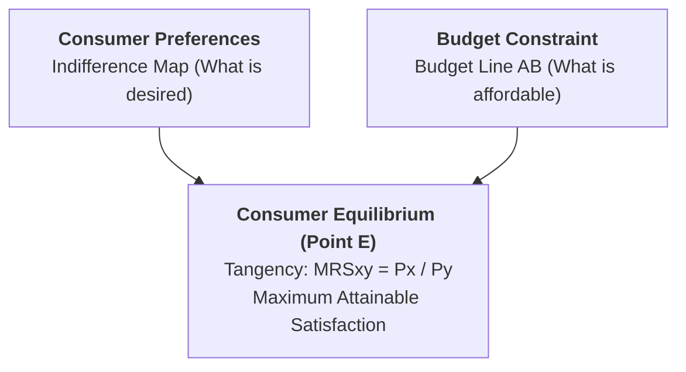
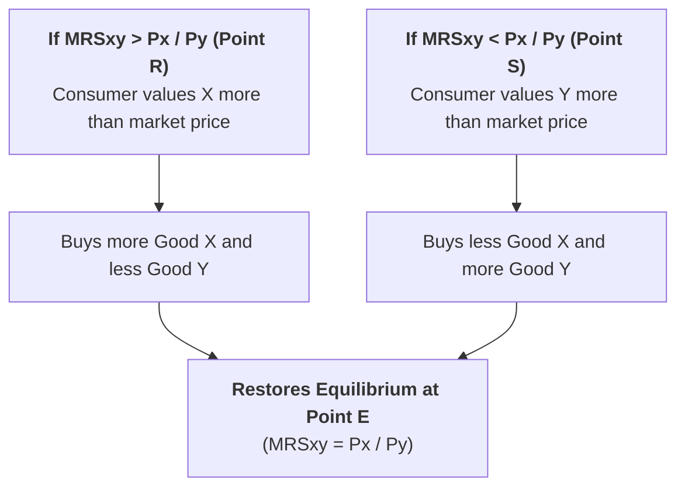

## 1. What is Consumer Equilibrium?

Under Ordinal Utility Analysis, a consumer is in **equilibrium** when they allocate their limited money income ($M$) across available goods ($X$ and $Y$) in such a way that they reach the **highest attainable indifference curve** (maximum total satisfaction), given prevailing market prices.

Once equilibrium is reached, the consumer has no incentive to change or reallocate their expenditure.

---

## 2. The Dual Equilibrium Conditions

To achieve consumer equilibrium, **two conditions** must be satisfied simultaneously:

### 1. First-Order Condition (Necessary / Tangency Condition):
The budget line must be strictly **tangent** to the highest possible indifference curve. At this tangency point, the slope of the Indifference Curve must equal the slope of the Budget Line:

$$\text{Slope of Indifference Curve} = \text{Slope of Budget Line}$$

$$MRS_{xy} = \dfrac{P_x}{P_y}$$

$$\dfrac{MU_x}{MU_y} = \dfrac{P_x}{P_y} \iff \dfrac{MU_x}{P_x} = \dfrac{MU_y}{P_y}$$

### 2. Second-Order Condition (Sufficient / Convexity Condition):
The Indifference Curve must be **strictly convex to the origin** at the point of tangency. This requires that the Marginal Rate of Substitution ($MRS_{xy}$) must be **diminishing** at the equilibrium bundle.

---

## 3. Diagrammatic Analysis of Consumer Equilibrium

### Step-by-Step Graphical Evaluation:
1. **Budget Line ($AB$):** Shows all affordable combinations of Good X and Good Y with money income $M$ at prices $P_x, P_y$.
2. **Indifference Curves ($IC_1, IC_2, IC_3$):** Show consumer preference rankings ($IC_3 \succ IC_2 \succ IC_1$).
3. **Points on $IC_3$:** Lie completely outside budget line $AB$ and are **unattainable** with current income.
4. **Points on $IC_1$ ($R$ and $S$):** Lie on the budget line and are affordable, but yield lower satisfaction than $IC_2$. At point $R$, $MRS_{xy} > \frac{P_x}{P_y}$, prompting the consumer to substitute X for Y and move down along $AB$.
5. **Tangency Point ($E$):** The budget line $AB$ is tangent to $IC_2$ at $(X_e^*, Y_e^*)$. Both the tangency condition ($MRS_{xy} = \frac{P_x}{P_y}$) and the convexity condition are fulfilled. Total utility is maximized.

---

## 4. Disequilibrium Self-Correcting Adjustments

What happens if the consumer is not at the tangency point? Rational adjustments automatically restore equilibrium:

* **Case 1: $MRS_{xy} > \dfrac{P_x}{P_y}$ (Point R):**  
  The consumer values an extra unit of X more than the market price ratio. The consumer buys **more of Good X** and **less of Good Y**. As X consumption increases, $MU_x$ falls and $MU_y$ rises, causing $MRS_{xy}$ to diminish until $MRS_{xy} = \frac{P_x}{P_y}$ at Point E.
* **Case 2: $MRS_{xy} < \dfrac{P_x}{P_y}$ (Point S):**  
  The consumer values Good X less than its market price. The consumer buys **less of Good X** and **more of Good Y**, increasing $MRS_{xy}$ until $MRS_{xy} = \frac{P_x}{P_y}$ is restored at Point E.

---

## 5. Interior vs. Corner Solutions

| Solution Type | Condition | Nature of Consumption Bundle |
| :--- | :--- | :--- |
| **Interior Solution** | Tangency on convex curve ($MRS_{xy} = \frac{P_x}{P_y}$) | Positive consumption of **both goods** ($X^* > 0, Y^* > 0$). Standard case for normal goods. |
| **Corner Solution** | Budget line flatter or steeper than linear IC | Spends entire income on **only one good** ($X^* = M/P_x, Y^* = 0$). Occurs with perfect substitutes. |

---

## 6. Review & Exam Practice Questions

### Very Short Questions (1-2 Marks):
1. **State the necessary tangency condition for consumer equilibrium in IC analysis.**  
   *Answer:* $MRS_{xy} = \dfrac{P_x}{P_y}$ (Slope of IC = Slope of Budget line).
2. **What is the second-order condition for consumer equilibrium?**  
   *Answer:* The indifference curve must be strictly convex to the origin at the tangency point (diminishing $MRS$).
3. **What adjustment occurs when $MRS_{xy} > \frac{P_x}{P_y}$?**  
   *Answer:* The consumer increases consumption of Good X and reduces Good Y until $MRS_{xy} = \frac{P_x}{P_y}$.

### Long Answer Questions (8-10 Marks):
1. Explain in detail how consumer equilibrium is determined using Indifference Curve analysis. Explain both the first-order and second-order conditions with a diagram.
2. Discuss the disequilibrium adjustment process when $MRS_{xy} \neq \frac{P_x}{P_y}$.
