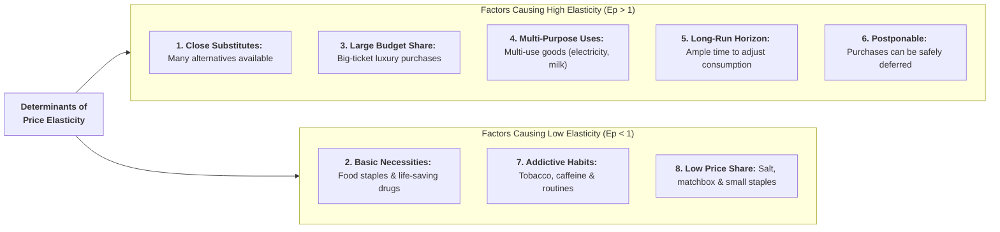

## 1. Why Does Elasticity Differ Across Goods?

Why does a 10% price increase cause a sharp 30% drop in restaurant dining, but almost no change in the demand for salt?

The price elasticity of demand is governed by **eight core economic and behavioral factors**:

---

## 2. Key Determinants Explained

### 1. Availability of Close Substitutes
* **High Elasticity ($E_p > 1$):** Goods with many close substitutes (e.g., tea, coffee, cold drinks, airline tickets) have highly elastic demand because consumers can easily switch brands when price rises.
* **Low Elasticity ($E_p < 1$):** Goods with few or no substitutes (e.g., salt, electricity, life-saving medicines) have inelastic demand.

### 2. Nature of the Commodity (Necessity vs. Luxury)
* **Necessities ($E_p < 1$):** Essential goods required for survival (food grains, drinking water, medicines) must be purchased regardless of price increases.
* **Luxuries ($E_p > 1$):** Non-essential comfort and luxury goods (designer clothing, resort vacations, luxury vehicles) have elastic demand because consumers can easily forgo them.

### 3. Proportion of Consumer Income Spent
* **Inelastic Demand:** Goods that take up an insignificant fraction of total monthly income (e.g., matchboxes, salt, newspapers). A 50% rise in salt price changes the monthly budget by only a few rupees.
* **Elastic Demand:** Big-ticket purchases that consume a substantial portion of income (e.g., cars, housing rent, tuition fees, consumer appliances).

### 4. Number of Alternative Uses
* Goods that have multiple uses (e.g., electricity, milk, aluminum, steel) have elastic demand. If milk price rises, families stop making sweets or cheese and reserve milk strictly for tea and infants.
* Single-use goods have less elastic demand.

### 5. Time Period (Short Run vs. Long Run)
* **Short Run ($E_p < 1$):** Consumers find it difficult to immediately change established habits, contracts, or machinery.
* **Long Run ($E_p > 1$):** Over time, consumers find substitutes, adopt fuel-efficient alternatives, or adjust lifestyle habits, making long-run demand significantly more elastic.

### 6. Possibility of Postponement
* Demand is elastic for goods whose purchases can be safely deferred without harm (e.g., buying a new sofa, home renovation, recreational travel).
* Demand is inelastic for urgent purchases that cannot be postponed (e.g., emergency hospital care, examination fees).

### 7. Habits and Consumer Addiction
Goods that are habitual or addictive (e.g., cigarettes, alcohol, daily morning coffee) face relatively inelastic demand because consumers are willing to pay higher prices to maintain consumption.

---

## 3. Summary Reference Table

| Determining Factor | When Demand is ELASTIC ($E_p > 1$) | When Demand is INELASTIC ($E_p < 1$) |
| :--- | :--- | :--- |
| **Substitutes** | Many close substitutes available (Tea/Coffee) | Few or no substitutes (Table Salt) |
| **Nature of Good** | Luxury and comfort items (Spa resort stays) | Basic necessities (Staple rice, medicine) |
| **Budget Share** | Large portion of income (Automobiles) | Minor fraction of income (Matchbox) |
| **Number of Uses** | Multiple alternative uses (Milk, electricity) | Single specific use (Textbook) |
| **Time Horizon** | Long-run adjustment period | Short-run immediate response |
| **Postponement** | Purchase can be easily deferred (Furniture) | Urgent and cannot be delayed (Emergency drugs) |
| **Habit / Addiction** | Non-habitual products | Strongly habitual products (Cigarettes) |

---

## 4. Review & Exam Practice Questions

### Very Short Questions (1-2 Marks):
1. **Why is the demand for table salt price-inelastic?**  
   *Answer:* Because salt has no close substitutes and accounts for a negligible fraction of consumer income.
2. **How does the time period affect price elasticity of demand?**  
   *Answer:* Demand is more elastic in the long run than in the short run because consumers have time to find alternatives.
3. **Why do durable goods like LED TVs have elastic demand?**  
   *Answer:* They represent a substantial share of consumer income and their purchase can be easily postponed.

### Short Questions (3-5 Marks):
1. Explain six major factors that determine the price elasticity of demand for a commodity.
2. Why is the long-run demand for gasoline more elastic than its short-run demand?
