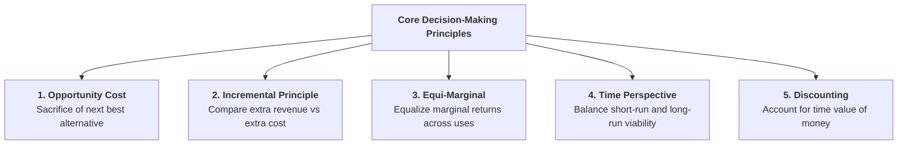
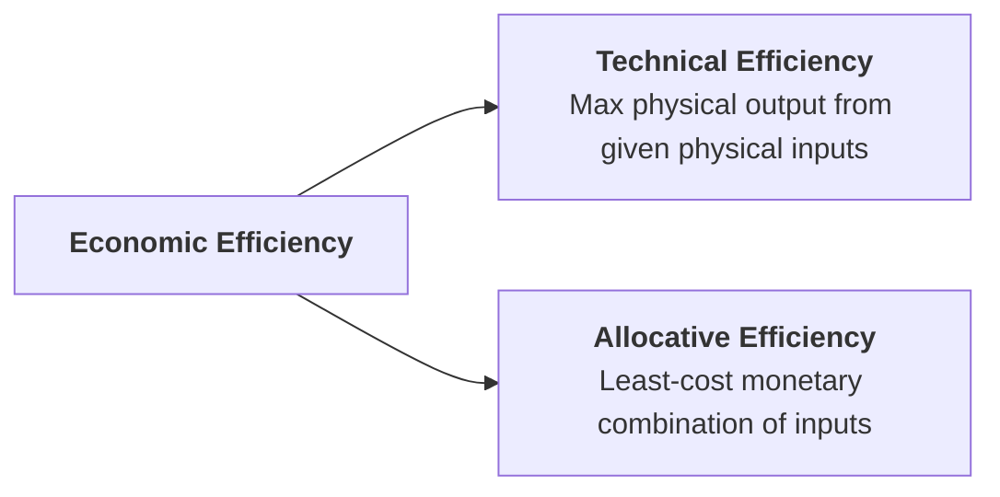
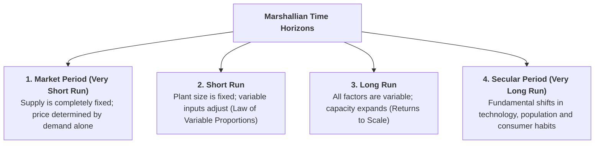

## 1. Foundational Decision-Making Principles

Business managers rely on five fundamental economic principles to guide rational operational and strategic choices:



### 1. Opportunity Cost Principle
Every business choice involves trade-offs. The **opportunity cost** of choosing one project is the profit or return sacrificed by not pursuing the next best alternative.
* *Example:* If a hotel owner uses their own commercial hall for a banquet hall instead of renting it out to a bank for Rs. 100,000/month, the opportunity cost is Rs. 100,000/month.

### 2. Incremental Principle
A business decision is profitable if the **Incremental Revenue ($\Delta TR$)** generated by the decision exceeds the **Incremental Cost ($\Delta TC$)** incurred:
$$\text{Net Gain} = \Delta TR - \Delta TC > 0$$

### 3. Equi-Marginal Principle
An enterprise with limited resources (capital, labour, marketing budget) maximizes total profit when the marginal returns from allocating resources across all departments or activities are equalized:
$$\frac{MP_1}{P_1} = \frac{MP_2}{P_2} = \dots = \frac{MP_n}{P_n}$$

### 4. Time Perspective Principle
A rational manager must not make decisions based only on immediate short-term profit. Short-run gains must be balanced against long-term brand equity, customer goodwill, and market sustainability.

### 5. Discounting Principle
A rupee received today is worth more than a rupee received in the future because money can earn interest over time. When evaluating long-term capital investments, future revenues are discounted to their **Present Value (PV)**:

```learn-formula
{
  "title": "Present Value Formula (Discounting Principle)",
  "expression": "PV = \\frac{FV}{(1 + r)^t}",
  "explanation": "PV is Present Value, FV is Future Cash Flow, r is the discount/interest rate, and t is the time period in years."
}
```

---

## 2. Accounting Profit vs. Economic Profit

Understanding the difference between accounting profit and economic profit is essential for making sound investment decisions:

### Definitions and Formulas:

1. **Accounting Profit:**  
   Total revenue minus explicit (out-of-pocket, direct book) expenses:
   $$\text{Accounting Profit} = \text{Total Revenue (TR)} - \text{Explicit Costs}$$
   *Explicit Costs* include recorded cash payments like employee wages, raw material costs, rent paid, utility bills, and machine depreciation.

2. **Economic Profit (Pure Profit):**  
   Total revenue minus **both explicit costs and implicit (opportunity) costs**:
   $$\text{Economic Profit} = \text{Total Revenue} - (\text{Explicit Costs} + \text{Implicit Costs})$$
   $$\text{Economic Profit} = \text{Accounting Profit} - \text{Implicit Costs}$$
   *Implicit Costs* represent the opportunity cost of using the owner's self-owned resources (such as the salary the owner could earn elsewhere, interest on personal savings invested in the business, and rental value of self-owned land).

| Dimension | Accounting Profit | Economic Profit (Pure Profit) |
| :--- | :--- | :--- |
| **Definition** | Total Revenue minus Explicit (Book) Costs | Total Revenue minus both Explicit and Implicit Costs |
| **Costs Included** | Direct out-of-pocket accounting expenses only | Cash expenses plus implicit opportunity costs |
| **Implicit Costs** | Ignored in standard financial books | Includes owner's foregone salary, rent, and equity interest |
| **Primary Purpose** | Tax assessment, auditing, and financial accounting | True resource allocation, capital investment decisions |
| **Relative Size** | Always higher when self-owned resources are used | Lower than accounting profit; Zero economic profit = Normal Profit |

> **Profit as Reward for Risk:** In economic theory, pure profit is the reward earned by an entrepreneur for undertaking business risks, managing market uncertainty, and introducing innovation (Knight's and Schumpeter's theories).

---

## 3. The Concept of Economic Efficiency

In business economics, **efficiency** means producing the maximum possible output at the lowest feasible cost:



1. **Technical Efficiency:**  
   A firm is technically efficient if it produces the maximum physical quantity of goods with a given set of inputs (labor, machines, raw materials) without wasting resources.
2. **Economic (Allocative) Efficiency:**  
   A firm achieves economic efficiency when it chooses the input combination that produces a given output at the **lowest possible monetary cost**, given market factor prices:
   $$\frac{MP_L}{P_L} = \frac{MP_K}{P_K}$$
   *(Where $MP_L$ and $MP_K$ are marginal products of labor and capital, and $P_L$ and $P_K$ are input prices).*

---

## 4. The Time Element in Business Decisions

Pioneered by **Alfred Marshall**, the time element is crucial because a firm's ability to adjust its production capacity depends on the length of time available:



| Time Period | Nature of Production Inputs | Supply Response & Adjustment |
| :--- | :--- | :--- |
| **1. Market Period (Very Short Run)** | All inputs are completely fixed | Supply cannot adjust; market price is determined entirely by demand fluctuations |
| **2. Short Run** | Fixed plant/machinery; Variable labor and materials | Output adjusts by utilizing existing capacity more intensively (Variable Proportions) |
| **3. Long Run** | All production factors are variable | Firms can build new facilities, install machinery, or enter/exit the market |
| **4. Secular Period (Very Long Run)** | Fundamental tech, demographic, and institutional shifts | Long-term transformations in production methods, supply chains, and consumer tastes |

---

## 5. Review & Exam Practice Questions

### Very Short Questions (1-2 Marks):
1. **What is the formula for calculating Economic Profit?**  
   *Answer:* $\text{Economic Profit} = \text{Total Revenue} - (\text{Explicit Costs} + \text{Implicit Costs})$.
2. **What does technical efficiency mean?**  
   *Answer:* Producing the maximum possible physical output from a given set of physical inputs without waste.
3. **What is the difference between the Short Run and the Long Run?**  
   *Answer:* In the short run, at least one input (plant capacity) is fixed; in the long run, all inputs are variable.
4. **State the condition for economic (allocative) efficiency in input choice.**  
   *Answer:* $\frac{MP_L}{P_L} = \frac{MP_K}{P_K}$.

### Short Questions (3-5 Marks):
1. Distinguish between Accounting Profit and Economic Profit with an example.
2. Explain the five core decision-making principles used in Business Economics.
3. Describe Alfred Marshall's four time horizons and explain their importance in managerial planning.
