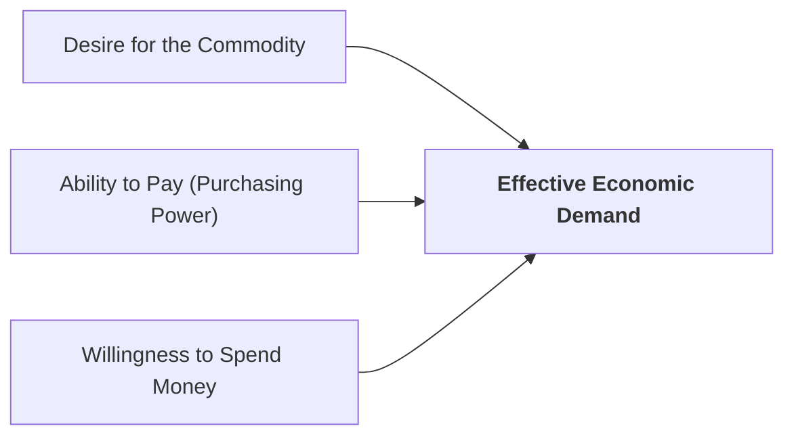

## 1. What is Demand in Economic Theory?

In everyday conversation, the words *desire*, *want*, and *demand* are often used interchangeably. However, in economics, **demand** has a very specific, technical meaning known as **Effective Demand**.

A mere desire or wish to buy something does not create economic demand unless it is backed by purchasing power and the willingness to spend.



> **Definition:** **Demand** is the quantity of a commodity that a consumer is both **willing and able to purchase** at a specific price during a given period of time.

### The Five Essential Elements of Demand:
1. **Desire for the Good:** The consumer must want or need the product.
2. **Ability to Pay (Purchasing Power):** The consumer must have sufficient financial resources or income.
3. **Willingness to Spend:** The consumer must be ready to part with their money to acquire the good.
4. **Price Specificity:** Demand is always meaningful only in reference to a specific price level.
5. **Time Specificity:** Demand is a **flow concept** measured per unit of time (e.g., 50 cups of coffee per day, 500 hotel rooms per week).

---

## 2. Types and Classifications of Demand

Economists classify demand into several practical categories:

### A. Individual Demand vs. Market Demand
* **Individual Demand:** The quantity of a good that a single buyer is willing and able to purchase at various price levels.
* **Market Demand:** The total aggregate quantity demanded by **all buyers** in the market at various price levels. It is the horizontal summation of all individual demand schedules:
  $$\text{Market Demand} = \sum_{i=1}^{n} q_i$$

### B. Direct Demand vs. Derived Demand
* **Direct (Autonomous) Demand:** Goods that satisfy human wants directly and immediately (e.g., restaurant food, clothes, consumer electronics).
* **Derived Demand:** Demand for an input or factor of production that arises because of the demand for the final product (e.g., demand for chefs and hotel housekeeping staff is derived from the demand for restaurant meals and guest room bookings).

### C. Joint (Complementary) Demand
When two or more goods are demanded together to satisfy a single want (e.g., tea and sugar, pen and ink, automobile and petrol, smartphone and SIM card).

### D. Composite Demand
When a single commodity can be put to multiple alternative uses (e.g., electricity used for lighting, cooking, heating, and industrial machinery; milk used for tea, butter, cheese, and sweets).

---

## 3. The Demand Function

The **demand function** is a mathematical statement showing the functional relationship between the quantity demanded of a commodity and the various factors that influence it:

```learn-formula
{
  "title": "General Demand Function",
  "expression": "Q_d = f(P_x, P_r, Y, T, E, N)",
  "explanation": "Qd is quantity demanded, Px is own price, Pr is related goods' prices, Y is income, T is tastes, E is expectations, and N is population."
}
```

---

## 4. Key Determinants of Demand

The quantity demanded of any commodity is determined by six primary market forces:

1. **Price of the Commodity ($P_x$):**  
   The own price of the good is the most direct determinant. Under normal conditions, a rise in price reduces quantity demanded, and a fall in price increases quantity demanded (*inverse relationship*).
2. **Prices of Related Goods ($P_r$):**
   * **Substitute Goods:** Goods that can replace each other (e.g., Tea and Coffee, Coke and Pepsi). An increase in the price of tea causes consumers to switch to coffee, increasing the demand for coffee.
   * **Complementary Goods:** Goods consumed together (e.g., Car and Fuel, Printer and Ink). An increase in the price of petrol makes driving cars more expensive, reducing the demand for cars.
3. **Consumer Income ($Y$):**
   * **Normal Goods:** Demand increases as consumer income rises (e.g., organic food, quality clothing, luxury hotel stays).
   * **Inferior Goods:** Demand decreases as consumer income rises, as consumers switch to higher-quality substitutes (e.g., low-grade grains, secondhand clothing).
4. **Tastes, Preferences, and Fashions ($T$):**  
   Favorable shifts in consumer habits, advertising campaigns, and social trends increase demand, while outdated fashions cause demand to decline.
5. **Consumer Expectations ($E$):**  
   If buyers expect prices to rise in the near future (or anticipate product shortages), they buy more today, causing current demand to increase.
6. **Size and Composition of Population ($N$):**  
   A growing population expands total market demand. Changes in demographic composition (such as an increase in the proportion of elderly citizens or school-age children) shift demand toward specific goods (healthcare vs. educational supplies).

---

## 5. Review & Exam Practice Questions

### Very Short Questions (1-2 Marks):
1. **What is Effective Demand in economics?**  
   *Answer:* Desire for a commodity backed by adequate purchasing power and willingness to spend.
2. **Give an example of complementary goods and substitute goods.**  
   *Answer:* Complementary: Tea and Sugar (or Car and Petrol). Substitute: Tea and Coffee (or Coke and Pepsi).
3. **What is Derived Demand?**  
   *Answer:* Demand for an input or factor of production resulting from the demand for the final output (e.g., demand for hotel staff derived from room bookings).

### Short Questions (3-5 Marks):
1. Distinguish between individual demand and market demand.
2. Explain the general demand function and list its main determinants.
3. How do changes in the prices of substitute and complementary goods affect the demand for a commodity?
