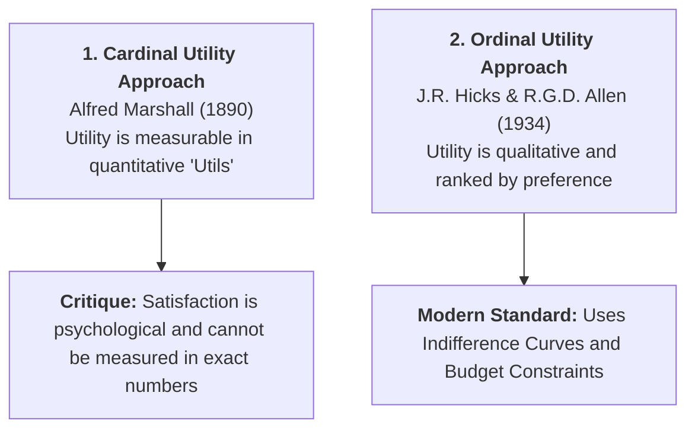

## 1. Historical Evolution: From Cardinal to Ordinal Utility

In economic literature, the analysis of consumer behavior is broadly divided into two major schools of thought:

### Key Pioneers & Timeline:
1. **Francis Y. Edgeworth (1881):** First introduced the concept of indifference curves in *Mathematical Psychics* to illustrate bilateral exchange.
2. **Vilfredo Pareto (1906):** Realized that Edgeworth’s curves could be used without assuming cardinal numbers, establishing pure ordinal preference ordering.
3. **Eugene Slutsky (1915):** Formulated the formal mathematical decomposition of price effects into substitution and income effects.
4. **J.R. Hicks and R.G.D. Allen (1934 &amp; 1939):** Reconstructed the modern theory of consumer demand in their landmark 1934 paper *"A Reconsideration of the Theory of Value"* and Hicks's book *Value and Capital* (1939).

---

## 2. Core Meaning of Ordinal Utility

Under the **Ordinal Utility Approach**, measuring the exact amount of satisfaction in numbers is discarded as unrealistic. What matters is the **relative ranking** of commodity bundles.

A consumer cannot say: *"An apple gives me 20 utils and a banana gives me 10 utils."*  
However, a consumer can easily say: *"I prefer an apple over a banana (Apple $\succ$ Banana), or I am completely indifferent between two commodity bundles (Bundle A $\sim$ Bundle B)."*

The practical analytical tool used to represent these preference rankings is the **Indifference Curve (IC)** technique.

---

## 3. Seven Fundamental Assumptions of Ordinal Analysis

The Indifference Curve approach rests on seven core behavioral and structural axioms:

1. **Consumer Rationality:** The consumer is rational and seeks to maximize total satisfaction given their money income and market prices.
2. **Ordinal Measurement of Utility:** Utility is an ordinal magnitude. The consumer ranks commodity baskets from most preferred to least preferred.
3. **Diminishing Marginal Rate of Substitution ($DMRS_{xy}$):** As the consumer acquires more units of Good X, they are willing to sacrifice progressively fewer units of Good Y for each additional unit of X.
4. **Consistency of Choice:** If bundle A is preferred over bundle B at one time ($A \succ B$), the consumer will not choose B over A under identical price and income conditions.
5. **Transitivity of Choice:** Consumer preferences are logically consistent:
   $$\text{If } A \succ B \text{ and } B \succ C \implies A \succ C$$
   $$\text{Similarly, if } A \sim B \text{ and } B \sim C \implies A \sim C$$
6. **Non-Satiety (Monotonic Preferences / "More is Better"):** The consumer has not reached total saturation. A bundle containing more of at least one good and no less of the other is strictly preferred.
7. **Divisibility of Goods:** Both commodities are perfectly divisible into fractional units.

---

## 4. Superiority of Ordinal Utility over Cardinal Utility

| Parameter | Cardinal Utility (Marshall) | Ordinal Utility (Hicks &amp; Allen) |
| :--- | :--- | :--- |
| **Measurability** | Assumes utility is cardinally measurable in numbers. | Assumes utility is psychological and only rankable. |
| **Marginal Utility of Money** | Assumes marginal utility of money ($MU_m$) is constant. | Acknowledges that $MU_m$ changes as money is spent. |
| **Scientific Realism** | Unrealistic (satisfaction cannot be measured in utils). | Highly realistic and universally accepted in modern economics. |
| **Price Effect Breakdown** | Cannot separate price effect into distinct forces. | Decomposes price effect into Substitution and Income effects. |
| **Explanation of Giffen Goods** | Fails to provide a satisfactory explanation. | Rigorously explains Giffen goods using income and substitution effects. |

---

## 5. Review & Exam Practice Questions

### Very Short Questions (1-2 Marks):
1. **Who popularized the Ordinal Utility approach in modern economics?**  
   *Answer:* J.R. Hicks and R.G.D. Allen (1934).
2. **What does the transitivity axiom state?**  
   *Answer:* If bundle A is preferred to B, and B is preferred to C, then A must be preferred to C ($A \succ B \text{ and } B \succ C \implies A \succ C$).
3. **What is the Monotonic Preference axiom?**  
   *Answer:* A consumer always prefers a commodity bundle with more goods over a bundle with fewer goods ("more is better").

### Short Questions (3-5 Marks):
1. Explain the fundamental assumptions of the Ordinal Utility approach.
2. Discuss why the Indifference Curve approach is considered superior to Marshall's Cardinal Utility approach.
