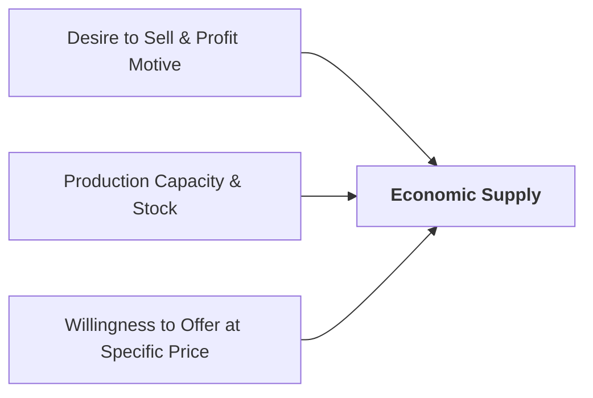

## 1. What is Supply in Economic Analysis?

In economics, **supply** refers to the supply side of the market — all producing firms, manufacturers, service enterprises, and farmers who are willing and able to offer goods and services for sale at various price levels during a specific period of time.

> **Definition:** **Supply** is the total quantity of a commodity that sellers are **willing and able to offer for sale** at different prices over a specific period of time, holding other factors constant (*ceteris paribus*).

### Passive vs. Active Factors of Production:
To create supply, businesses combine four factors of production:
* **Passive Factors (Land &amp; Capital):** Land, raw materials, and machinery cannot produce output on their own without human intervention.
* **Positive / Active Factors (Labour &amp; Entrepreneurship):** Human workers and business managers actively initiate, organize, and direct the production process.

---

## 2. The Law of Supply

Systematically formulated by **Alfred Marshall**, the **Law of Supply** states:

> *"Other things being equal (ceteris paribus), the quantity supplied of a commodity increases with a rise in its price, and decreases with a fall in its price."*

There is a **direct (positive) relationship** between the market price of a good and the quantity producers are willing to supply:

$$\text{Supply Function: } Q_s = f(P) \quad \text{where } \dfrac{dQ_s}{dP} > 0$$

$$P \uparrow \implies Q_s \uparrow \quad \text{and} \quad P \downarrow \implies Q_s \downarrow$$

### Why Does the Supply Curve Slope Upwards?
1. **Profit Incentive:** Higher selling prices make production more profitable, encouraging existing firms to expand output.
2. **Entry of New Firms:** Higher market prices attract new competitors into the industry.
3. **Covering Rising Marginal Costs:** As production expands in the short run, additional output becomes more costly to produce (due to the Law of Increasing Costs), so producers require higher prices to justify extra production.

---

## 3. Assumptions of the Law of Supply (*Ceteris Paribus*)

The Law of Supply holds true only when non-price determinants remain unchanged:
1. Factor/input prices (wages, raw materials, electricity) remain constant.
2. Production technology remains unchanged.
3. The number of firms in the industry remains constant.
4. Government taxation rates and business subsidies remain stable.
5. Prices of alternative agricultural or industrial goods stay constant.
6. Producers aim to maximize financial profits.

---

## 4. Supply Schedule and Supply Curve

### A. Individual Supply Schedule
A **supply schedule** is a numerical table showing the different quantities of a good that a producer offers for sale at various price levels:

| Price per Unit (Rs.) | Quantity Supplied (Units per Month) | Producer Market Response |
| :---: | :---: | :--- |
| **Rs. 10** | 10 Units | Low price; limited profit margin; minimum output |
| **Rs. 20** | 25 Units | Rising price; producer begins expanding production |
| **Rs. 30** | 40 Units | Moderate market price; steady operations |
| **Rs. 40** | 55 Units | Attractive profitability; substantial production expansion |
| **Rs. 50** | 70 Units | Maximum price; maximum production and sales |

### B. The Upward-Sloping Supply Curve ($SS$)

Plotting price on the vertical axis ($Y$-axis) and quantity supplied on the horizontal axis ($X$-axis) produces the upward-sloping **Supply Curve ($SS$)**, illustrating the direct price-supply relationship.

---

## 5. Movement Along vs. Shift in the Supply Curve

It is essential to distinguish between a change in **Quantity Supplied** and a change in **Supply**:

### 1. Movement Along the Curve (Change in Quantity Supplied)
* **Cause:** Solely caused by a change in the **own price ($P_s$)** of the good (*ceteris paribus*).
* **Extension of Supply:** Price rises ($P_1 \to P_2$) $\implies$ Quantity supplied expands ($Q_1 \to Q_2$) along the same curve.
* **Contraction of Supply:** Price falls ($P_2 \to P_1$) $\implies$ Quantity supplied contracts ($Q_2 \to Q_1$) along the same curve.

### 2. Shift in the Supply Curve (Change in Supply)
* **Cause:** Caused by changes in **non-price factors** while the selling price remains constant ($P_0$).
* **Increase in Supply (Rightward Shift $S_0 \to S_1$):** Lower input costs, technological advancements, tax cuts, or government subsidies.
* **Decrease in Supply (Leftward Shift $S_0 \to S_2$):** Higher wage rates, expensive raw materials, machine breakdowns, natural disasters, or new indirect taxes.

---

## 6. Comprehensive Comparison: Movement vs. Shift in Supply

| Basis of Comparison | Movement Along Supply Curve | Shift in Supply Curve |
| :--- | :--- | :--- |
| **Alternative Name** | **Change in Quantity Supplied** | **Change in Supply** |
| **Primary Cause** | Change in own selling price ($P$) only | Change in non-price determinants (costs, tech, taxes) |
| **Price Condition** | Price changes; non-price factors stay constant | Price stays constant ($P_0$); other factors change |
| **Graphical Effect** | Movement from one point to another on the same curve | Entire supply curve shifts to a new position ($S_0 \to S_1$) |
| **Types of Change** | Extension (upward) or Contraction (downward) | Increase (rightward shift) or Decrease (leftward shift) |
| **Practical Example** | A farmer supplies more wheat because market price rose | A farmer supplies more wheat because cheaper fertilizer was introduced |

---

## 7. Key Determinants of Supply

1. **Own Price of the Commodity ($P$):** Higher price stimulates larger supply.
2. **Prices of Inputs / Factors of Production ($P_f$):** Lower raw material costs reduce production costs and shift supply to the right.
3. **State of Production Technology ($T$):** Modern automated machinery increases productivity and expands supply.
4. **Government Policy (Taxes and Subsidies):** Taxes increase production costs (shifting supply left); production subsidies reduce costs (shifting supply right).
5. **Prices of Related Goods ($P_r$):** If the market price of soybeans rises significantly, farmers shift land away from maize to soybeans, reducing the supply of maize.
6. **Number of Sellers ($N$):** Entry of new manufacturing firms increases total market supply.

---

## 8. Review & Exam Practice Questions

### Very Short Questions (1-2 Marks):
1. **What is the slope of a standard supply curve?**  
   *Answer:* Positive (slopes upward from left to right).
2. **Distinguish between active and passive factors of production.**  
   *Answer:* Passive factors (land, capital) cannot produce alone; active factors (labour, entrepreneurship) initiate and drive production.
3. **What causes a contraction of supply?**  
   *Answer:* A decrease in the own price of the commodity, holding non-price factors constant.

### Short Questions (3-5 Marks):
1. State the Law of Supply and explain its core assumptions (*ceteris paribus*).
2. Differentiate between a movement along the supply curve and a shift in the supply curve with diagrams.
3. Explain five major determinants that influence the market supply of a commodity.
