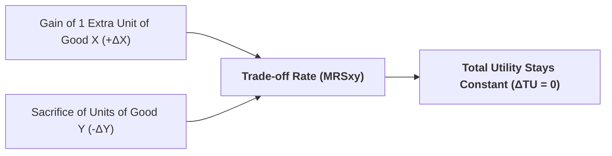

## 1. What is the Marginal Rate of Substitution ($MRS_{xy}$)?

The **Marginal Rate of Substitution of X for Y ($MRS_{xy}$)** measures the quantity of **Good Y** that a consumer is willing to give up or sacrifice in order to obtain **one additional unit of Good X**, while keeping their total satisfaction completely unchanged (remaining on the exact same indifference curve).

### Mathematical Formula:

$$MRS_{xy} = -\dfrac{\Delta Y}{\Delta X} = \dfrac{\text{Loss of Good Y}}{\text{Gain of Good X}}$$

Mathematically, $MRS_{xy}$ represents the **absolute slope** of the indifference curve at any given point.

---

## 2. Derivation: $MRS_{xy}$ Equals the Ratio of Marginal Utilities ($\frac{MU_x}{MU_y}$)

Along any indifference curve, the total change in utility ($\Delta TU$) is zero because satisfaction is constant:

$$\Delta TU = (MU_x \cdot \Delta X) + (MU_y \cdot \Delta Y) = 0$$

Subtracting $(MU_x \cdot \Delta X)$ from both sides:

$$MU_y \cdot \Delta Y = - (MU_x \cdot \Delta X)$$

Dividing both sides by $(MU_y \cdot \Delta X)$:

$$-\dfrac{\Delta Y}{\Delta X} = \dfrac{MU_x}{MU_y} = MRS_{xy}$$

> **Key Takeaway:** The Marginal Rate of Substitution ($MRS_{xy}$) is exactly equal to the ratio of the marginal utilities of the two commodities ($\dfrac{MU_x}{MU_y}$).

---

## 3. The Law of Diminishing Marginal Rate of Substitution ($DMRS_{xy}$)

> **The Law:** As a consumer increases the consumption of Good X by successive equal units, the quantity of Good Y that they are willing to surrender for each additional unit of Good X continually **diminishes** along the same indifference curve.

### Numerical Schedule of Diminishing $MRS_{xy}$:

| Combination | Good X (Units) | Good Y (Units) | Change in Y ($\Delta Y$) | Change in X ($\Delta X$) | $MRS_{xy} = -\Delta Y / \Delta X$ |
| :---: | :---: | :---: | :---: | :---: | :---: |
| **A** | 1 | 12 | — | — | — |
| **B** | 2 | 8 | -4 | +1 | **4.0 (4 Y for 1 X)** |
| **C** | 3 | 5 | -3 | +1 | **3.0 (3 Y for 1 X)** |
| **D** | 4 | 3 | -2 | +1 | **2.0 (2 Y for 1 X)** |
| **E** | 5 | 2 | -1 | +1 | **1.0 (1 Y for 1 X)** |

As shown in the table, to get the 2nd unit of X, the consumer gives up 4 units of Y ($MRS = 4$). But for the 5th unit of X, they are willing to give up only 1 unit of Y ($MRS = 1$).

---

## 4. Why Does $MRS_{xy}$ Diminish?

There are two primary economic reasons:

1. **Principle of Diminishing Marginal Utility:**  
   As the stock of Good X increases, the consumer's hunger or urgency for X declines, causing its marginal utility ($MU_x$) to fall. Simultaneously, as the stock of Good Y shrinks, Y becomes scarcer and its marginal utility ($MU_y$) rises. Because $MRS_{xy} = \dfrac{MU_x}{MU_y}$, a falling numerator divided by a rising denominator causes $MRS_{xy}$ to decrease continuously.
2. **Imperfect Substitutability of Goods:**  
   Commodities are not perfect substitutes for each other. As you accumulate more of Good X, it becomes progressively harder for Good X to replace the diminishing stock of Good Y.

---

## 5. Connection Between Diminishing $MRS$ and Convexity

The Law of Diminishing $MRS_{xy}$ is the direct mathematical reason why **Indifference Curves are strictly convex to the origin**:
* If $MRS_{xy}$ were **constant**, the indifference curve would be a straight linear line.
* If $MRS_{xy}$ were **increasing**, the curve would be concave to the origin.
* Because $MRS_{xy}$ is **diminishing**, the curve flattens out as you move down and to the right, producing a smooth **convex curve**.

---

## 6. Review & Exam Practice Questions

### Very Short Questions (1-2 Marks):
1. **Define Marginal Rate of Substitution ($MRS_{xy}$).**  
   *Answer:* The amount of Good Y a consumer is willing to give up for one extra unit of Good X while keeping total utility constant.
2. **What is the mathematical relationship between $MRS_{xy}$ and marginal utilities?**  
   *Answer:* $MRS_{xy} = \dfrac{MU_x}{MU_y}$.
3. **What geometric property of an indifference curve is caused by Diminishing $MRS$?**  
   *Answer:* Strict convexity to the origin.

### Short Questions (3-5 Marks):
1. State the Law of Diminishing Marginal Rate of Substitution and explain why $MRS_{xy}$ diminishes.
2. Prove algebraically that along an indifference curve, $MRS_{xy} = \dfrac{MU_x}{MU_y}$.
