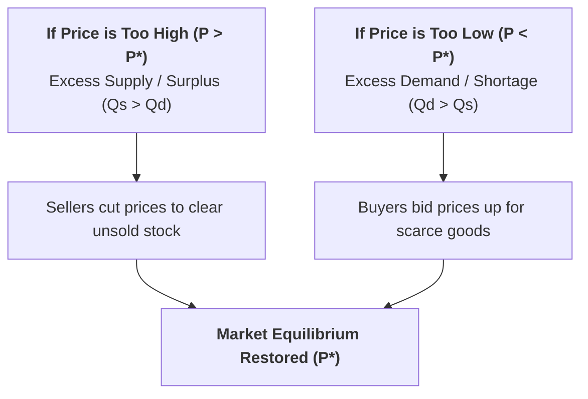

## 1. What is Market Equilibrium?

In a market economy, neither consumers alone nor producers alone determine the price of a good. Price is determined by the **mutual interaction of demand and supply**.

> **Definition:** **Market Equilibrium** is the state of balance where the **Quantity Demanded ($Q_d$)** by consumers exactly equals the **Quantity Supplied ($Q_s$)** by producers at the prevailing market price.

$$\text{Equilibrium Condition: } Q_d = Q_s$$

At the **Equilibrium Price ($P^*$)**, the market clears: there is neither an unsold surplus nor an unsatisfied shortage, and there is no inherent tendency for the price to change.

---

## 2. Tabular Determination of Market Equilibrium

Consider the following hypothetical market schedule for Commodity X:

| Price per Unit (Rs.) | Quantity Demanded (Units/Month) | Quantity Supplied (Units/Month) | Market State & Pressure on Price |
| :---: | :---: | :---: | :--- |
| **Rs. 50** | 10 | 70 | **Excess Supply (Surplus = +60)** $\implies$ Downward pressure on price |
| **Rs. 40** | 20 | 55 | **Excess Supply (Surplus = +35)** $\implies$ Downward pressure on price |
| **Rs. 30** | **35** | **35** | **Market Equilibrium ($Q_d = Q_s = 35$)** $\implies$ Stable Price ($P^* = \text{Rs. } 30$) |
| **Rs. 20** | 50 | 20 | **Excess Demand (Shortage = -30)** $\implies$ Upward pressure on price |
| **Rs. 10** | 70 | 10 | **Excess Demand (Shortage = -60)** $\implies$ Upward pressure on price |

---

## 3. Graphical Representation of Market Equilibrium

### Graph Elements:
* **Demand Curve ($DD$):** Slopes downward from left to right (Law of Demand).
* **Supply Curve ($SS$):** Slopes upward from left to right (Law of Supply).
* **Point $E$ (Equilibrium Point):** The intersection point where $DD$ intersects $SS$.
* **$P^*$ (Equilibrium Price = Rs. 30):** The unique price at which quantity demanded equals quantity supplied.
* **$Q^*$ (Equilibrium Quantity = 35 Units):** The total volume traded in the market.

---

## 4. The Self-Correcting Price Mechanism (Adam Smith's "Invisible Hand")

What happens if the market price deviates from the equilibrium price? Free competitive markets naturally self-correct through price adjustments:

### Case 1: When Price is Above Equilibrium ($P > P^*$) $\implies$ Excess Supply (Surplus)
* At price $P_1$ (Rs. 50), producers supply 70 units, but consumers buy only 10 units.
* Unsold inventories pile up in warehouses. To get rid of excess stock, competing sellers **lower their prices**.
* As price falls toward $P^*$, quantity demanded expands while quantity supplied contracts until the surplus is completely eliminated.

### Case 2: When Price is Below Equilibrium ($P < P^*$) $\implies$ Excess Demand (Shortage)
* At price $P_2$ (Rs. 10), consumers want 70 units, but producers supply only 10 units.
* Long queues and stockouts occur. Eager consumers **bid prices upward** to secure the scarce goods.
* As price rises toward $P^*$, producers are incentivized to expand supply while some buyers drop out until the shortage is completely eliminated.

---

## 5. Effects of Simultaneous Shifts in Demand and Supply

When both demand and supply curves shift at the same time, the effect on equilibrium price and quantity depends on the direction and magnitude of the shifts:

| Market Shift Event | Effect on Equilibrium Price ($P^*$) | Effect on Equilibrium Quantity ($Q^*$) |
| :--- | :--- | :--- |
| **Demand Increases &amp; Supply Decreases** | **Price Rises Significantly ($P^* \uparrow$)** | Quantity change is ambiguous (depends on shift size) |
| **Demand Decreases &amp; Supply Increases** | **Price Falls Significantly ($P^* \downarrow$)** | Quantity change is ambiguous (depends on shift size) |
| **Both Demand and Supply Increase** | Price change is ambiguous | **Quantity Increases Significantly ($Q^* \uparrow$)** |
| **Both Demand and Supply Decrease** | Price change is ambiguous | **Quantity Falls Significantly ($Q^* \downarrow$)** |

---

## 6. Review & Exam Practice Questions

### Very Short Questions (1-2 Marks):
1. **Under what condition is a market said to be in equilibrium?**  
   *Answer:* When quantity demanded equals quantity supplied ($Q_d = Q_s$) with no shortage or surplus.
2. **What happens to equilibrium price if demand increases while supply decreases?**  
   *Answer:* The equilibrium price rises significantly.
3. **What is Excess Demand in a market?**  
   *Answer:* A situation where quantity demanded exceeds quantity supplied ($Q_d > Q_s$) because the price is below equilibrium.

### Short Questions (3-5 Marks):
1. Explain how market equilibrium price and quantity are determined using a schedule and diagram.
2. Describe the self-correcting price mechanism when a market experiences excess supply.
3. How do simultaneous shifts in demand and supply affect market equilibrium?
