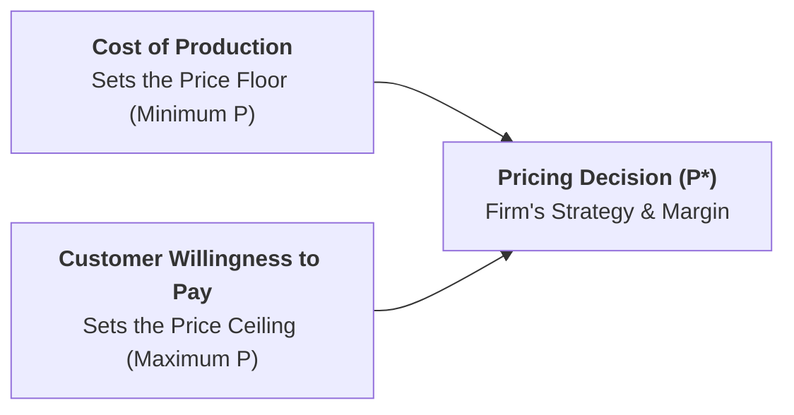
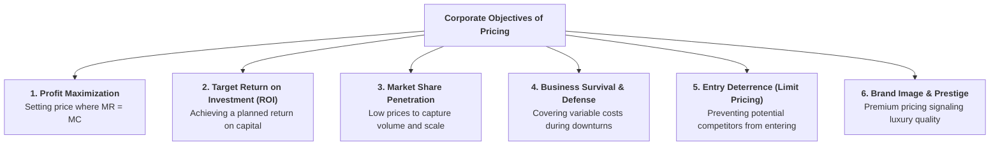
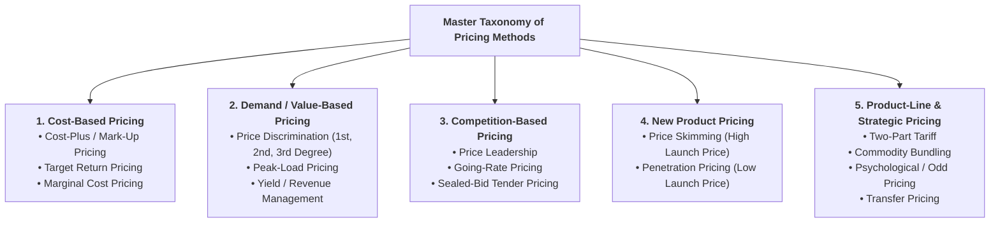

## 1. Meaning and Role of Pricing in Business Economics

In marketing and business management, price is one of the foundational variables of the marketing mix ($4\text{ Ps}$: Product, Price, Place, and Promotion). 

Unlike product development or brand promotion which require months of planning and capital investment, **price is the most flexible, dynamic, and immediately adjustable decision variable** available to a manager.

> **Definition:** **Pricing Policy** is the strategic framework and set of rules an enterprise uses to determine the selling prices of its goods and services to achieve corporate goals such as profit maximization, market share growth, and long-term brand equity.

---

## 2. Six Core Business Objectives of Pricing

Commercial enterprises establish pricing strategies based on specific operational and strategic goals:

1. **Profit Maximization:** The classical microeconomic goal of setting prices to achieve maximum total profit ($MR = MC$).
2. **Target Return on Investment (ROI):** Pricing products to earn a pre-determined percentage return on capital employed (e.g., target 15% annual ROI).
3. **Market Share Expansion:** Setting competitive or discounted prices to build volume rapidly and lower unit costs through economies of scale.
4. **Short-Run Survival:** In severe recessions, setting prices just above Average Variable Cost ($P \ge AVC$) to maintain cash flow and stay in business.
5. **Entry Deterrence (Limit Pricing):** Setting prices below the potential entrant's average cost to discourage rivals from entering the market.
6. **Brand Image and Quality Signaling:** Using premium prices to reinforce consumer perceptions of luxury, exclusivity, and superior quality.

---

## 3. Key Determinants of Pricing Policy

A firm's pricing strategy is shaped by the interaction of internal corporate factors and external market forces:

| Dimension | Key Determining Factors | Managerial Impact |
| :--- | :--- | :--- |
| **Internal Factors (Firm-Level)** | Cost structure ($TFC$ vs. $TVC$), corporate objectives, capacity constraints, product lifecycle stage, perishability. | Dictates the minimum price floor below which the firm incurs operational losses. |
| **External Factors (Market-Level)** | Market structure (monopoly vs. competition), price elasticity of demand, competitor prices, consumer income, government taxes/regulations. | Dictates the maximum price ceiling that consumers and market forces will tolerate. |

---

## 4. Master Classification of Pricing Methods

Economists and business managers divide pricing techniques into five broad categories:

---

## 5. Summary Reference Matrix of Pricing Techniques

| Pricing Method | Determining Basis | Primary Market Context | Key Industry Example |
| :--- | :--- | :--- | :--- |
| **Cost-Plus / Mark-Up** | Average variable cost + profit margin | Retail, manufacturing, catering | Restaurant F&amp;B menu pricing ($P = AVC(1+m)$) |
| **Price Discrimination** | Differences in buyer price elasticity ($E_d$) | Monopoly, airlines, hotels | Student/senior citizen discounts, domestic vs. foreign tariffs |
| **Peak-Load Pricing** | Periodic capacity constraints over time | Non-storable public utilities, hospitality | High-season hotel rates, evening peak electricity |
| **Transfer Pricing** | Internal cost of intermediate goods ($MC_u$) | Vertically integrated corporations | Central hotel bakery transferring goods to restaurant |
| **Price Skimming** | High initial willingness to pay (innovators) | Innovative products with entry barriers | Flagship Apple iPhones, new luxury boutique hotels |
| **Penetration Pricing** | Highly price-elastic mass market demand | Highly competitive mass markets | Budget hotel chains (OYO), low-cost airlines (AirAsia) |
| **Two-Part Tariff** | Fixed entry fee + per-unit usage fee | Entertainment, recreation, telecommunications | Amusement parks, golf clubs, cellular plans |
| **Commodity Bundling** | Selling multiple goods as a package deal | Hospitality, fast food, software | All-inclusive resort packages, fast-food combo meals |

---

## 6. Review & Exam Practice Questions

### Very Short Questions (1-2 Marks):
1. **What is the difference between the price floor and the price ceiling?**  
   *Answer:* The price floor is set by production costs (minimum profitable price); the price ceiling is set by customer willingness to pay (maximum possible price).
2. **Name three internal determinants and three external determinants of pricing.**  
   *Answer:* Internal: Cost structure, capacity, corporate goals. External: Market competition, demand elasticity, government taxes.
3. **What is Going-Rate Pricing?**  
   *Answer:* A competition-based pricing method where a firm sets its price based largely on competitors' prevailing market prices.

### Short Questions (3-5 Marks):
1. Explain the major business objectives of pricing policy with real-world examples.
2. Provide a master classification of modern pricing methods used by business enterprises.
