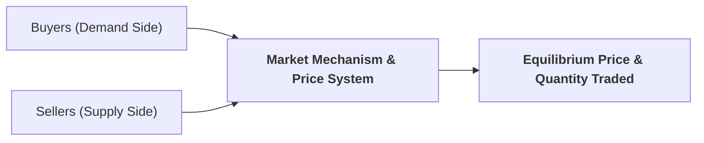
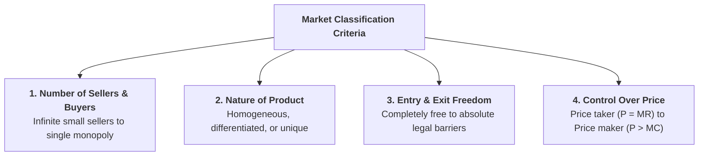

## 1. What is a Market in Economic Theory?

In everyday language, a "market" refers to a physical bazaar, shopping mall, or grocery store. In economic analysis, however, a **market** has a much broader, institutional meaning.

> **Definition:** A **market** is any arrangement, mechanism, or network of communication through which potential buyers and sellers interact to determine the price and quantity of a specific good or service traded.



A market does not require a physical location. Global foreign exchange (Forex), stock markets, online e-commerce platforms, and wholesale grain markets are all economic markets.

---

## 2. Four Key Criteria for Classifying Market Structures

Economists classify markets along a competitive continuum based on **four fundamental structural parameters**:



1. **Number and Size Distribution of Sellers:** Ranges from an infinite number of small price-taking firms to a single price-making monopolist.
2. **Nature of the Product:** Whether goods are identical (homogeneous / perfect substitutes), differentiated (branding / close substitutes), or unique (no close substitutes).
3. **Barriers to Entry and Exit:** Whether new competitors can enter freely or are blocked by high capital requirements, government patents, or economies of scale.
4. **Degree of Pricing Power:** Whether individual firms have zero control over market price or substantial pricing freedom.

---

## 3. The Spectrum of Market Structures


---

## 4. Master Market Classification Matrix

| Market Structure | Number of Sellers | Nature of Product | Entry &amp; Exit Conditions | Pricing Power | Industry Examples |
| :--- | :--- | :--- | :--- | :--- | :--- |
| **Perfect Competition** | Very Large / Infinite | Homogeneous (Identical) | Completely Free ($0$ barriers) | Zero (Price Taker, $P = AR = MR$) | Agricultural wheat, Forex market |
| **Monopolistic Competition** | Many Sellers | Differentiated (Close substitutes) | Free Entry &amp; Exit | Limited Pricing Power | Restaurants, clothing, hotels |
| **Oligopoly** | Few Large Sellers | Homogeneous or Differentiated | High Barriers (Scale, Capital) | High (Mutual Interdependence) | Airlines, automobiles, telecom |
| **Duopoly** | Exactly Two Sellers | Homogeneous or Differentiated | High Barriers | Strategic Interdependent Power | Visa vs. Mastercard, Airbus vs. Boeing |
| **Pure Monopoly** | Single Seller | Unique (No close substitutes) | Absolute Barriers (Legal/Natural) | Complete Price Maker ($P > MC$) | Local water utility, railway network |

---

## 5. Main Categories on the Basis of Competition

On the basis of market rivalry, economists divide all markets into two broad categories:

```
┌────────────────────────────────────────────────────────────────────────┐
│                        MARKET STRUCTURES                               │
├───────────────────────────────────┬────────────────────────────────────┤
│     1. PERFECT COMPETITION        │      2. IMPERFECT COMPETITION      │
├───────────────────────────────────┼────────────────────────────────────┤
│ • Infinite price-taking sellers   │ • Monopolistic Competition         │
│ • Homogeneous identical goods     │ • Oligopoly                        │
│ • Zero barriers to entry          │ • Duopoly                          │
│ • P = MR = MC (Maximum Efficiency)│ • Pure Monopoly                    │
└───────────────────────────────────┴────────────────────────────────────┘
```

> **Special Case — Bilateral Monopoly:** A specialized market structure featuring **only one buyer (Monopsony) and only one seller (Monopoly)** (e.g., a single labor union negotiating with a single state enterprise).

---

## 6. Review & Exam Practice Questions

### Very Short Questions (1-2 Marks):
1. **Define an economic market.**  
   *Answer:* Any arrangement or network through which buyers and sellers interact to determine price and trade quantities.
2. **Name the four main criteria used to classify market structures.**  
   *Answer:* Number of sellers/buyers, nature of product, barriers to entry/exit, and degree of price control.
3. **What is a Bilateral Monopoly?**  
   *Answer:* A market structure with exactly one buyer and one seller.

### Short Questions (3-5 Marks):
1. Explain the master spectrum of market structures from Perfect Competition to Pure Monopoly.
2. Compare and contrast Perfect Competition and Imperfect Competition using a summary table.
