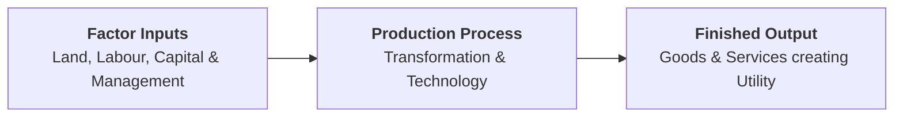

## 1. What is Production in Economics?

In economics, **production** is the process of transforming physical and intangible factor inputs (land, labour, capital, and entrepreneurship) into finished goods and services that create utility to satisfy human wants.

> **Definition:** **Production** is the creation or addition of value and utility in goods and services through the application of human effort, machinery, and natural resources.

---

## 2. The Production Function

The **production function** is a purely technical and engineering relationship expressing the maximum physical quantity of output ($Q$) that can be produced from a given combination of factor inputs, assuming a constant state of technology.

$$\mathbf{Q = f(L, K, N, T)}$$

* $Q$ = Total physical output
* $L$ = Labour input (variable factor)
* $K$ = Capital input (fixed or variable factor)
* $N$ = Land and natural resources
* $T$ = State of technology (held constant)

### Key Characteristics:
1. **Technical Relationship:** Measures physical quantities of inputs and outputs, independent of monetary prices or costs.
2. **Flow Concept:** Measures output produced per specific time period (e.g., daily output, monthly factory volume).
3. **Technology-Dependent:** Any technological innovation shifts the production function upward, producing more output from the same inputs.

---

## 3. Short-Run vs. Long-Run Time Horizons

Economists distinguish between the short run and the long run based on the **flexibility of factor inputs**:

| Feature | Short-Run Production Horizon | Long-Run Production Horizon |
| :--- | :--- | :--- |
| **Factor Input Flexibility** | At least one factor input is **fixed** (e.g., plant size, land, heavy machinery); others are variable. | All factor inputs are **variable** ($L, K, N$ can all be adjusted). |
| **Operational Plant Size** | Plant capacity is fixed; output changes by adjusting labor and materials. | Plant scale can be expanded, new factories built, or firms can enter/exit. |
| **Governing Economic Law** | Governed by the **Law of Variable Proportions** (Returns to a Variable Factor). | Governed by the **Law of Returns to Scale**. |
| **Cost Classifications** | Divided into Fixed Costs ($TFC$) and Variable Costs ($TVC$). | All costs become **Variable Costs** in the long run ($TFC = 0$). |

---

## 4. The Three Physical Product Concepts

To measure short-run production with one variable factor (Labour, $L$) applied to fixed capital ($K$):

### 1. Total Product ($TP_L$):
The total physical quantity of output produced by combining a given quantity of variable factor ($L$) with fixed factor inputs.

### 2. Average Product ($AP_L$):
The total physical output per unit of the variable input employed:

$$AP_L = \dfrac{TP_L}{L}$$

### 3. Marginal Product ($MP_L$):
The additional physical output generated by employing one extra unit of the variable factor:

$$MP_L = \dfrac{\Delta TP}{\Delta L} = TP_n - TP_{n-1} \quad \text{or} \quad MP_L = \dfrac{d(TP)}{dL}$$

---

## 5. Review & Exam Practice Questions

### Very Short Questions (1-2 Marks):
1. **What is a production function?**  
   *Answer:* The technical relationship between physical factor inputs and the maximum physical output produced.
2. **How is the short-run time period defined in production analysis?**  
   *Answer:* A time period where at least one factor input (plant/machinery) is fixed while other inputs can be varied.
3. **State the formula for calculating Marginal Product ($MP$).**  
   *Answer:* $MP_L = \dfrac{\Delta TP}{\Delta L} = TP_n - TP_{n-1}$.

### Short Questions (3-5 Marks):
1. Differentiate between short-run and long-run production functions with a comparative table.
2. Explain the concepts of Total Product, Average Product, and Marginal Product with their formulas.
