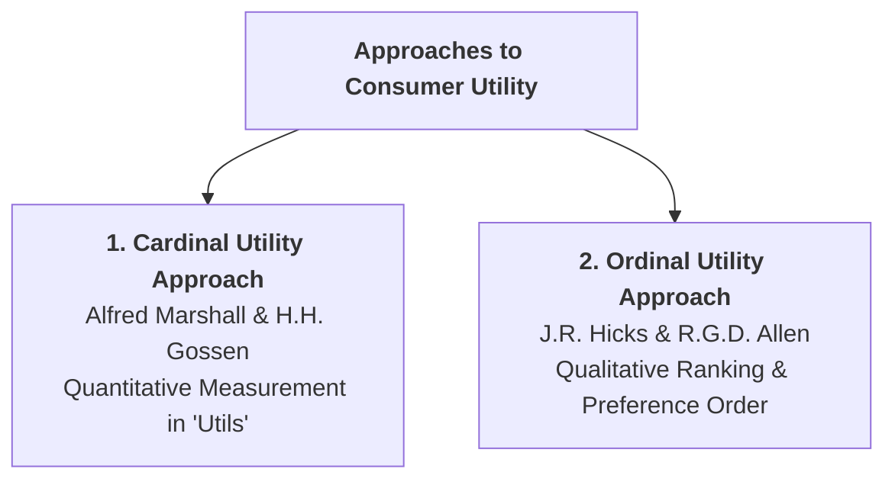

## 1. What is Utility in Economics?

In economic analysis, **utility** refers to the subjective capacity of a good or service to satisfy a human want.

> **Definition:** **Utility** is the **want-satisfying power** of a commodity. It measures the pleasure, satisfaction, or benefit a consumer expects to derive from consuming a good or service.

### Key Characteristics of Utility:
1. **Subjective in Nature:** Utility is a psychological feeling that varies from person to person. A cup of coffee yields high utility to a coffee lover, but zero utility to someone who dislikes caffeine.
2. **Relative to Time and Place:** The utility of a good changes depending on circumstances. A warm woolen jacket has high utility in winter in Kathmandu, but very low utility in summer in the Terai.
3. **Distinct from Usefulness or Health:** A commodity can possess utility without being socially useful or healthy. For example, cigarettes or alcohol provide utility to an addicted consumer, even though they harm physical health.
4. **Distinct from Pleasure:** Bitter life-saving medicine provides immense medical utility (cures illness), even though taking it is unpleasant.

---

## 2. Cardinal Utility vs. Ordinal Utility Approaches

Economists study consumer decision-making through two major analytical approaches:

### 1. The Cardinal Utility Approach (Marshallian View)
* **Core Premise:** Utility is a measurable physical quantity, just like weight (kg), temperature (degrees), or height (meters).
* **Unit of Measurement:** Utility is measured in hypothetical units called **Utils** or in monetary terms (the maximum amount of money a consumer is willing to pay for a good).
* **Key Assumption:** The marginal utility of money ($MU_m$) remains constant during consumption.
* **Core Theories:** Forms the foundation of the **Law of Diminishing Marginal Utility (DMU)** and the **Law of Equi-Marginal Utility**.

### 2. The Ordinal Utility Approach (Hicks-Allen Modern View)
* **Core Premise:** Utility is a purely subjective psychological feeling that **cannot** be measured in numerical units. A consumer cannot say *"I got 25 utils from an apple and 15 utils from an orange."*
* **Ranking Mechanism:** A consumer can only **rank or compare** preferences (e.g., *"I prefer an apple over an orange, or I am indifferent between two bundles of goods"*).
* **Core Theories:** Analyzes consumer choice using **Indifference Curves** and **Budget Lines**.

---

## 3. Comprehensive Comparison: Cardinal vs. Ordinal Utility

| Basis of Comparison | Cardinal Utility Approach | Ordinal Utility Approach |
| :--- | :--- | :--- |
| **Pioneers & Economists** | H.H. Gossen (1854), Alfred Marshall (1890) | F.Y. Edgeworth, Vilfredo Pareto, J.R. Hicks, R.G.D. Allen (1934) |
| **Core Concept** | Utility is quantitatively measurable in exact numbers. | Utility is qualitative and can only be ranked in order of preference. |
| **Unit of Measurement** | Measured in **Utils** or monetary willingness to pay. | No numerical units; measured through **ranks (1st, 2nd, 3rd)**. |
| **Analytical Tools** | Marginal Utility ($MU$), Total Utility ($TU$), Equi-Marginal Rule | Indifference Curves ($IC$), Budget Line, Marginal Rate of Substitution ($MRS$) |
| **Assumptions** | Constant marginal utility of money ($MU_m = \text{constant}$). | Realistic consumer ranking under budget constraints. |
| **Scientific Realism** | Less realistic (satisfaction cannot be measured in utils). | Highly realistic and accepted in modern microeconomic analysis. |

---

## 4. Fundamental Concepts: Total Utility ($TU$) and Marginal Utility ($MU$)

Under the cardinal framework, total satisfaction and incremental satisfaction are expressed as:

### 1. Total Utility ($TU$):
The aggregate sum of satisfaction obtained by a consumer from consuming a specific number of units of a good:

$$TU = f(Q) \quad \text{or} \quad TU_n = \sum_{i=1}^n MU_i = MU_1 + MU_2 + \dots + MU_n$$

### 2. Marginal Utility ($MU$):
The additional utility derived from the consumption of one extra unit of the commodity:

$$MU_n = TU_n - TU_{n-1} \quad \text{or} \quad MU = \dfrac{d(TU)}{dQ}$$

---

## 5. Review & Exam Practice Questions

### Very Short Questions (1-2 Marks):
1. **Define utility in economics.**  
   *Answer:* The subjective want-satisfying power of a commodity.
2. **What is the unit of measurement under the Cardinal Utility approach?**  
   *Answer:* Utils (or monetary willingness to pay).
3. **Who developed the Ordinal Utility approach?**  
   *Answer:* J.R. Hicks and R.G.D. Allen (1934).

### Short Questions (3-5 Marks):
1. Distinguish between Cardinal Utility and Ordinal Utility approaches with a comparative table.
2. Explain why utility is distinct from usefulness and morality with examples.
3. State the formulas for calculating Total Utility and Marginal Utility.
