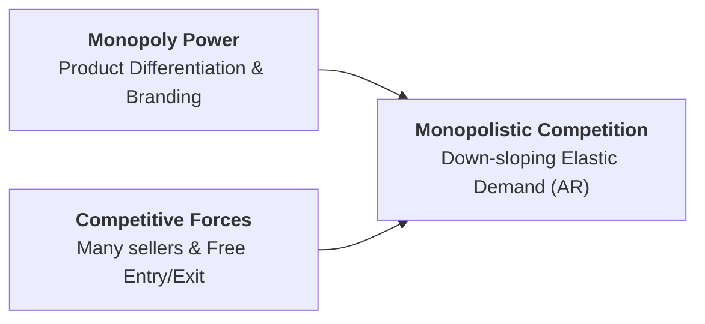

## 1. What is Monopolistic Competition?

Formulated by American economist **Edward Chamberlin** in 1933, **Monopolistic Competition** is a market structure that combines elements of both monopoly and perfect competition:

* **Monopoly Element:** Each firm has a mini-monopoly over its own unique brand or design due to **Product Differentiation**.
* **Competitive Element:** There are **many sellers** producing close substitutes, with **free entry and exit**.

### Key Characteristics:
1. **Large Number of Sellers:** Many firms compete independently without direct strategic retaliation.
2. **Product Differentiation:** Goods are close substitutes but differentiated by physical design, brand name, packaging, customer service, or location (e.g., restaurants, clothing stores, hotels).
3. **Free Entry and Exit:** Low entry barriers ensure firms earn only **Normal Profit** in the long run.
4. **Heavy Selling Costs:** Firms spend substantial funds on advertising, branding, and sales promotions to make consumer demand more inelastic.
5. **Downward-Sloping Elastic Demand Curve:** Because close substitutes exist, the firm's demand curve ($AR$) is flatter and highly price-elastic ($E_d > 1$).

---

## 2. Short-Run vs. Long-Run Equilibrium

### A. Short-Run Equilibrium:
In the short run, a firm acts like a mini-monopolist, setting output where **$MR = MC$**.
* If demand is strong ($P > ATC$), the firm earns **supernormal profits**.
* If demand is weak ($P < ATC$), the firm incurs short-run **losses**.

### B. Long-Run Equilibrium (Chamberlin's Tangency Solution):
* When existing firms earn supernormal profits, **new firms enter** the market with close substitute brands.
* Each firm's market share declines, shifting the individual firm's demand curve ($AR$) leftward until it becomes **tangent to the Long-Run Average Cost ($LAC$) curve**.
* **Long-Run Condition:** $MR = LMC$ and $P^* = LAC$. All firms earn strictly **Normal Profit** (zero economic profit).

---

## 3. Chamberlin's Excess Capacity Theorem

### Geometric Proof of Excess Capacity:
1. Because the firm's demand curve ($AR$) slopes downward due to product differentiation, its tangency with the U-shaped $LAC$ curve **must occur on the falling segment of the $LAC$ curve** (to the left of the lowest point).
2. The firm produces **Actual Output ($q_A$)** at price $P^*$.
3. The socially optimal or **Ideal Output ($q_M$)** occurs at the absolute minimum point of the $LAC$ curve.
4. The difference between optimal capacity and actual output represents **Excess Capacity**:

$$\mathbf{\text{Excess Capacity} = q_M - q_A}$$

> **Economic Significance:** Excess capacity represents underutilized plant size and higher unit costs. However, economists recognize this as the **price society pays for product variety, consumer choice, and brand diversity** rather than consuming a single standardized product.

---

## 4. Comparison: Monopolistic Competition vs. Perfect Competition

| Basis of Comparison | Perfect Competition | Monopolistic Competition |
| :--- | :--- | :--- |
| **Product Nature** | Homogeneous (Identical) | Differentiated (Close Substitutes) |
| **Demand Curve Facing Firm** | Horizontal line ($E_d = \infty$) | Downward-sloping, elastic ($E_d > 1$) |
| **Long-Run Plant Output** | Optimal Scale ($\text{Min } LAC$, Zero excess capacity) | Sub-optimal ($q_A < q_M$, **Excess Capacity exists**) |
| **Long-Run Efficiency** | Allocatively ($P = MC$) &amp; Productively ($P = \text{Min } LAC$) Efficient | Inefficient ($P > MC$ and $P > \text{Min } LAC$) |
| **Selling Costs &amp; Advertising** | Zero advertising expenditure | Heavy selling and promotional costs |
| **Long-Run Economic Profit** | Normal Profit ($P = LAC$) | Normal Profit ($P = LAC$) |

---

## 5. Review & Exam Practice Questions

### Very Short Questions (1-2 Marks):
1. **What is the defining feature of monopolistic competition?**  
   *Answer:* Product differentiation among many competing sellers.
2. **What is Excess Capacity?**  
   *Answer:* The unutilized production capacity resulting when a firm produces below its minimum efficient scale ($q_M - q_A$).
3. **What is the long-run profit state under monopolistic competition?**  
   *Answer:* Normal profit ($P = LAC$, zero economic profit).

### Short Questions (3-5 Marks):
1. Explain Chamberlin's Excess Capacity hypothesis with a diagram.
2. Compare the long-run equilibrium of a firm under perfect competition and monopolistic competition.
