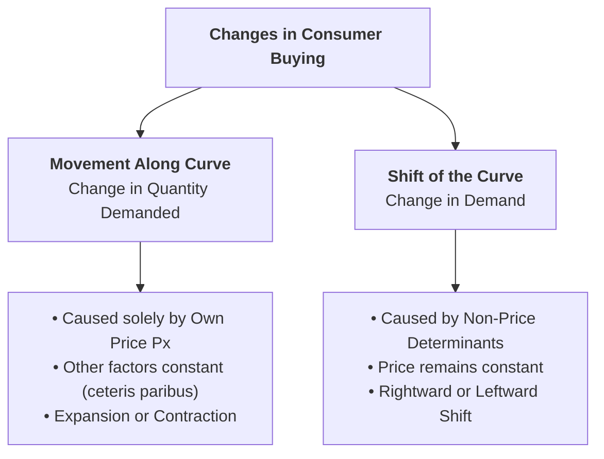
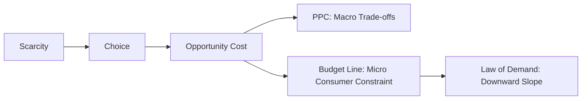

## 1. Overview: Two Types of Demand Changes

In economic analysis, it is essential to distinguish between a change in **Quantity Demanded** and a change in **Demand**:



---

## 2. Movement Along the Demand Curve (Change in Quantity Demanded)

### Definition
A **movement along the demand curve** occurs when the quantity demanded changes solely due to a change in the **own price ($P_x$)** of the commodity, while all non-price determinants (income, tastes, related goods' prices) remain strictly constant (*ceteris paribus*).

```
   Price (Rs.)
       ^
    P1 |      A (Contraction: Price rises to P1, Quantity falls to Q1)
       |       \
    P0 |--------B (Initial Equilibrium: Price P0, Quantity Q0)
       |         \
    P2 |----------C (Expansion: Price falls to P2, Quantity rises to Q2)
       |           \______ Demand Curve (DD)
       +----------------------------> Quantity Demanded
             Q1   Q0   Q2
```

### Types of Movements:
1. **Expansion / Extension of Demand:**  
   When the price of the commodity **falls**, the quantity demanded **increases** (moving downward from point $B$ to point $C$ along the same curve).
2. **Contraction of Demand:**  
   When the price of the commodity **rises**, the quantity demanded **decreases** (moving upward from point $B$ to point $A$ along the same curve).

---

## 3. Shift in the Demand Curve (Change in Demand)

### Definition
A **shift of the demand curve** occurs when the quantity demanded changes at the **same existing price level** due to changes in one or more **non-price determinants** (such as consumer income, tastes, population, or prices of substitute and complementary goods).

```
   Price (Rs.)
       ^
       |      Leftward Shift       Rightward Shift
       |      (Decrease in Demand) (Increase in Demand)
       |          D2       D0       D1
       |          \        \        \
    P0 |-----------E2-------E0-------E1
       |            \        \        \
       |             \        \        \
       +----------------------------------> Quantity Demanded
                     Q2       Q0       Q1
```

### Types of Shifts:
1. **Rightward / Outward Shift (Increase in Demand $D_0 \to D_1$):**  
   Consumers purchase more units at the same price ($P_0$), caused by:
   * Increase in consumer income (for normal goods).
   * Increase in the price of substitute goods (e.g., higher tea price increases coffee demand).
   * Decrease in the price of complementary goods (e.g., cheaper petrol increases car demand).
   * Favorable changes in consumer tastes, fashion, or successful advertising.
   * Growth in population or number of buyers.
   * Expectations of future price rises or shortages.

2. **Leftward / Inward Shift (Decrease in Demand $D_0 \to D_2$):**  
   Consumers purchase fewer units at the same price ($P_0$), caused by:
   * Fall in consumer income (for normal goods).
   * Decrease in the price of substitute goods.
   * Increase in the price of complementary goods.
   * Unfavorable change in consumer tastes or outdated fashion.
   * Imposition of higher indirect taxes (VAT / Sales Tax).

---

## 4. Comprehensive Comparison: Movement vs. Shift

| Basis of Comparison | Movement Along the Demand Curve | Shift in the Demand Curve |
| :--- | :--- | :--- |
| **Alternative Term** | **Change in Quantity Demanded** | **Change in Demand** |
| **Primary Cause** | Change in the **own price ($P_x$)** of the good only. | Change in **non-price factors** (Income, Tastes, Related Prices, Taxes). |
| **Price Condition** | Price changes; non-price factors are constant (*ceteris paribus*). | Price of the good remains **constant**; other factors change. |
| **Graphical Effect** | Movement from one point to another along the **same demand curve**. | The entire demand curve shifts to a **new position** ($D_0 \to D_1$ or $D_0 \to D_2$). |
| **Types / Direction** | • **Expansion** (downward movement)<br>• **Contraction** (upward movement) | • **Increase in Demand** (Rightward / Outward Shift)<br>• **Decrease in Demand** (Leftward / Inward Shift) |
| **Real-World Example** | Room bookings increase because the hotel offered a 30% price discount. | Room bookings increase because national household income grew, even though room tariffs stayed the same. |

---

## 5. Structural Link: Opportunity Cost, PPC, and the Law of Demand

Economic theory forms an interconnected logical chain:



1. **Consumer Budget Constraint as a Micro-PPC:**  
   Just as a nation faces a Production Possibility Curve (PPC), an individual consumer faces a financial budget constraint:
   $$M = P_x \cdot X + P_y \cdot Y$$
   The slope of the budget line ($-\frac{P_x}{P_y}$) represents the **opportunity cost** of buying Good $X$ in terms of Good $Y$.

2. **Opportunity Cost Drives the Law of Demand:**  
   When the price of Good $X$ rises, its opportunity cost in terms of sacrificed alternatives increases. Rational consumers substitute away from Good $X$ toward cheaper goods (**Substitution Effect**), causing the quantity demanded of $X$ to decline.

---

## 6. Review & Exam Practice Questions

### Very Short Questions (1-2 Marks):
1. **What causes a movement along the demand curve?**  
   *Answer:* A change in the own price of the commodity ($P_x$), holding other factors constant.
2. **What does a rightward shift of the demand curve indicate?**  
   *Answer:* An Increase in Demand (more quantity demanded at the same price due to non-price factors).
3. **What is the difference between Expansion of Demand and Increase in Demand?**  
   *Answer:* Expansion is a rise in quantity demanded due to a fall in own price; Increase in Demand is a rise in quantity demanded at the same price due to non-price factors.

### Short Questions (3-5 Marks):
1. Distinguish between movement along a demand curve and shift of a demand curve using suitable diagrams.
2. List four factors that cause a leftward shift in the demand curve for a normal good.
3. Explain how the concept of opportunity cost connects the consumer's budget constraint to the Law of Demand.
