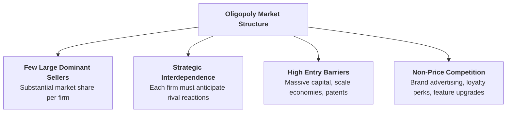
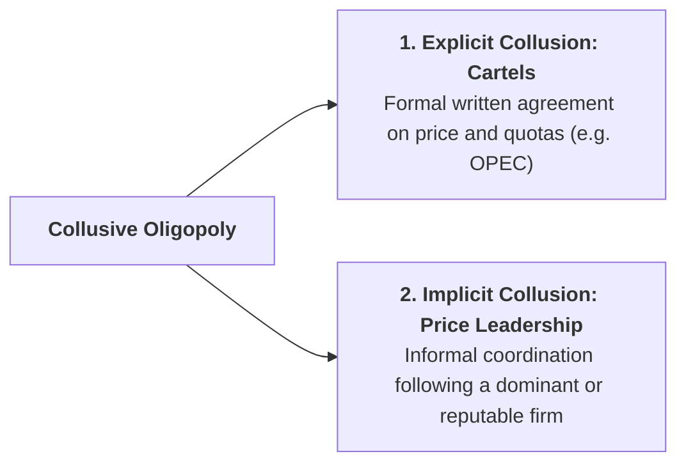

## 1. What is an Oligopoly?

An **Oligopoly** is a market structure in which a **small number of large, powerful firms** dominate the entire industry, selling either homogeneous products (e.g., crude oil, steel, cement) or differentiated products (e.g., passenger airlines, automobiles, smartphones, telecommunications).

> **The Key Defining Feature — Mutual Interdependence:** In an oligopoly, no firm can make a pricing or advertising decision in isolation. Every action (such as a price cut or a new loyalty campaign) triggers an immediate reaction and counter-strategy from competing rivals.

---

## 2. Paul Sweezy's Kinked Demand Curve Model (Price Rigidity)

Formulated by American economist **Paul Sweezy** in 1939, this non-collusive model explains why oligopoly market prices remain remarkably **sticky or rigid** even when production costs fluctuate.

### A. The Asymmetric Reaction Assumption:
1. **If a firm raises its price above $P^*$:** Competing rivals **will NOT follow** the price hike in order to capture the firm's customers. The upper segment ($dk$) of the demand curve is **highly elastic**.
2. **If a firm cuts its price below $P^*$:** Competing rivals **will IMMEDIATELY match** the price reduction to avoid losing market share. The lower segment ($kD$) of the demand curve is **steep and inelastic**.

This dual behavior creates a **kink (bend)** in the demand curve at the prevailing market price ($P^*$).

### B. Discontinuous Marginal Revenue ($MR$) Curve and Price Rigidity:
* The sharp difference in elasticity between the upper and lower segments causes a **vertical, discontinuous gap ($a-b$)** in the firm's Marginal Revenue ($MR$) curve directly below the kink point.
* As long as the firm's Marginal Cost curve ($MC$) shifts up or down within this vertical gap ($a-b$), the profit-maximizing condition ($MR = MC$) continues to occur at the **exact same output level ($Q^*$) and price ($P^*$)**.
* This proves why oligopolistic prices remain rigid.

---

## 3. Collusive Oligopoly: Cartels and Price Leadership

When oligopolists realize that price wars harm everyone's profits, they often form collusive arrangements:

### 1. Explicit Collusion (Cartels):
Firms form a formal agreement to fix market prices, divide market sales quotas, and restrict output (e.g., **OPEC** in the global petroleum industry). The cartel acts as a joint multi-plant monopoly to maximize combined industry profit:
$$MR_{\text{industry}} = \sum MC$$

### 2. Implicit Collusion (Price Leadership):
* **Dominant Firm Leadership:** The largest, lowest-cost firm sets the market price, and smaller fringe competitors follow as price takers.
* **Barometric Price Leadership:** A respected firm with superior market intelligence changes prices first in response to changing macroeconomic conditions (e.g., inflation or raw material shortages).

---

## 4. Comparison Table: Oligopoly vs. Pure Monopoly

| Feature | Oligopoly | Pure Monopoly |
| :--- | :--- | :--- |
| **Number of Sellers** | A few large dominant firms | A single seller ($\text{Firm} = \text{Industry}$) |
| **Product Nature** | Homogeneous (steel) or Differentiated (cars) | Unique product with zero close substitutes |
| **Strategic Interdependence** | **High mutual interdependence** among rivals | Zero interdependence (no rivals exist) |
| **Demand Curve** | Kinked or indeterminate demand curve | Standard downward-sloping market demand curve |
| **Barriers to Entry** | High (capital, economies of scale) | Absolute (patents, natural monopoly, licenses) |
| **Real-World Examples** | Commercial aviation (Boeing vs. Airbus), Telecom | Municipal water supply, national railway grid |

---

## 5. Review & Exam Practice Questions

### Very Short Questions (1-2 Marks):
1. **What is the key defining feature of an oligopoly?**  
   *Answer:* Mutual strategic interdependence among the few large competing firms.
2. **Why does the demand curve have a kink in Sweezy's model?**  
   *Answer:* Because rivals do not follow price increases (elastic) but immediately match price cuts (inelastic).
3. **What is an economic Cartel?**  
   *Answer:* A formal collusive agreement among independent firms to fix prices and allocate production quotas (e.g., OPEC).

### Short Questions (3-5 Marks):
1. Explain Sweezy's Kinked Demand Curve model and why prices are rigid under oligopoly.
2. Compare and contrast an Oligopoly and a Pure Monopoly with a summary table.
