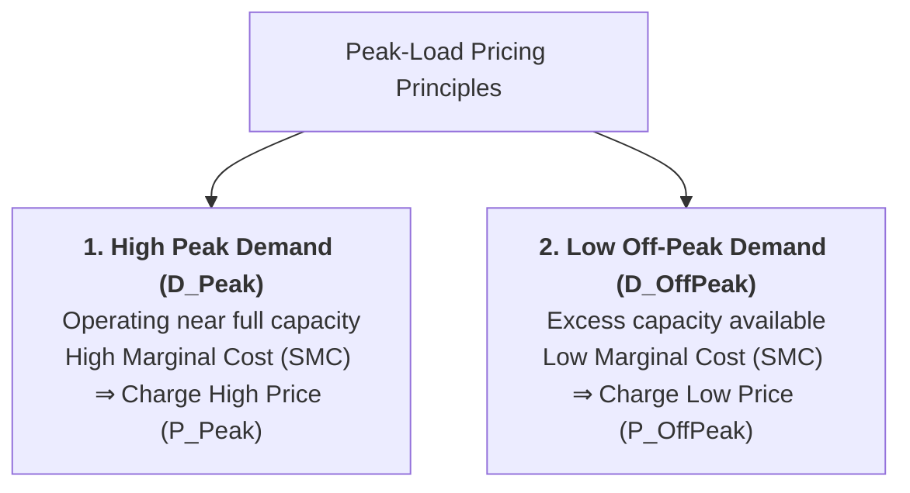

## 1. What is Peak-Load Pricing?

**Peak-Load Pricing** is a form of time-variant price discrimination applied to **non-storable goods and services** that experience periodic, recurring fluctuations in demand (peaks and off-peaks) within fixed short-run physical capacities.

> **Definition:** **Peak-Load Pricing** is the commercial practice of charging a **higher price during peak demand periods** (when capacity is fully utilized and marginal cost is high) and a **lower price during off-peak periods** (when idle capacity exists and marginal cost is low).

---

## 2. Why is Peak-Load Pricing Necessary?

1. **Non-Storability of Services:**  
   Unlike physical manufactured goods, services (such as hotel room nights, airline seats, and electricity) **cannot be produced and stored** during quiet off-peak times to be sold later during peak periods.
2. **Fixed Short-Run Capacity:**  
   A hotel cannot instantly build 50 extra rooms for a single festival weekend, and an electricity utility cannot quickly build a new power plant for a few hot summer afternoons.
3. **Surging Marginal Cost ($SMC$):**  
   Serving additional customers when capacity is nearly 100% full imposes heavy congestion costs, overtime labor wages, and equipment strain, causing short-run marginal cost to rise steeply.

---

## 3. Graphical Model and Equilibrium Determination

### Dual Equilibrium Conditions:
1. **Off-Peak Period Equilibrium:**  
   The firm equates off-peak marginal revenue with operating marginal cost:
   $$MR_{\text{OffPeak}} = SMC \implies \text{Charge Lower Price } P_{\text{OffPeak}}, \text{ Output } Q_{\text{OffPeak}}$$
2. **Peak Period Equilibrium:**  
   During peak demand, the firm equates peak marginal revenue with capacity-constrained marginal cost:
   $$MR_{\text{Peak}} = SMC \implies \text{Charge Higher Price } P_{\text{Peak}}, \text{ Output } Q_{\text{Peak}}$$

---

## 4. Real-World and Hospitality Industry Applications

* **Hospitality Industry (Hotels &amp; Resorts):**  
  Hotels charge premium rates during peak holiday seasons (October–November in Nepal, Christmas/New Year) and wedding seasons, while offering steep 40–50% discounts during off-peak monsoon months.
* **Aviation &amp; Passenger Transport:**  
  Airlines and express commuter rail charge higher fares for peak Friday evening flights and peak morning rush hours.
* **Public Utilities (Electricity &amp; Water):**  
  Power companies charge higher per-kWh tariffs during evening peak hours (6 PM – 10 PM) and discounted rates during off-peak night hours.

---

## 5. Economic Advantages of Peak-Load Pricing

1. **Rations Scarce Capacity:** High peak prices prevent severe crowding, blackout surges, and service failure.
2. **Shifts Demand to Off-Peak:** Encourages price-sensitive consumers to shift their consumption to off-peak periods (e.g., traveling on weekdays or running laundry at night).
3. **Maximizes Economic Efficiency:** Aligns market prices with true short-run marginal opportunity costs ($P \approx MC$), ensuring optimal resource allocation.

---

## 6. Review & Exam Practice Questions

### Very Short Questions (1-2 Marks):
1. **Define Peak-Load Pricing.**  
   *Answer:* Charging higher prices during high-demand peak periods and lower prices during low-demand off-peak periods for non-storable services.
2. **What types of goods are subject to peak-load pricing?**  
   *Answer:* Non-storable services with fixed capacity constraints (hotel rooms, electricity, airline flights).
3. **Why is marginal cost higher during peak periods?**  
   *Answer:* Because operating near full capacity causes congestion, overtime costs, and steep short-run marginal costs.

### Short Questions (3-5 Marks):
1. Explain the economic rationale and graphical determination of Peak-Load Pricing with a diagram.
2. Discuss how hotel managers use peak-load pricing to manage seasonal room occupancy and revenue.
