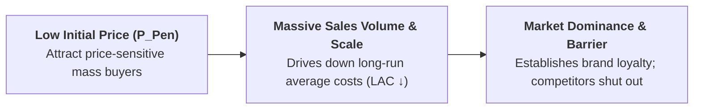

## 1. What is Penetration Pricing?

**Penetration Pricing** is a strategic new-product pricing method where a firm sets a **very low initial price** (often near or slightly above average variable cost) to penetrate the market rapidly, capture a dominant market share, build brand loyalty, and deter potential competitors from entering.

> **Definition:** **Market Penetration Pricing** is the practice of setting low initial prices to stimulate rapid market adoption, maximize unit sales volume, and build long-run cost leadership through economies of scale.

---

## 2. Favorable Conditions for Penetration Pricing

A firm successfully deploys penetration pricing when:

1. **Highly Price-Elastic Market Demand:** Consumers are extremely sensitive to price ($|E_d| > 1$). A small price cut produces a very large expansion in unit sales.
2. **Close Existing Substitutes:** The product competes against established brands, requiring an aggressive price advantage to induce consumers to switch.
3. **Substantial Economies of Scale:** High production volume significantly lowers the firm's Long-Run Average Cost ($LAC$), enabling profitable low-cost operations.
4. **Threat of Strong Competition:** Low entry prices discourage potential competitors from entering because profit margins appear razor-thin.

---

## 3. Comprehensive Comparison: Skimming vs. Penetration Pricing

| Feature / Dimension | Market Skimming Pricing | Market Penetration Pricing |
| :--- | :--- | :--- |
| **Initial Launch Price** | **Very High Initial Price** | **Very Low Initial Price** |
| **Primary Objective** | Maximize unit profit margins; recoup R&amp;D costs quickly | Maximize market share rapidly; achieve scale economies |
| **Target Consumer Segment** | Price-inelastic Early Adopters and innovators | Price-sensitive Mass Market consumers |
| **Price Elasticity of Demand** | Inelastic Demand ($|E_d| < 1$) | Highly Elastic Demand ($|E_d| > 1$) |
| **Market Structure** | Monopolistic / High Product Innovation | Highly Competitive / Standardized Market |
| **Long-Run Price Path** | **Price falls over time** as competition enters | **Price stays low or rises gradually** once loyalty is built |
| **Barriers to Competitors** | Protected by patents or unique technology | Low price and massive volume create scale barriers |
| **Profit Strategy** | High margin per unit, lower unit volume | Low margin per unit, massive unit volume |
| **Real-World Examples** | Apple iPhone, Sony PlayStation, Luxury Hotels | Jio 4G Telecom, Budget Airlines (AirAsia), OYO Rooms |

---

## 4. Advantages and Limitations of Penetration Pricing

| Advantages | Limitations &amp; Risks |
| :--- | :--- |
| **Rapid Market Share Capture:** Quickly establishes market dominance and builds large customer bases. | **Low Short-Run Profitability:** Yields razor-thin or negative profit margins during initial launch. |
| **Achieves Scale Economies:** High production volume pushes the firm down its $LAC$ curve, lowering unit costs. | **High Capital Requirement:** Requires substantial financial backing to absorb initial operational losses. |
| **Creates High Entry Barriers:** Low market prices discourage potential rivals from entering. | **"Cheap" Brand Perception:** Consumers may perceive the product as low-quality; raising prices later is difficult. |
| **High Customer Brand Loyalty:** First-mover volume creates strong customer habit and switching costs. | **Risk of Price Wars:** Competitors may retaliate with destructive price cuts, harming the entire industry. |

---

## 5. Real-World and Hospitality Examples

* **Telecommunications:** Reliance Jio in India and low-cost 4G data providers entered with free/ultra-cheap introductory data packs, capturing hundreds of millions of subscribers before gradually normalizing tariffs.
* **Budget Hospitality (Hotel Chains):** Budget hotel aggregators (e.g., **OYO Rooms**, Motel 6) offer promotional low introductory rates (e.g., Rs. 999/night) to build high occupancy and customer app downloads.
* **Low-Cost Airlines:** Airlines like **AirAsia** and Ryanair enter new routes with promotional low fares, building volume and earning ancillary revenue through baggage, seat selection, and onboard meals.
* **Streaming Services:** Video and music streaming platforms (Netflix, Spotify) offering low introductory subscription rates before standardizing pricing.

---

## 6. Review & Exam Practice Questions

### Very Short Questions (1-2 Marks):
1. **Define Market Penetration Pricing.**  
   *Answer:* Setting a low initial price in a price-sensitive market to capture mass market share and build volume.
2. **Under what elasticity condition is penetration pricing recommended?**  
   *Answer:* When market demand is highly price-elastic ($|E_d| > 1$).
3. **What is the main risk of penetration pricing?**  
   *Answer:* Generating low short-run profit margins and establishing a "cheap" brand image that makes future price hikes difficult.

### Long Answer Questions (8-10 Marks):
1. Compare and contrast Price Skimming and Market Penetration pricing strategies with a summary table. Discuss their strategic applications in the hospitality and tech industries.
