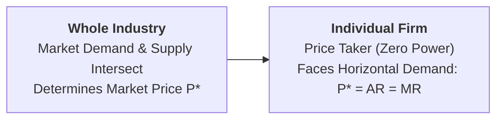

## 1. What is Perfect Competition?

**Perfect Competition** is a theoretical market structure characterized by total absence of individual market power or direct rivalry. The market price is determined strictly by aggregate market demand and market supply, and individual firms act as pure **Price Takers**.



### Key Assumptions and Characteristics:
1. **Very Large Number of Buyers and Sellers:** Individual firm sales are an insignificant fraction of total market volume; no single firm can alter the market price.
2. **Homogeneous (Identical) Products:** All firms produce standardized goods (e.g., agricultural wheat, pure gold). Buyers have no brand preference.
3. **Free Entry and Exit:** In the long run, there are zero legal, technical, or financial barriers to new firms entering or unprofitable firms leaving.
4. **Perfect Knowledge:** All buyers and sellers have full transparency regarding market prices, input costs, and production technology.
5. **Perfect Mobility of Factors:** Labour and capital can move freely between industries without friction.
6. **Zero Transportation Costs:** Assumes uniform price across all locations.

---

## 2. Industry Price Determination vs. Firm's Demand Curve


* **Industry (Price Maker):** Aggregate market demand ($DD$) and supply ($SS$) intersect to establish the market-clearing equilibrium price **$P^*$**.
* **Individual Firm (Price Taker):** The firm can sell any quantity at price $P^*$. Therefore, the firm's demand curve ($d$), Average Revenue ($AR$), and Marginal Revenue ($MR$) are all identical and form a **horizontal straight line**:
  $$P^* = AR = MR = d \quad (E_d = \infty)$$

---

## 3. Short-Run Price and Output Determination

In the short run, plant capacity is fixed. The firm maximizes profit by satisfying two universal equilibrium conditions:

1. **First-Order Condition (Necessary):** $MR = MC \iff P = MC$.
2. **Second-Order Condition (Sufficient):** The $MC$ curve must cut the $MR$ line from below ($MC$ is rising).

### Three Possible Short-Run Profit States:

```mermaid
flowchart TD
    S[Short-Run Equilibrium State: P = MC] --> S1[<b>1. Supernormal Profit (P &gt; SAC)</b><br>Profit = (P* - SAC) × q*]
    S --> S2[<b>2. Normal Profit (P = Min SAC)</b><br>Zero economic profit (Break-Even)]
    S --> S3[<b>3. Economic Loss (P &lt; SAC)</b><br>Loss = (SAC - P*) × q*]
    S3 --> SH1[Operate if P &gt;= SAVC to cover variable costs]
    S3 --> SH2[SHUTDOWN if P &lt; Min SAVC]
```

1. **Supernormal Profit ($P > SAC$):** When market price $P^*$ is above the Short-Run Average Cost curve at equilibrium output $q^*$.
2. **Normal Profit ($P = \text{Min } SAC$):** Total revenue covers all explicit and implicit production costs (Break-Even point).
3. **Loss Minimization ($SAVC < P < SAC$):** Price is below $SAC$ but above Average Variable Cost ($SAVC$). The firm continues producing in the short run because it covers all variable costs and a portion of fixed overheads.
4. **The Shutdown Point ($P < \text{Min } SAVC$):** If the market price falls below minimum $SAVC$, the firm shuts down immediately ($q = 0$), limiting its loss strictly to Total Fixed Costs ($TFC$).

> **Short-Run Supply Curve:** The portion of the firm's Marginal Cost ($SMC$) curve that lies **above the minimum point of $SAVC$** represents the competitive firm's short-run supply curve.

---

## 4. Long-Run Equilibrium of a Competitive Industry

In the long run, all inputs are variable and firms can enter or exit freely:
* If existing firms earn **supernormal profits** ($P > SAC$), new firms enter $\implies$ market supply expands $\implies$ market price falls until profits are eliminated.
* If existing firms suffer **losses** ($P < SAC$), unprofitable firms exit $\implies$ market supply shrinks $\implies$ market price rises until losses are eliminated.

### The Long-Run Equilibrium Condition:

$$\mathbf{P = AR = MR = LMC = SMC = \text{Min } LAC = \text{Min } SAC}$$

Every firm in the industry operates at the **absolute minimum point of its Long-Run Average Cost curve ($LAC$)** and earns strictly **Normal Profit** (zero economic profit).

---

## 5. Dual Economic Efficiency of Perfect Competition

1. **Allocative Efficiency ($P = MC$):** Society's marginal valuation of the good equals the marginal opportunity cost of producing it. Zero deadweight loss.
2. **Productive Efficiency ($P = \text{Min } LAC$):** Goods are produced at the lowest possible per-unit cost using optimal plant scale.

---

## 6. Review & Exam Practice Questions

### Very Short Questions (1-2 Marks):
1. **What is the shape of the demand curve facing a firm in perfect competition?**  
   *Answer:* A horizontal straight line parallel to the $X$-axis ($P = AR = MR, E_d = \infty$).
2. **State the short-run equilibrium condition under perfect competition.**  
   *Answer:* $P = MR = MC$, with $MC$ cutting $MR$ from below.
3. **What is the shutdown point for a competitive firm?**  
   *Answer:* When price falls below the minimum Average Variable Cost ($P < \text{Min } SAVC$).

### Long Answer Questions (8-10 Marks):
1. Explain how price and output are determined under Perfect Competition in both the short run and the long run with diagrams.
2. Discuss why perfect competition achieves both allocative and productive efficiency in the long run.
