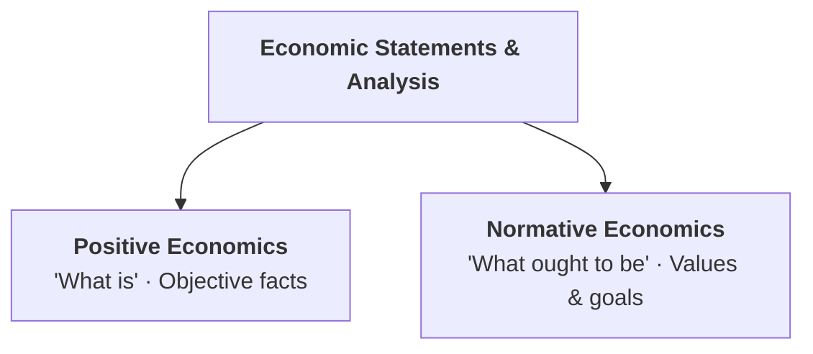
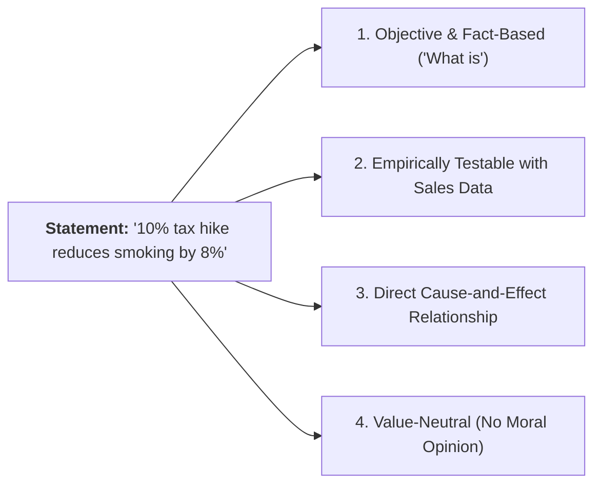
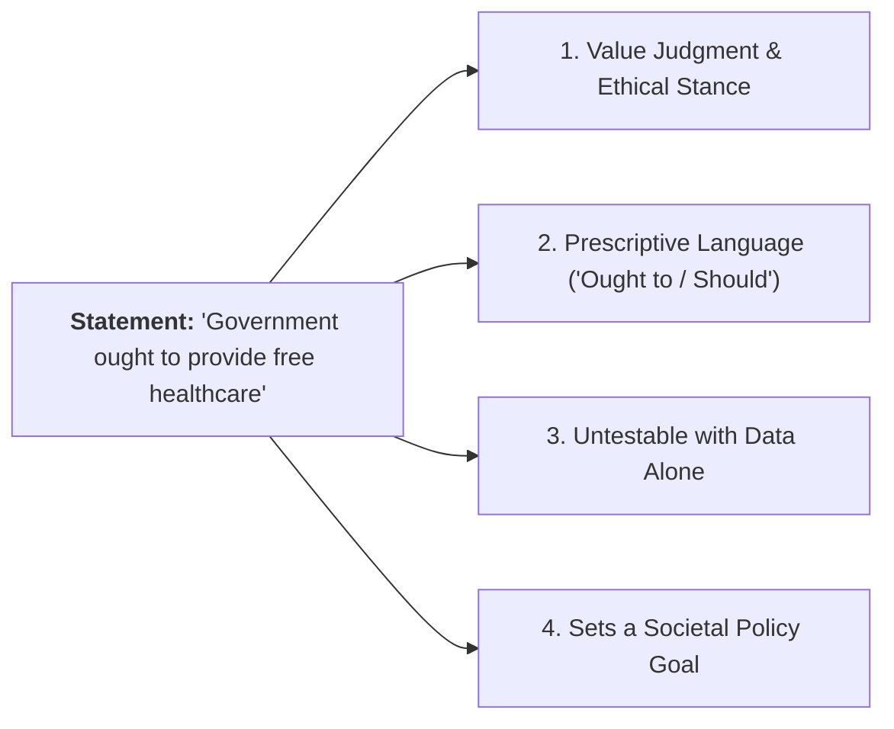
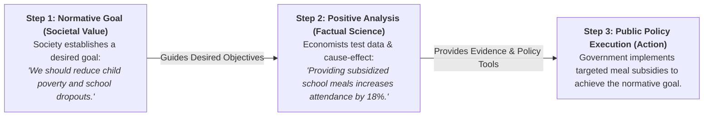

## 1. Introduction: Two Ways Economists Look at the World

In economics, statements, models, and arguments fall into two major categories depending on whether they describe **actual facts** or express **opinions and ethical values**:

---

## 2. What is Positive Economics? ("What Is")

### Definition
**Positive economics** deals with objective, factual explanations of how the economy actually operates. It focuses on **"what is"**, **"what was"**, or **"what will happen"** based on real-world evidence and cause-and-effect relationships.

### Key Characteristics:
* **Objective and Value-Neutral:** It does not make moral judgments about whether an outcome is "good" or "bad". It simply states the facts.
* **Empirically Testable:** Positive statements can be tested, verified, or refuted using historical economic data and statistical observation.
* **Scientific Basis:** Follows the scientific method of formulating hypotheses and testing them against empirical evidence.

---

## 3. Decoding a Positive Statement: Why is it Positive?

Consider the statement:  
> *"A 10% increase in the tax on cigarettes leads to an 8% decrease in cigarette consumption."*

### Why this is a Positive Economic Statement:
1. **Factual Cause-and-Effect Relationship:** It identifies a measurable link between an economic cause (tax increase) and an effect (consumption drop).
2. **Empirically Verifiable with Data:** Researchers can collect real sales data from retail shops to verify whether the statement is true or false.
3. **Free from Value Judgments:** It does not state whether smoking is good, bad, moral, or immoral; it strictly reports market behavior.
4. **Independent of Personal Bias:** Two economists with opposing political beliefs will reach the same factual conclusion when examining the data.

---

## 4. What is Normative Economics? ("What Ought to Be")

### Definition
**Normative economics** involves subjective value judgments, ethics, opinions, and prescriptions about **"what should be"** or **"what ought to be"**. It deals with what policies the government or society should choose based on moral priorities and social goals.

### Key Characteristics:
* **Subjective and Prescriptive:** Reflects personal beliefs, social philosophies, and political viewpoints.
* **Cannot Be Tested with Data:** Because it expresses values rather than facts, a normative statement cannot be proven true or false by economic data alone.
* **Focuses on Policy Goals:** Aims to improve human welfare, equity, fairness, and economic justice.

---

## 5. Decoding a Normative Statement: Why is it Normative?

Consider the statement:  
> *"The government ought to provide free healthcare and subsidized medicines to all low-income citizens."*

### Why this is a Normative Economic Statement:
1. **Expresses a Value Judgment:** It reflects a moral belief about social justice, fairness, and human rights rather than a cold statistical fact.
2. **Contains Prescriptive Language:** The use of words like *"ought to"*, *"should"*, or *"must"* signals an ethical recommendation.
3. **Cannot Be Tested or Refuted by Raw Data:** No amount of statistical data can scientifically prove whether a government *should* or *should not* fund healthcare.
4. **Subject to Democratic Debate:** Different political parties and citizens will hold opposing, equally valid opinions on this priority.

---

## 6. Seven Key Bases of Difference

The distinction between Positive and Normative Economics can be summarized across seven foundational parameters:

* **1. Core Meaning:** Positive economics deals with objective facts (**"What is"**); Normative economics deals with value judgments (**"What ought to be"**).
* **2. Nature & Purpose:** Positive is descriptive, analytical, and scientific; Normative is prescriptive, advisory, and policy-oriented.
* **3. Objectivity:** Positive is strictly objective and value-neutral; Normative is subjective and based on ethical values.
* **4. Empirical Testability:** Positive statements can be tested and verified with data; Normative statements cannot be tested with data.
* **5. Core Question:** Positive asks *"How does the economy work?"*; Normative asks *"What goals should society pursue?"*.
* **6. Method of Disagreement Resolution:** Positive disputes are settled by looking at facts and evidence; Normative disputes are settled by debate and voting.
* **7. Role in Policy Formulation:** Positive economics provides the analytical tools and consequences; Normative economics determines the desired social objectives.

---

## 7. Summary Comparison Matrix

| Basis | Positive Economics | Normative Economics |
| :--- | :--- | :--- |
| **Core Meaning** | Deals with objective facts and cause-and-effect relationships (**"What is"**). | Deals with value judgments, ethics, and opinions (**"What ought to be"**). |
| **Nature** | Descriptive, analytical, and scientific. | Prescriptive, advisory, and policy-oriented. |
| **Objectivity** | Objective and neutral (free from personal bias). | Subjective and based on ethical values. |
| **Testability** | Can be verified or refuted using empirical data. | Cannot be tested or verified with statistical data. |
| **Core Question** | How does the economy work? | What goals should the economy pursue? |
| **Disagreement Resolution** | Resolved by checking empirical facts and data. | Resolved by philosophical debate, values, and voting. |
| **Policy Role** | Informs policymakers of real-world costs and trade-offs. | Sets the desirable social and welfare targets. |

---

## 8. How Positive and Normative Economics Work Together

Although positive and normative economics are distinct, effective economic decision-making requires **both**:

1. **Positive Economics provides the tools:** It informs policymakers of the real-world trade-offs, costs, and consequences of any action.
2. **Normative Economics sets the goals:** It helps society decide which economic objectives (such as reducing unemployment, controlling inflation, or protecting the environment) are most desirable.

---

## 9. Review & Exam Practice Questions

### Very Short Answer Questions (1-2 Marks):
1. **What specific relationship does positive economics deal with?**  
   *Answer:* Factual cause-and-effect relationships between economic variables ("what is").
2. **What does normative economics address?**  
   *Answer:* Value judgments, ethical standards, and prescriptive recommendations ("what should be").
3. **Classify the following statement as Positive or Normative:** *"The government should lower income tax rates for teachers."*  
   *Answer:* **Normative** (contains a value judgment and the prescriptive word "should").

### Short Questions (3-5 Marks):
1. Distinguish between positive economics and normative economics across seven key parameters.
2. Decode why the statement *"A minimum wage hike reduces teen employment"* is positive, while *"A minimum wage hike is necessary for worker dignity"* is normative.
3. Explain how positive and normative economics complement each other in public policy formulation.

