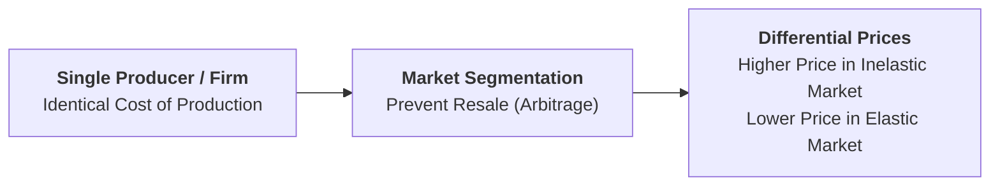
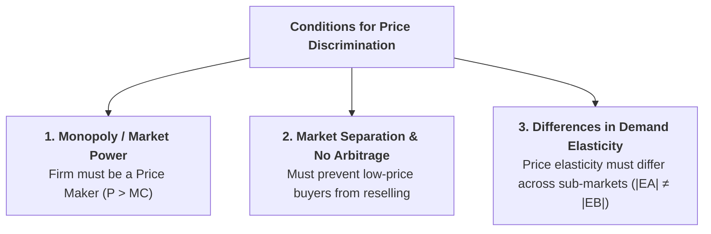

## 1. What is Price Discrimination?

**Price Discrimination** (also called **Differential Pricing**) is the commercial practice of selling the exact same product or service to different buyers at **different prices**, or charging different prices for different units of output, for reasons **not justified by differences in production cost**.



> **Prof. Joan Robinson's Definition:** *"Price discrimination refers to the act of selling the same article produced under a single control at different prices to different consumers."*

### The Core Objective: Capturing Consumer Surplus
In a uniform single-price market, consumers who are willing to pay more enjoy **Consumer Surplus**. Price discrimination enables a price-making firm to capture this consumer surplus and convert it into **Producer Profit**.

---

## 2. Three Necessary Conditions for Price Discrimination

Price discrimination is feasible and profitable only when three conditions are satisfied simultaneously:



1. **Market Power (Price Maker):** The seller must operate in an imperfectly competitive market (Monopoly, Oligopoly, or Monopolistic Competition). A price-taker in perfect competition cannot discriminate ($P = MR$).
2. **Market Separation and Prevention of Resale (Arbitrage):** The seller must be able to segment customers and strictly prevent low-price buyers from reselling the product to high-price buyers.
3. **Differences in Price Elasticity of Demand ($|E_d|$):** If demand elasticity is identical across all markets, price discrimination yields no extra profit compared to a single uniform price.

---

## 3. Kinds of Price Discrimination

* **Personal Price Discrimination:** Charging different rates to different individuals based on income or bargaining power (e.g., doctors charging wealthy patients higher consultation fees).
* **Geographical Price Discrimination (Spatial Pricing / Dumping):** Charging different prices in different geographic regions.  
  * **Dumping:** An international trade strategy where a firm charges a **high price in the protected domestic market** (where demand is inelastic) and a **low price in the competitive foreign export market** (where demand is highly elastic).
* **Price Discrimination by Use (Trade Discrimination):** Charging different tariffs based on how the good is used (e.g., electricity boards charging higher rates for commercial/hotel use than domestic household use).

---

## 4. A.C. Pigou's Three Degrees of Price Discrimination

| Degree of Discrimination | Pricing Mechanism | Consumer Surplus Status | Real-World &amp; Business Example |
| :--- | :--- | :--- | :--- |
| **First-Degree (Perfect)** | Seller charges each buyer their exact **maximum reservation price**. | **Zero ($CS = 0$)**; 100% captured as producer profit. | Fine art auctions, personalized legal consulting fees. |
| **Second-Degree (Block Pricing)** | Charges different unit prices for **different quantity blocks**. | Partial consumer surplus captured. | Tiered electricity slab rates, bulk wholesale discounts. |
| **Third-Degree (Market Segmentation)** | Divides market into sub-markets based on **differing price elasticities ($E_d$)**. | Consumer surplus split across groups. | Student/senior discounts, peak vs. off-peak hotel room tariffs. |

---

## 5. Third-Degree Price Discrimination: Equilibrium and the Elasticity-Price Rule


### Dual Equilibrium Conditions:
1. **Equal Marginal Revenue Condition:**  
   Total output must be distributed across sub-markets such that marginal revenue in each market equals the combined marginal cost:
   $$MR_A = MR_B = MR_{\text{Total}} = MC_{\text{Total}}$$
2. **The Elasticity-Price Rule (Golden Pricing Rule):**  
   Recall the relationship between price, marginal revenue, and elasticity:
   $$MR = P \left(1 - \dfrac{1}{|E_d|}\right)$$
   Setting $MR_A = MR_B$ yields the **Price-Ratio Formula**:
   $$\dfrac{P_A}{P_B} = \dfrac{1 - \dfrac{1}{|E_B|}}{1 - \dfrac{1}{|E_A|}}$$

```
┌────────────────────────────────────────────────────────────────────────┐
│                        GOLDEN ELASTICITY-PRICE RULE                    │
├────────────────────────────────────────────────────────────────────────┤
│ • Inelastic Market (|E_A| < 1): Charge HIGHER Price (P_A), Sell Less   │
│ • Elastic Market   (|E_B| > 1): Charge LOWER Price  (P_B), Sell More   │
└────────────────────────────────────────────────────────────────────────┘
```

---

## 6. Review & Exam Practice Questions

### Very Short Questions (1-2 Marks):
1. **What is price discrimination?**  
   *Answer:* Selling the same product at different prices to different buyers for reasons not justified by cost differences.
2. **What is Dumping in international trade?**  
   *Answer:* Charging a high price in the domestic market (inelastic demand) and a low price in foreign export markets (elastic demand).
3. **What is the status of consumer surplus under First-Degree Price Discrimination?**  
   *Answer:* Consumer surplus is zero ($CS = 0$) because the seller extracts 100% of consumer willingness to pay.

### Long Answer Questions (8-10 Marks):
1. Define price discrimination and explain the three necessary conditions for it to be feasible and profitable.
2. Explain price and output determination under Third-Degree Price Discrimination using a 3-panel diagram and derive the Elasticity-Price Rule.
