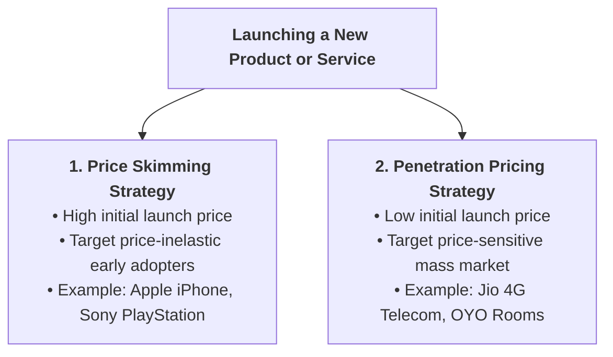
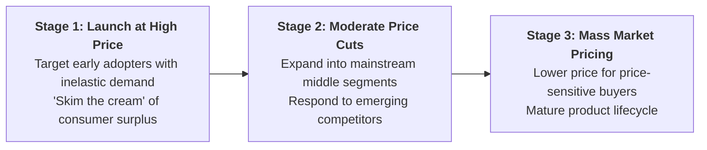
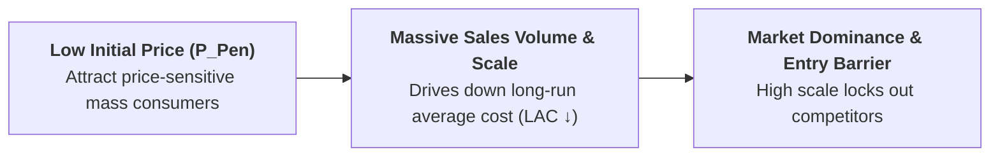

## 1. Introduction: Two Contrasting Paths for Launching New Products

When an enterprise introduces a new product or service into the market, it faces a fundamental strategic dilemma: **Should it start with a high price to capture premium profit margins, or start with a low price to capture mass market share?**

In business economics, this choice represents the two core new-product pricing strategies:

---

## 2. Market Price Skimming Strategy (The iPhone Strategy)

### What is Price Skimming?
**Price Skimming** (or **Market Skimming Pricing**) is a strategy where a firm sets a **very high initial price** when a new, innovative product is first launched, and then **gradually reduces the price step-by-step** over time as the market matures and competing substitutes emerge.

> **Definition:** **Price Skimming** is the practice of charging the highest possible price during product introduction to extract maximum consumer surplus from early adopters before catering to broader, price-sensitive mass markets.

### Favorable Conditions for Price Skimming:
1. **High Product Innovation &amp; Quality:** The product has unique technology, distinctive design, or prestige appeal with no immediate close rivals.
2. **Inelastic Initial Demand:** Early adopters (innovators and tech enthusiasts) place high value on novelty and are relatively insensitive to price ($|E_d| < 1$).
3. **High Sunk R&amp;D Costs:** Heavy research, patent development, and promotional launch investments must be recovered rapidly.
4. **Strong Entry Barriers:** Patents, proprietary software, or high capital requirements prevent competitors from copying the product quickly.

---

## 3. Market Penetration Pricing Strategy (The Jio Strategy)

### What is Penetration Pricing?
**Penetration Pricing** is a strategy where a firm sets a **very low initial price** (often near or slightly above average variable cost) to penetrate the market rapidly, capture a dominant market share, build customer loyalty, and deter rivals from entering.

> **Definition:** **Penetration Pricing** is the practice of setting low introductory prices to stimulate rapid adoption, achieve high unit sales volumes, and establish long-run cost leadership through economies of scale.

### Favorable Conditions for Penetration Pricing:
1. **Highly Price-Elastic Market Demand:** Consumers are extremely sensitive to price ($|E_d| > 1$). A small price discount generates a very large surge in customer demand.
2. **Readily Available Existing Substitutes:** The product competes in an established category where aggressive pricing is needed to persuade consumers to switch brands.
3. **Substantial Economies of Scale:** High production volume significantly drives down Long-Run Average Cost ($LAC$), enabling profitable low-cost operations.
4. **Threat of Strong Competition:** Low entry prices discourage potential competitors from entering because profit margins appear razor-thin.

---

## 4. Product Lifecycle Price Trajectories

* **Skimming Trajectory:** Starts at high price $P_{\text{Skim}}$ and glides downward over the product lifecycle as competition expands.
* **Penetration Trajectory:** Starts at low price $P_{\text{Pen}}$, building huge volume, and stays competitive or rises slightly once strong brand loyalty is established.

---

## 5. Comprehensive 10-Point Comparison: Skimming vs. Penetration

| Feature / Dimension | Price Skimming Strategy | Penetration Pricing Strategy |
| :--- | :--- | :--- |
| **1. Initial Launch Price** | **Very High Initial Price** | **Very Low Initial Price** |
| **2. Core Objective** | Maximize unit profit margins; recoup R&amp;D fast | Maximize market share rapidly; achieve scale economies |
| **3. Target Consumers** | Price-inelastic Early Adopters &amp; Innovators | Price-sensitive Mass Market consumers |
| **4. Price Elasticity of Demand** | Inelastic Demand ($\|E_d\| < 1$) | Highly Elastic Demand ($\|E_d\| > 1$) |
| **5. Market Structure** | Monopolistic / High Product Innovation | Highly Competitive / Standardized Market |
| **6. Unit Profit Margin** | Very High Profit Margin per unit | Low margin per unit; relies on massive volume |
| **7. Cost Trajectory** | Focuses on recovering sunk R&amp;D costs | Focuses on driving down $LAC$ via scale economies |
| **8. Long-Run Price Path** | **Price falls over time** as competitors enter | **Price stays low or rises slightly** as loyalty forms |
| **9. Competitive Barrier** | Protected by patents, brand prestige, or tech | Massive volume and cost leadership create scale barriers |
| **10. Real-World Examples** | Apple iPhone, Sony PlayStation, Luxury Resorts | Reliance Jio 4G, Budget Airlines (AirAsia), OYO Rooms |

---

## 6. Advantages and Limitations Comparison

| Strategy | Major Advantages | Major Risks &amp; Limitations |
| :--- | :--- | :--- |
| **Price Skimming** | • High short-run cash flow and profit margins. • Recoups expensive R&amp;D investments fast. • Creates premium brand perception of luxury quality. • Downward price flexibility is commercially easy. | • Lucrative margins attract fast-following competitors. • Low unit volume at launch delays scale economies. • Early buyers feel frustrated when prices drop later. • Completely fails if substitutes are widely available. |
| **Penetration Pricing** | • Fast customer adoption and high market share. • Drives down unit costs through economies of scale. • Low profit margins discourage rivals from entering. • High volume creates strong brand dominance. | • Razor-thin or negative profit margins during launch. • Creates a "cheap quality" psychological perception. • Price-sensitive buyers may switch if prices are raised later. • Requires massive initial capital to support volume. |

---

## 📌 Exam Summary Points
* **Skimming:** High initial price $\rightarrow$ Inelastic demand $\rightarrow$ Recoup R&D $\rightarrow$ Gradual price cuts (Apple model).
* **Penetration:** Low initial price $\rightarrow$ Highly elastic demand $\rightarrow$ Scale economies $\rightarrow$ Lock out competition (Jio model).
* **Key Exam Distinction:** Skimming captures consumer surplus from the top down; Penetration builds volume from the bottom up.
