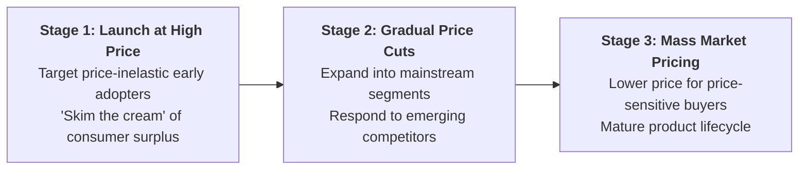

## 1. What is Price Skimming?

**Price Skimming** (or **Market Skimming Pricing**) is a strategic new-product pricing method where a firm sets a **very high initial price** when a new, innovative, or premium product is first launched, and then **gradually lowers the price over time** as the market matures and competitors enter.

> **Definition:** **Price Skimming** is the practice of charging the highest possible price during the introduction stage of a product lifecycle to extract maximum revenue from buyers with inelastic demand before catering to price-sensitive mass-market segments.

---

## 2. Favorable Conditions for Price Skimming

A firm can successfully execute a price skimming strategy when:

1. **High Product Innovation &amp; Differentiation:** The product offers unique technology, distinctive features, or prestige appeal with no immediate close substitutes.
2. **Inelastic Initial Demand:** Early adopters (innovators and tech enthusiasts) place high value on having the product first and are relatively insensitive to price ($|E_d| < 1$).
3. **High Sunk R&amp;D Costs:** The company needs to rapidly recover heavy initial research, development, and promotional launch expenses.
4. **Protected Entry Barriers:** Patents, proprietary software, exclusive manufacturing techniques, or high capital barriers prevent competitors from copying the product immediately.

---

## 3. Product Lifecycle Price Trajectory

* **At Launch:** Price is set high at $P_{\text{Skim}}$, capturing maximum profit margin per unit.
* **Over Time:** As early demand is satisfied and competing substitute products appear, the firm reduces the price step-by-step to capture broader, price-sensitive consumer tiers.

---

## 4. Advantages and Limitations of Price Skimming

| Advantages | Limitations &amp; Risks |
| :--- | :--- |
| **High Profit Margins:** Maximizes short-run revenue per unit from high-income consumers. | **Attracts Competitors:** High profit margins signal lucrative returns, attracting fast-following competitors. |
| **Recoups R&amp;D Costs Quickly:** Helps innovate companies pay off sunk development investments rapidly. | **Low Volume at Launch:** High prices limit initial unit sales, delaying the attainment of scale economies. |
| **Creates Premium Brand Image:** High pricing psychologically signals superior quality and exclusivity. | **Customer Frustration:** Early adopters may feel disappointed when prices drop significantly a few months later. |
| **Downward Price Flexibility:** It is commercially much easier to lower prices later than to raise an initial low price. | **Ineffective in Commodity Markets:** Completely fails if substitutes are already widely available. |

---

## 5. Real-World and Hospitality Examples

* **Consumer Technology:** Apple launches new flagship **iPhones** at premium prices ($Rs. 180,000+$) for early adopters, gradually reducing the price of older models as new iterations launch.
* **Gaming Consoles:** Sony **PlayStation** and Microsoft Xbox launch at high prices to enthusiasts before lowering prices as production costs decline.
* **Hospitality Industry:** A newly constructed **luxury boutique resort hotel** opens with high introductory rack rates targeting elite travelers before offering broader promotional packages as capacity stabilizes.
* **Pharmaceuticals:** Patented prescription drugs are sold at high prices during the patent protection window before generic alternatives enter.

---

## 6. Review & Exam Practice Questions

### Very Short Questions (1-2 Marks):
1. **Define Market Skimming Pricing.**  
   *Answer:* Setting a high initial price for an innovative product to maximize revenue from early adopters, then lowering price over time.
2. **Under what demand elasticity condition is price skimming effective?**  
   *Answer:* When initial demand is price-inelastic ($|E_d| < 1$).
3. **Give two examples of products using price skimming.**  
   *Answer:* Apple iPhones and patented pharmaceutical drugs.

### Short Questions (3-5 Marks):
1. Explain the economic rationale and favorable market conditions for Price Skimming.
2. Discuss the advantages and potential risks of implementing a price skimming strategy.
