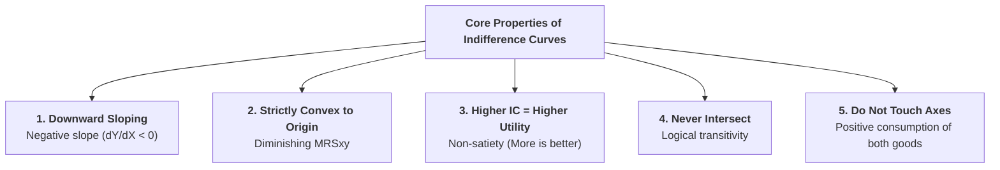

## 1. Overview of Core Properties

Standard indifference curves possess five fundamental geometric and economic properties:

---

## 2. Detailed Explanation of the 5 Properties

### Property 1: Indifference Curves Slope Downward from Left to Right (Negative Slope)
* **Economic Reason:** To keep total utility constant along an indifference curve, an increase in the consumption of Good X must be accompanied by a compensatory decrease in Good Y.
* **Proof by Contradiction:**
  * *If an IC were Horizontal:* Quantity of Y stays fixed while X increases $\implies$ Total utility rises (violates constant satisfaction).
  * *If an IC were Vertical:* Quantity of X stays fixed while Y increases $\implies$ Total utility rises (violates constant satisfaction).
  * *If an IC were Upward-Sloping:* Quantities of both X and Y increase simultaneously $\implies$ Total utility must rise.
  * Therefore, an indifference curve **must slope downward** ($\frac{dY}{dX} < 0$).

---

### Property 2: Indifference Curves are Strictly Convex to the Origin
* **Economic Reason:** Convexity is a direct graphic consequence of the **Law of Diminishing Marginal Rate of Substitution ($DMRS_{xy}$)**.
* As the consumer substitutes X for Y, $MU_x$ falls and $MU_y$ rises, causing the slope ($MRS_{xy} = \dfrac{MU_x}{MU_y}$) to decline continuously, flattening the curve as it moves downward to the right.

---

### Property 3: A Higher Indifference Curve Represents a Higher Level of Satisfaction
* **Economic Reason:** Based on the axiom of **Non-Satiety (Monotonic Preferences)**, a rational consumer always prefers more goods to fewer goods.
* Points on a higher curve ($IC_3$) contain more of Good X, more of Good Y, or more of both compared to a lower curve ($IC_1$). Hence, $IC_3 \succ IC_2 \succ IC_1$.

---

### Property 4: Indifference Curves Can Never Intersect or Touch Each Other
* **Proof by Contradiction (Reductio ad Absurdum):**
  * Suppose two curves $IC_1$ and $IC_2$ intersect at Point **A**.
  * Let Point **B** lie on $IC_1$, so $U(A) = U(B)$.
  * Let Point **C** lie on $IC_2$ (at the same X level as B), so $U(A) = U(C)$.
  * By the transitivity rule, $U(B) = U(C)$.
  * However, Point **C** lies vertically above Point **B** and contains strictly more units of Good Y. Under monotonic preferences, $U(C) > U(B)$.
  * This creates an impossible logical contradiction. Therefore, **indifference curves can never cross or intersect**.

---

### Property 5: Indifference Curves Do Not Touch Either Axis
* **Economic Reason:** The two-commodity model assumes that the consumer purchases a combination containing **positive quantities of both goods** ($X > 0$ and $Y > 0$).
* If an indifference curve touches the $X$-axis, it means $Y = 0$ (the consumer is buying only Good X). If it touches the $Y$-axis, it means $X = 0$. To represent a true two-commodity choice, the curve remains asymptotic to both axes.

---

## 3. Summary Reference Table

| Property | Geometric Feature | Underlying Economic Principle |
| :--- | :--- | :--- |
| **1. Downward Slope** | Negative slope ($\Delta Y / \Delta X < 0$) | Trade-off: consuming more X requires giving up Y. |
| **2. Convexity** | Bowed inward toward origin | Diminishing Marginal Rate of Substitution ($DMRS_{xy}$). |
| **3. Higher Curve** | Positioned up and to the right | Non-satiety / Monotonic preferences ("more is better"). |
| **4. Non-Intersection** | Never cross or touch | Transitivity and logical consistency of choices. |
| **5. No Axis Contact** | Asymptotic to both axes | Consumer purchases a combination of both goods. |

---

## 4. Review & Exam Practice Questions

### Very Short Questions (1-2 Marks):
1. **Why do indifference curves slope downward?**  
   *Answer:* Because to maintain a constant level of satisfaction, gaining more of Good X requires sacrificing some units of Good Y.
2. **What causes an indifference curve to be convex to the origin?**  
   *Answer:* The Law of Diminishing Marginal Rate of Substitution ($DMRS_{xy}$).
3. **Can two indifference curves intersect?**  
   *Answer:* No, intersecting indifference curves violate the logical transitivity of consumer preferences.

### Short Questions (3-5 Marks):
1. Explain the five core properties of indifference curves with clear economic justifications.
2. Prove through logical contradiction why two indifference curves cannot intersect each other.
