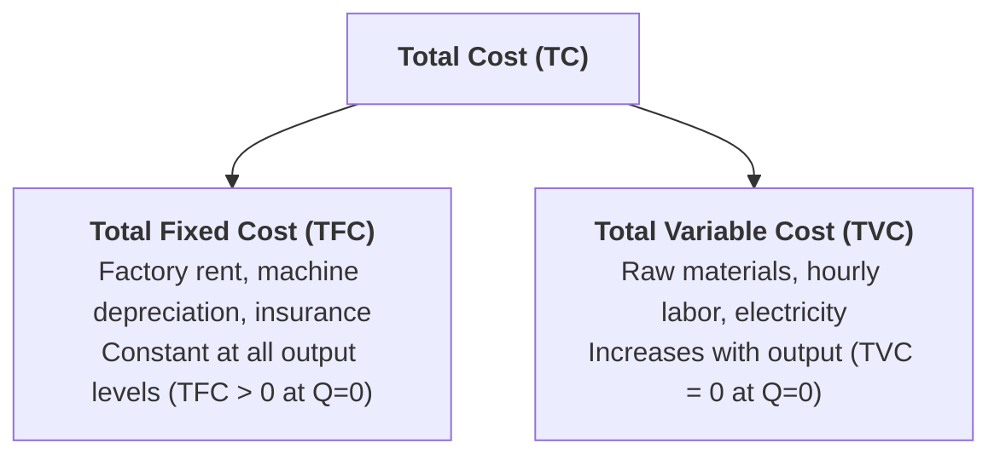
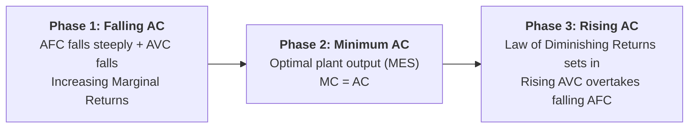

## 1. Short-Run Cost Classifications

In the short run, because some factor inputs are fixed while others are variable, a firm's total costs are divided into:

$$\mathbf{TC = TFC + TVC}$$

---

## 2. Short-Run Unit Cost Curves ($AFC, AVC, ATC, MC$)

To analyze business pricing and profitability, total costs are converted into per-unit cost measures:

### 1. Average Fixed Cost ($AFC$):
$$AFC = \dfrac{TFC}{Q}$$
* As output ($Q$) increases, the fixed overhead is spread over more and more units.
* The $AFC$ curve falls continuously, taking the geometric shape of a **Rectangular Hyperbola** (asymptotic to both axes).

### 2. Average Variable Cost ($AVC$):
$$AVC = \dfrac{TVC}{Q}$$
* Initially falls due to increasing marginal returns and factor specialization, reaches a minimum, and then rises due to the Law of Diminishing Returns (**U-shaped curve**).

### 3. Average Total Cost ($ATC$ or $AC$):
$$AC = \dfrac{TC}{Q} = AFC + AVC$$
* The sum of $AFC$ and $AVC$. It is **U-shaped**.
* The minimum point of $AC$ lies to the right of the minimum point of $AVC$ because falling $AFC$ continues to pull $AC$ down even after $AVC$ has begun to rise.

### 4. Marginal Cost ($MC$):
$$MC = \dfrac{\Delta TC}{\Delta Q} = \dfrac{\Delta TVC}{\Delta Q} = \dfrac{d(TC)}{dQ}$$
* The additional cost incurred by producing **one more unit of output**.
* **Key Geometric Rule:** The $MC$ curve is U-shaped and **cuts both the $AVC$ curve and the $ATC$ curve at their respective minimum points from below**.

---

## 3. Why is the Short-Run Average Cost (SRAC) Curve U-Shaped?

The U-shape of the SRAC curve is explained by the interaction between $AFC$ and $AVC$, governed by the **Law of Diminishing Marginal Returns**:

1. **Initial Declining Phase (Left side of 'U'):**  
   At low output levels, $AFC$ drops steeply as fixed plant capacity is utilized. $AVC$ also falls due to labor specialization. Consequently, overall $AC$ falls rapidly.
2. **Optimum Output Point (Bottom of 'U'):**  
   The firm reaches its optimal operating capacity where unit cost is minimized.
3. **Subsequent Rising Phase (Right side of 'U'):**  
   Beyond optimal capacity, adding more variable labor to fixed machinery causes crowding and diminishing returns. $AVC$ rises sharply and overtakes the small decline in $AFC$, driving overall $AC$ upward.

---

## 4. The Long-Run Average Cost (LAC) Curve: The Envelope / Planning Curve

In the long run, all inputs are variable. A firm can choose from various plant sizes ($SAC_1, SAC_2, SAC_3, SAC_4, SAC_5$) to produce any projected output:

### Key Features of the $LAC$ Curve:
1. **The Envelope Curve:** The $LAC$ curve is formed by drawing a smooth curve tangent to the family of short-run average cost ($SAC$) curves for different plant scales.
2. **Planning Curve:** Guides management in building the optimal factory size for long-term expected demand.
3. **Flatter U-Shape:** The $LAC$ curve is much flatter than individual $SAC$ curves because long-run factor flexibility eliminates short-run fixed bottlenecks.
4. **Minimum Efficient Scale (MES / $Q^*$):** At the absolute minimum point of the $LAC$ curve, the firm operates at its **Optimum Plant Scale**, where:
   $$LMC = SMC = SAC = LAC$$

---

## 5. Summary Table: Short-Run Cost Formulas

| Cost Concept | Mathematical Formula | Graphic Shape | Behavioral Property |
| :--- | :--- | :--- | :--- |
| **Total Fixed Cost (TFC)** | $TFC = TC - TVC$ | Horizontal line | Constant at all output levels ($TFC > 0$ at $Q=0$) |
| **Total Variable Cost (TVC)** | $TVC = TC - TFC$ | Inverted-S curve | Starts at origin ($TVC = 0$ at $Q=0$), increases with $Q$ |
| **Total Cost (TC)** | $TC = TFC + TVC$ | Inverted-S curve | Starts at $TFC$ level on $Y$-axis, parallel to $TVC$ |
| **Average Fixed Cost (AFC)** | $AFC = TFC / Q$ | Rectangular Hyperbola | Falls continuously as $Q$ expands |
| **Average Variable Cost (AVC)** | $AVC = TVC / Q$ | U-shaped | Reaches minimum before $AC$ reaches minimum |
| **Average Total Cost (ATC)** | $ATC = TC / Q = AFC + AVC$ | U-shaped | Vertical distance to $AVC$ equals $AFC$ |
| **Marginal Cost (MC)** | $MC = \Delta TC / \Delta Q$ | U-shaped | Cuts $AVC$ and $ATC$ at their minimum points |

---

## 6. Review & Exam Practice Questions

### Very Short Questions (1-2 Marks):
1. **If a firm produces zero output, which cost is equal to zero?**  
   *Answer:* Total Variable Cost ($TVC = 0$). Total Fixed Cost ($TFC$) must still be paid.
2. **Where does the Marginal Cost curve intersect the Average Total Cost curve?**  
   *Answer:* At the lowest (minimum) point of the $ATC$ curve from below ($MC = AC_{\text{min}}$).
3. **Why is the Long-Run Average Cost curve called an Envelope Curve?**  
   *Answer:* Because it wraps around and touches tangent to a family of short-run average cost curves for various plant sizes.

### Short Questions (3-5 Marks):
1. Explain why the Short-Run Average Cost (SRAC) curve is U-shaped.
2. Explain the relationship between Marginal Cost ($MC$), Average Variable Cost ($AVC$), and Average Total Cost ($ATC$) with a diagram.
