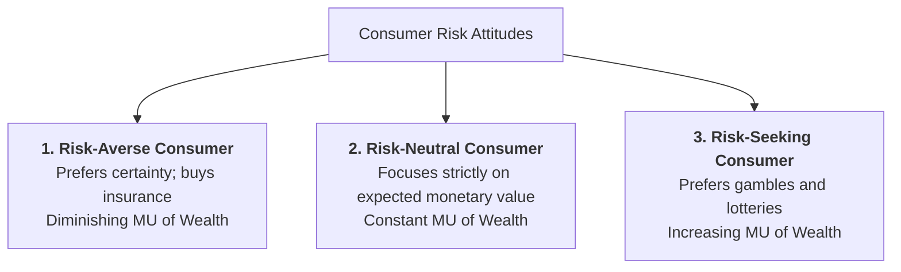
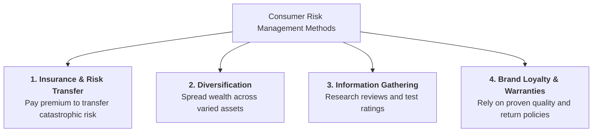

## 1. Decision-Making Under Risk and Uncertainty

In basic economic models, consumers are assumed to have complete information. In the real world, however, almost all consumer and business decisions involve **risk and uncertainty** (e.g., buying insurance, investing savings, traveling, or purchasing high-value electronics).

### Certainty vs. Risk vs. Uncertainty (Frank Knight):
* **Certainty:** All future outcomes and payoffs are known with 100% precision.
* **Risk:** The future outcome is not known with certainty, but the **probabilities** of possible outcomes can be calculated or estimated (e.g., rolling dice, purchasing flight cancellation insurance).
* **Uncertainty:** Future outcomes are unknown and objective mathematical probabilities **cannot** be assigned (e.g., unexpected global pandemic, revolutionary technological disruption).

---

## 2. Expected Value ($EV$) vs. Expected Utility ($EU$)

When facing a risky gamble or uncertain choice:

1. **Expected Value ($EV$):**  
   The weighted average monetary payoff of all possible outcomes:
   $$EV = (P_1 \times X_1) + (P_2 \times X_2) + \dots + (P_n \times X_n)$$
   *(Where $P_i$ is the probability of outcome $i$, and $X_i$ is the monetary payoff).*

2. **Expected Utility ($EU$):**  
   Proposed by **John von Neumann and Oskar Morgenstern**, consumers do not maximize expected money; they maximize **Expected Utility** (satisfaction):
   $$EU = (P_1 \times U(X_1)) + (P_2 \times U(X_2)) + \dots + (P_n \times U(X_n))$$

---

## 3. The Three Types of Consumer Risk Attitudes

Depending on how a consumer's marginal utility of wealth behaves, consumers fall into **three behavioral categories**:

### 1. Risk-Averse Consumer (The Majority of Consumers)
* **Behavior:** Prefers a guaranteed sure payoff over a risky gamble with the exact same expected value.
* **Utility Curve:** **Concave to the origin** because the marginal utility of money declines as wealth increases ($MU_{\text{wealth}}$ falls).
* **Consumer Action:** Buys health insurance, flight insurance, warranties, and keeps emergency savings in low-risk bank deposits.

### 2. Risk-Neutral Consumer
* **Behavior:** Completely indifferent between a sure payoff and a risky gamble with equal expected value.
* **Utility Curve:** A **straight linear line** (constant marginal utility of wealth).
* **Consumer Action:** Makes decisions purely based on expected monetary value ($EV$), regardless of variance or risk.

### 3. Risk-Seeking / Risk-Loving Consumer
* **Behavior:** Prefers a risky gamble with high variance over a guaranteed sure payoff with the same expected value.
* **Utility Curve:** **Convex to the origin** (increasing marginal utility of wealth).
* **Consumer Action:** Participates in lotteries, high-stakes casino gambling, and highly speculative asset trading.

---

## 4. Comprehensive Comparison Table: Risk Attitudes

| Feature / Dimension | Risk-Averse Consumer | Risk-Neutral Consumer | Risk-Seeking Consumer |
| :--- | :--- | :--- | :--- |
| **Preference Choice** | Prefers sure income over equal risky gamble | Indifferent between sure income and gamble | Prefers risky gamble over sure income |
| **Marginal Utility of Wealth** | Diminishing ($MU$ falls as wealth rises) | Constant ($MU$ is constant) | Increasing ($MU$ rises as wealth rises) |
| **Shape of Utility Curve** | **Concave** curve | **Linear straight line** | **Convex** curve |
| **Demand for Insurance** | **High demand** (willing to pay premium) | Zero demand for fair insurance | Refuses insurance; prefers gambling |
| **Real-World Example** | Family buying comprehensive medical insurance | Large financial corporate investment firm | Casino gamblers, lottery ticket buyers |

---

## 5. Consumer Risk Management Strategies

In everyday life, risk-averse consumers use four primary methods to manage and reduce economic risk:

1. **Insurance and Risk Transfer:**  
   Consumers pay a small, certain insurance premium to protect themselves against the risk of a rare, catastrophic financial loss (e.g., fire insurance, car accident insurance, travel health insurance).
2. **Diversification ("Don't put all your eggs in one basket"):**  
   Consumers and investors spread their savings across multiple independent assets (e.g., bank deposits, gold, mutual funds, real estate) so that a loss in one asset is balanced by gains in another.
3. **Information Search & Quality Verification:**  
   To reduce the risk of buying a defective product, consumers read customer reviews, inspect food safety labels, compare prices online, and seek recommendations before purchasing.
4. **Warranties, Guarantees, and Brand Loyalty:**  
   Consumers reduce product performance risk by purchasing well-known trusted brands or demanding manufacturer return warranties.

---

## 6. Review & Exam Practice Questions

### Very Short Questions (1-2 Marks):
1. **What is the difference between risk and uncertainty according to Frank Knight?**  
   *Answer:* In risk, probabilities of outcomes can be calculated; in uncertainty, probabilities cannot be assigned.
2. **What is a Risk-Averse consumer?**  
   *Answer:* A consumer who prefers a certain payoff over an uncertain gamble with the same expected value.
3. **Why do risk-averse consumers buy insurance?**  
   *Answer:* Because the utility loss from a potential catastrophic financial catastrophe is greater than the utility cost of paying a small certain premium (diminishing $MU$ of wealth).

### Short Questions (3-5 Marks):
1. Explain Expected Utility Theory and distinguish between the three consumer attitudes toward risk.
2. Discuss four practical risk-reduction strategies used by modern consumers in the marketplace.
