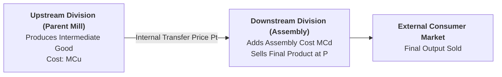

## 1. What is Transfer Pricing?

Modern corporations are frequently **vertically integrated** — divided into autonomous operating divisions where an **upstream division** (e.g., central bakery, raw material mill, engine plant) manufactures intermediate components and transfers them to a **downstream division** (e.g., hotel restaurants, car assembly line) for final marketing to consumers.

> **Definition:** **Transfer Price ($P_t$)** is the internal accounting price charged by one autonomous division (upstream) to another division (downstream) of the **same parent company** for intermediate goods or services.

---

## 2. The Problem of Double Marginalization

If central management allows both divisional managers to add their own independent profit mark-ups:
* Upstream adds a mark-up above cost ($P_t = MC_u + \text{mark-up}$).
* Downstream adds another mark-up to the final consumer price.
* **The Result (Double Marginalization):** The final retail price becomes excessively inflated, reducing unit sales volume and shrinking **total corporate profit**.

---

## 3. Optimal Transfer Pricing Rules Across Market Scenarios

To maximize total corporate profit, central management sets transfer prices based on external market conditions:

### Scenario 1: When No External Market Exists for Intermediate Goods
When intermediate components cannot be bought or sold outside the company:
* The upstream division must act as a cost center.
* **The Golden Rule:** Set transfer price strictly equal to the **Upstream Marginal Cost**:
  $$\mathbf{P_t = MC_u}$$
* The downstream division combines $P_t$ with its own assembly marginal cost ($MC_d$) to get total marginal cost ($MC_{\text{Total}} = MC_u + MC_d$) and maximizes corporate profit where $MR_{\text{Final}} = MC_{\text{Total}}$.

### Scenario 2: When a Perfectly Competitive External Market Exists
When intermediate goods can be freely bought or sold on an open external market at market price $P_m$:
* **The Rule:** Set transfer price strictly equal to the **Competitive Market Price**:
  $$\mathbf{P_t = P_m}$$
* If upstream $MC_u < P_m$, the upstream division expands production and sells excess intermediate goods to outside firms.
* If upstream capacity is full, the downstream division buys additional intermediate components from the open market.

---

## 4. Methods of Transfer Pricing

| Transfer Pricing Method | Determination Basis | Key Advantage | Key Limitation |
| :--- | :--- | :--- | :--- |
| **1. Market-Based Price** | Prevailing external competitive market price ($P_m$). | Objective and preserves full divisional autonomy. | Requires a perfectly competitive external market to exist. |
| **2. Cost-Based Price** | Upstream marginal cost ($MC_u$) or standard full cost. | Simple to calculate and eliminates double marginalization. | Upstream division shows zero accounting profit (cost center). |
| **3. Negotiated Price** | Bargaining and agreement between divisional managers. | Fosters decentralization and managerial negotiation. | Can cause internal corporate friction and sub-optimal decisions. |
| **4. Dual Pricing** | Upstream records at market price; Downstream records at $MC$. | Motivates both divisions simultaneously. | Requires corporate-level accounting reconciliation. |

---

## 5. Practical Example in the Hospitality Industry

A large luxury hotel chain operates a **centralized commercial bakery** (upstream division) that supplies fresh bread, croissants, and pastries to its **three hotel restaurants** (downstream divisions):
* If the bakery charges an inflated price to make itself look profitable on paper, the restaurants face artificially high food costs and raise menu prices, driving away hotel dining guests.
* By setting the internal transfer price equal to the **bakery's marginal production cost ($MC_u$)**, the restaurants price their menus competitively, maximizing overall hotel group profit.

---

## 6. Review & Exam Practice Questions

### Very Short Questions (1-2 Marks):
1. **Define Transfer Price.**  
   *Answer:* The internal price charged for goods and services transferred between divisions of the same parent company.
2. **What is Double Marginalization?**  
   *Answer:* The problem where multiple autonomous divisions each add a profit mark-up, inflating the final retail price and reducing total corporate profit.
3. **What is the optimal transfer price when no external market exists?**  
   *Answer:* Upstream Marginal Cost ($P_t = MC_u$).

### Short Questions (3-5 Marks):
1. Explain how transfer prices are determined with and without an external competitive market.
2. Discuss the four common methods of setting transfer prices in large business corporations.
